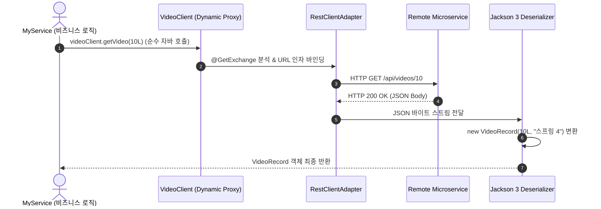

# 선언적 HTTP 서비스 인터페이스와 RestClient 프록시

## 한눈에 보기
| 방식 | 구현 코드 스타일 | 장단점 및 특징 |
|------|-----------------|----------------|
| 전통적 `RestClient` 직접 호출 | `restClient.get().uri("/videos/{id}", id).retrieve().body(...)` | 세밀한 커스터마이징 가능하나 반복적 보일러플레이트 코드 발생 |
| 선언적 HTTP 인터페이스 (`@HttpExchange`) | `public interface VideoClient { @GetExchange("/videos/{id}") Video get(@PathVariable Long id); }` | 인터페이스 선언만으로 프록시 자동 생성, 완벽한 타입 안전성 확보 |

## 1. 왜 이게 필요한가

### 이런 상황을 상상해 보자
마이크로서비스 아키텍처(MSA) 환경에서 주문 서비스가 회원 서비스나 결제 서비스의 외부 REST API를 원격 호출해야 한다고 하자.

```java
// 외부 서비스의 사용자 정보를 조회해야 한다!
```

전통적인 방식에서는 `RestTemplate`이나 최신 `RestClient` 인스턴스를 주입받아, 매번 URL 문자열을 조립하고 HTTP 헤더를 세팅하고 에러 상태 코드를 if-else로 검사한 뒤 응답 JSON을 DTO로 파싱하는 수십 줄의 클라이언트 호출 코드를 클래스마다 직접 작성해야 했다.

### 여기서 뭐가 무너지나
호출해야 할 외부 엔드포인트가 수십 개로 늘어나면, 동일한 HTTP 통신 보일러플레이트 코드가 프로젝트 전체에 중복 작성된다. URL 오타나 파라미터 타입 불일치 버그가 컴파일 타임에 잡히지 않고 실제 서버가 돌아갈 때 런타임 에러로 터지며, 외부 서비스 인터페이스가 변경되었을 때 리팩토링하기가 매우 번거롭다.

### 그래서 나온 생각
Spring Data JPA가 인터페이스 메서드 이름만 선언하면 SQL 쿼리를 대신 실행해 주듯이, 외부 HTTP API 통신도 자바 인터페이스에 어노테이션(`@HttpExchange`, `@GetExchange`)만 붙이면 프레임워크가 런타임에 동적 프록시를 생성해 통신을 대행하는 **[[선언적-에이치티티피-인터페이스]]**(= 인터페이스 선언만으로 원격 API 클라이언트 구현체를 자동 생성해 주는 기술) 체계를 도입했다.

개발자는 이제 내부 자바 메서드를 호출하듯이 외부 마이크로서비스 API를 호출할 수 있으며, 실제 HTTP 전송은 하부의 `RestClient`와 **[[잭슨]]**(= JSON 직렬화/역직렬화 엔진)이 투명하게 처리한다.

쉽게 비유하자면, 전화 교환원 시스템과 같다. 다른 지사의 담당자와 통화하기 위해 상대방의 내선 번호, 교환기 프로토콜, 통신 회선 연결 코드를 내가 직접 조작할 필요가 없다. "김 부장님 연결해 주세요(인터페이스 메서드 호출)"라고 말하면, 내부 교환원(스프링 HTTP 프록시 팩토리)이 번호를 누르고 회선을 연결하여 통화를 연결해 준다.

→ 비유가 깨지는 지점: 교환원은 사람의 음성 대화를 중계하지만, 선언적 HTTP 인터페이스는 자바 객체 파라미터를 실시간으로 HTTP Request 패킷으로 직렬화하고 반환된 JSON을 불변 Record 객체로 완벽히 역직렬화하여 반환한다.

## 2. 어떻게 동작하는가
1. **클라이언트 인터페이스 정의**: 개발자는 외부 API 명세를 담은 자바 인터페이스를 선언하고 `@HttpExchange("/api/videos")` 및 `@GetExchange("/{id}")` 어노테이션을 부여한다 — 원격 호출 규약을 선언적으로 정의하기 위해서다.
2. **RestClient 기반 어댑터 생성**: 기본 URL(`https://api.internal-service.com`)과 타임아웃, 공통 인증 토큰 헤더가 설정된 `RestClient`를 생성하고 이를 `RestClientAdapter`로 감싼다 — 실제 네트워크 I/O 전송 엔진을 준비하기 위해서다.
3. **HttpServiceProxyFactory 프록시 빈 등록**: `HttpServiceProxyFactory.builderFor(adapter).build()`를 통해 인터페이스의 구현체 프록시 빈을 생성하여 스프링 컨테이너에 등록한다 — 비즈니스 서비스에 `@Autowired` 또는 생성자 주입으로 공급하기 위해서다.
4. **인터페이스 메서드 호출 및 자동 직렬화**: 비즈니스 서비스에서 `videoClient.getVideo(10L)`을 호출하면, 프록시가 가로채어 URL 경로 파라미터를 치환하고 **[[잭슨]]** 3을 통해 인자를 JSON으로 직렬화한다 — 실제 HTTP 요청 패킷을 조립하기 위해서다.
5. **원격 전송 및 응답 역직렬화**: 원격 **[[레스트-컨트롤러]]**로 HTTP GET 요청이 전송되고, 돌아온 200 OK 응답 본문의 JSON을 `VideoRecord` 객체로 역직렬화하여 호출자에게 최종 반환한다 — 개발자가 외부 네트워크 통신을 로컬 자바 메서드 호출처럼 투명하게 소비할 수 있게 하기 위해서다.

## 3. 그림으로 보기



## 4. 이 노트에 나온 용어
| 용어 | 한 줄 풀이 | 용어집 링크 |
|------|------------|-------------|
| 선언적-에이치티티피-인터페이스 | 인터페이스와 어노테이션만으로 원격 API 클라이언트 구현체를 자동 생성하는 기술 | [[_glossary#선언적-에이치티티피-인터페이스]] |
| 레스트-컨트롤러 | 외부 클라이언트 요청을 수신하여 JSON을 응답하는 원격 엔드포인트 | [[_glossary#레스트-컨트롤러]] |
| 잭슨 | HTTP 요청/응답 본문과 자바 객체 간의 직렬화/역직렬화를 수행하는 엔진 | [[_glossary#잭슨]] |
| 디스패처-서블릿 | 스프링 MVC 서버에서 들어오는 요청을 컨트롤러로 라우팅하는 진입점 | [[_glossary#디스패처-서블릿]] |

## 5. 자주 헷갈리는 것
- **OpenFeign vs Spring Native HTTP Interfaces**: Spring Cloud OpenFeign은 넷플릭스 깃허브 기반의 서드파티 라이브러리인 반면, `@HttpExchange`는 Spring Framework 6 및 Spring Boot 4 코어에 네이티브로 내장된 표준 기능이므로 추가 의존성 없이 GraalVM AOT와 100% 호환된다.
- **`RestClient`와의 결합**: 선언적 인터페이스는 독자적인 통신 라이브러리가 아니라, 하부의 `RestClient`가 제공하는 인터셉터, 에러 핸들러, SSL 설정 등의 강력한 인프라 기능을 그대로 공유한다.

## 6. 언제 안 쓰나 / 경계
- **gRPC 또는 바이너리 RPC 프로토콜**: Protobuf 기반의 초고속 바이너리 통신이 필수적인 마이크로서비스 간 통신에서는 HTTP JSON 기반 인터페이스 대신 gRPC 스타터를 사용하는 것이 적합하다.

## 7. 연결
- [[01-spring-mvc-architecture-and-controllers]] — 서버 측의 DispatcherServlet 컨트롤러 인터페이스와 클라이언트 측의 선언적 HTTP 인터페이스가 완벽한 대칭을 이룬다.
- [[03-json-rest-api-jackson3]] — 원격 API와 통신할 때 Jackson 3를 통해 JSON 페이로드를 타입 세이프하게 주고받는다.

## 8. 스스로 확인
1. `RestClient`를 직접 호출하는 방식과 비교하여 선언적 HTTP 서비스 인터페이스가 가져오는 생산성 및 유지보수성 향상은 무엇인가?
2. `HttpServiceProxyFactory`가 자바 인터페이스로부터 실제 동작하는 HTTP 클라이언트 빈을 생성하는 메커니즘은 무엇인가?
3. Java 25 가상 스레드(Virtual Threads) 환경에서 선언적 HTTP 인터페이스를 호출할 때 성능상의 이점은 무엇인가?

<!-- ==== 아래는 내 영역 · 스킬 수정 금지 ==== -->

## 내 설명 시도

## 막혔던 지점

## 리뷰 이력
