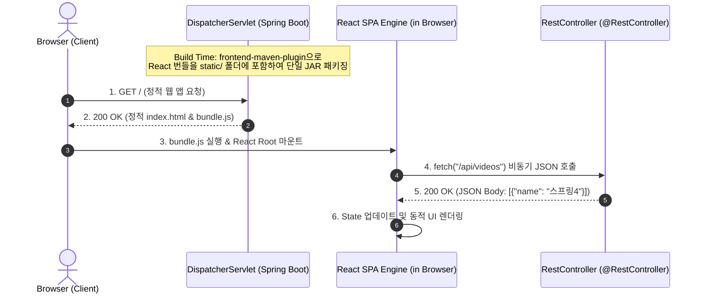

# Node.js와 React 프론트엔드 빌드 통합

## 한눈에 보기
| 항목 | 서버사이드 렌더링 (Thymeleaf) | 싱글 페이지 애플리케이션 (React SPA) | 통합 배포 방식 |
|------|------------------------------|--------------------------------------|----------------|
| 렌더링 주체 | 스프링 부트 백엔드 서버 | 사용자 웹 브라우저 (클라이언트 JS) | 빌드 플러그인으로 정적 리소스에 번들 포함 |
| 데이터 통신 | HTML 문서 통째로 전송 | REST API를 통한 순수 JSON 비동기 fetch | 단일 JAR 배포로 CORS 문제 원천 차단 |
| 사용자 경험 | 매 클릭마다 페이지 새로고침 | 화면 깜빡임 없는 유려한 반응형 UI | 개발 편의성과 프로덕션 단일 운영의 조화 |

## 1. 왜 이게 필요한가

### 이런 상황을 상상해 보자
동영상 재생 목록을 실시간으로 검색하고 필터링하며, 페이지 새로고침 없이 즉각적인 애니메이션과 상호작용을 제공하는 최신 웹 애플리케이션을 만든다고 하자.

프론트엔드는 React.js로 컴포넌트를 만들고, 백엔드는 Spring Boot 4로 비즈니스 로직과 JSON API를 제공하려 한다.

```javascript
// src/main/javascript/ListOfVideos.js
class ListOfVideos extends React.Component {
    async componentDidMount() {
        let json = await (await fetch("/api/videos")).json();
        this.setState({ data: json });
    }
    render() {
        return <ul>{this.state.data.map(v => <li>{v.name}</li>)}</ul>;
    }
}
```

이때 프론트엔드와 백엔드를 어떻게 빌드하고 하나의 배포 단위로 패키징할 것인가의 문제가 발생한다.

### 여기서 뭐가 무너지나
프론트엔드 프로젝트(Node.js/npm)와 백엔드 프로젝트(Java/Gradle/Maven)를 완전히 분리하여 별도의 서버로 띄우면, 개발 환경과 배포 환경에서 도메인이 달라 브라우저의 동일 출처 정책(CORS) 에러가 발생한다. 또한 운영 배포 시 두 개의 서버 인프라를 따로 프로비저닝하고 배포 파이프라인을 두 번 태워야 하므로 운영 복잡도가 두 배로 증가한다.

반대로 **[[서버사이드-템플릿]]**(= 서버에서 HTML을 완성해 내려주는 기술)만 고집하면 데스크톱 수준의 부드러운 화면 전환과 복잡한 프론트엔드 상태 관리를 구현하기 어렵다.

### 그래서 나온 생각
프론트엔드와 백엔드의 장점을 결합하여, 백엔드 빌드 도구(Maven/Gradle) 실행 시 Node.js와 번들러(Vite/Parcel)를 백그라운드에서 자동으로 다운로드 및 실행하여 React 코드를 정적 자산(`src/main/resources/static/`)으로 컴파일해 넣는 파이프라인을 구축했다.

이를 통해 브라우저는 초기에 가벼운 단일 HTML과 자바스크립트 번들을 다운로드받아 **[[싱글-페이지-애플리케이션]]**(= 페이지 전환 없이 백엔드 API와 통신하며 화면을 동적으로 그리는 클라이언트 웹 앱)으로 동작하고, 백엔드는 순수한 **[[레스트-컨트롤러]]**(= JSON 데이터를 응답하는 API 엔드포인트) 역할에만 집중할 수 있게 되었다.

쉽게 비유하자면, 자동차(Spring Boot 백엔드) 안에 최첨단 전자식 내비게이션 태블릿(React SPA)을 매립하여 일체형으로 출고하는 것과 같다. 태블릿은 화면 UI와 터치 조작(프론트엔드 렌더링)을 담당하고, 자동차 엔진과 바퀴 제어(백엔드 비즈니스 로직)는 차량 메인 컴퓨터와 내부 케이블(REST API 통신)로 신호를 주고받는다. 사용자는 하나의 완성차(단일 JAR 파일)만 사면 된다.

→ 비유가 깨지는 지점: 차량 태블릿은 한 번 장착되면 화면 레이아웃을 바꾸기 어렵지만, 웹 브라우저의 React SPA는 백엔드 REST API의 응답 데이터에 따라 실시간으로 컴포넌트 상태(State)를 업데이트하며 무한히 화면을 재구성한다.

## 2. 어떻게 동작하는가
1. **빌드 플러그인 가동**: 빌드 시 `frontend-maven-plugin` 또는 Gradle의 Node 플러그인이 로컬 시스템의 오염 없이 지정된 버전의 Node.js 및 npm을 임시 디렉터리에 설치한다 — 개발자 머신에 Node.js가 깔려있지 않아도 완벽히 동일한 빌드를 재현하기 위해서다.
2. **NPM 패키지 설치 및 번들링**: `npm install`과 `npx parcel build`(또는 Vite 빌드)가 실행되어 `src/main/javascript/`의 JSX/React 코드들을 단일 최적화 자바스크립트 파일(`main.js`)로 번들링한다 — 브라우저가 JSX 문법을 직접 이해하지 못하므로 순수 JS로 트랜스파일하기 위해서다.
3. **정적 리소스 디렉터리 배치**: 번들링된 `index.html`과 `main.js` 파일이 스프링 부트의 정적 리소스 기본 폴더(`src/main/resources/static/`)로 복사된다 — 스프링 부트의 기본 정적 파일 서빙 메커니즘을 그대로 활용하기 위해서다.
4. **초기 페이지 로드 및 React 마운트**: 사용자가 `http://localhost:8080/`에 접속하면 스프링 부트의 **[[디스패처-서블릿]]**이 정적 HTML을 반환하고, 브라우저가 `main.js`를 실행하여 `<div id="app"></div>` 태그에 React 루트를 마운트한다 — 클라이언트 브라우저에서 화면을 즉시 그리기 위해서다.
5. **비동기 API 통신 및 상태 렌더링**: 마운트된 React 컴포넌트(`ListOfVideos`)가 `fetch('/api/videos')`로 **[[레스트-컨트롤러]]**를 비동기 호출하고, 수신된 JSON 배열을 컴포넌트 상태(`this.state.data`)에 넣어 화면을 실시간 업데이트한다 — 전체 페이지 새로고침 없이 유려한 반응형 UI를 제공하기 위해서다.

## 3. 그림으로 보기



## 4. 이 노트에 나온 용어
| 용어 | 한 줄 풀이 | 용어집 링크 |
|------|------------|-------------|
| 싱글-페이지-애플리케이션 | 단일 HTML 기반으로 백엔드 API와 비동기 통신하며 화면을 다시 그리는 웹 앱 | [[_glossary#싱글-페이지-애플리케이션]] |
| 서버사이드-템플릿 | 서버에서 HTML을 완성하여 내려주는 전통적 템플릿 기술 | [[_glossary#서버사이드-템플릿]] |
| 레스트-컨트롤러 | React 등 프론트엔드 클라이언트에 JSON 데이터를 제공하는 백엔드 엔드포인트 | [[_glossary#레스트-컨트롤러]] |
| 디스패처-서블릿 | 정적 리소스(HTML/JS) 및 REST API 요청을 조율하는 프론트 관문 | [[_glossary#디스패처-서블릿]] |

## 5. 자주 헷갈리는 것
- **CORS 설정 불필요**: 프론트엔드 번들이 스프링 부트 서버의 `static` 폴더에서 서빙되므로, 브라우저 입장에서는 프론트엔드 정적 파일과 백엔드 REST API가 동일한 오리진(동일 호스트/포트)이 되어 CORS(Cross-Origin Resource Sharing) 설정이 필요 없다.
- **SPA 라우팅과 404 Fallback**: React Router를 사용하는 SPA에서는 사용자가 브라우저 주소창에 `/videos/detail/1`을 직접 입력했을 때 서버가 404를 내지 않고 `index.html`로 포워딩해 주는 설정이 필요하다.

## 6. 언제 안 쓰나 / 경계
- **검색 엔진 최적화(SEO)가 중요한 공공 포털/쇼핑몰**: 검색 로봇이 자바스크립트를 완벽히 실행하지 못할 수 있으므로, SEO가 핵심인 서비스는 서버사이드 템플릿(Thymeleaf)을 쓰거나 Next.js 기반의 SSR(Server-Side Rendering) 서버를 별도로 구축하는 것이 안전하다.

## 7. 연결
- [[01-spring-mvc-architecture-and-controllers]] — DispatcherServlet의 기본 정적 리소스 서빙 메커니즘을 토대로 React 번들을 배포한다.
- [[03-json-rest-api-jackson3]] — 브라우저에 마운트된 React 컴포넌트가 백엔드의 Jackson 3 기반 REST 엔드포인트를 호출하여 데이터를 소비한다.

## 8. 스스로 확인
1. React 프론트엔드를 별도 웹 서버(Nginx)로 분리하지 않고 스프링 부트 단일 Jar로 패키징할 때 얻는 운영상 이점은 무엇인가?
2. `frontend-maven-plugin`이 개발자 머신에 독립적으로 프론트엔드 빌드를 수행하는 메커니즘은 무엇인가?
3. 서버사이드 렌더링(Thymeleaf)과 싱글 페이지 애플리케이션(React)의 트레이드오프를 사용자 경험과 아키텍처 관점에서 비교 설명할 수 있는가?

<!-- ==== 아래는 내 영역 · 스킬 수정 금지 ==== -->

## 내 설명 시도

## 막혔던 지점

## 리뷰 이력
