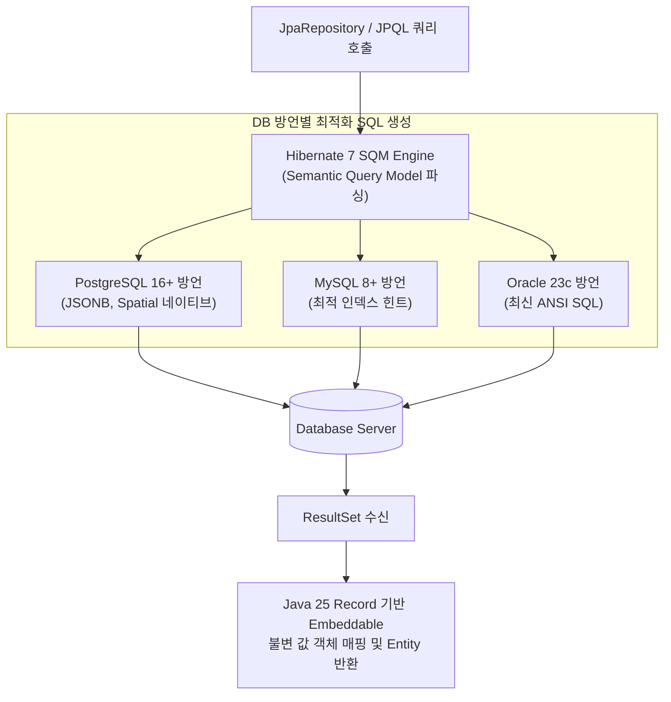

# Hibernate 7과 Spring Boot Persistence 모듈 아키텍처

## 한눈에 보기
| 항목 | Spring Boot 3 (Hibernate 6.x) | Spring Boot 4 (Hibernate 7.x) | 핵심 향상점 |
|------|--------------------------------|-------------------------------|-------------|
| JPA 표준 명세 | Jakarta Persistence 3.1 | Jakarta Persistence 3.2 | 신규 표준 쿼리 함수 및 고급 타입 매핑 지원 |
| 모듈 구조 | `spring-boot-starter-data-jpa`에 강결합 | `spring-boot-persistence` 전용 독립 모듈화 | 데이터 계층 구성의 명확성과 클래스패스 최적화 |
| Java 25 최적화 | 레코드 임베디드 기본 매핑 제약 | Java Record를 `@Embeddable` 1급 시민으로 지원 | 불변 값 객체(Value Object)의 완벽한 ORM 결합 |

## 1. 왜 이게 필요한가

### 이런 상황을 상상해 보자
현대적인 엔터프라이즈 애플리케이션에서 지리 정보(Spatial Data), JSON 열(JSON Columns), 불변 값 객체(Value Objects)를 데이터베이스 테이블과 매핑하여 대규모 트랜잭션을 처리하려 한다.

```java
@Entity
public class VideoEntity {
    @Id
    @GeneratedValue
    private Long id;
    private String name;

    @Embedded
    private VideoMetadata metadata; // Java 25 Record 불변 객체
}
```

기존 하이버네이트 버전에서는 불변 Record를 JPA 임베디드 객체로 매핑할 때 기본 생성자 부재로 인한 제약이 있었고, SQL 변환 엔진이 복잡한 서브쿼리나 네이티브 함수를 처리할 때 성능 저하가 발생했다.

### 여기서 뭐가 무너지나
과거 하이버네이트 6 이전 세대에서는 ORM 엔진의 쿼리 변환기(HQL/JPQL Parser)가 생성하는 SQL이 비효율적(N+1 쿼리 빈발, 불필요한 조인 발생)이었으며, 데이터베이스 방언(Dialect) 간의 기능 차이를 프레임워크가 매끄럽게 흡수하지 못했다.

또한 스프링 부트의 영속성 관련 인프라 코드가 여러 스타터에 흩어져 있어, JPA를 쓰지 않고 순수 JDBC나 R2DBC만 쓸 때도 불필요한 JPA 관련 자동 구성 클래스들이 함께 분석되는 비효율이 존재했다.

### 그래서 나온 생각
Spring Boot 4에서는 차세대 ORM 표준 엔진인 **[[하이버네이트]]**(= 객체와 관계형 테이블 간의 매핑을 처리하는 ORM 표준 구현체, Hibernate 7)과 최신 **Jakarta Persistence 3.2** 표준을 전격 도입했다.

동시에 프레임워크 내부의 영속성 처리 로직을 `spring-boot-persistence`라는 독립 모듈로 깔끔하게 분리하여 모듈화했다.

이를 통해 개발자는 **[[엔티티]]**(= DB 테이블과 매핑되는 영속 객체)를 설계할 때 자바 25의 강력한 레코드(Record)와 최신 SQL 문법을 완벽히 활용할 수 있게 되었으며, **[[제이피에이-리포지토리]]**(= 자동 CRUD 데이터 접근 인터페이스)가 생성하는 SQL의 실행 효율이 극대화되었다.

쉽게 비유하자면, 노후화된 디젤 엔진(구형 ORM 파서)을 최첨단 하이브리드 고효율 파워트레인(Hibernate 7 SQM 엔진)으로 전면 교체한 것과 같다. 운전자(개발자)는 동일한 가속 페달(JpaRepository 메서드)을 밟지만, 엔진 내부에서 연료를 분사하고 바퀴를 굴리는 방식(SQL 최적화 및 타입 변환)이 훨씬 더 강력하고 정밀해졌다.

→ 비유가 깨지는 지점: 자동차 엔진 교체는 차체 전체를 뜯어고쳐야 하지만, 스프링 부트의 Hibernate 7 업그레이드는 기존의 표준 JPA 어노테이션(`@Entity`, `@Id`, `@Table`)을 100% 그대로 유지하면서 내부 엔진의 효율만 투명하게 향상시킨다.

## 2. 어떻게 동작하는가
1. **SQM (Semantic Query Model) 최적화 분석**: 개발자가 JPQL을 호출하면 하이버네이트 7의 SQM 엔진이 객체 지향 쿼리를 단일 통일된 의미론적 트리 구조로 파싱한다 — 데이터베이스 벤더(PostgreSQL, MySQL, Oracle)에 무관한 최적의 쿼리 계획을 세우기 위해서다.
2. **방언별 고성능 네이티브 SQL 생성**: 최적화된 SQM 트리를 타깃 DB의 최신 기능(JSON 함수, 윈도우 함수 등)을 활용하는 네이티브 SQL로 변환한다 — 데이터베이스 쿼리 실행 속도를 극대화하기 위해서다.
3. **불변 Record 임베디드 매핑**: 엔티티 내부의 `@Embedded` 필드인 Java Record를 리플렉션 트릭 없이 생성자 인자 순서대로 매핑하여 인스턴스화한다 — 도메인 **[[디티오]]** 및 값 객체의 불변성을 영속 계층까지 완벽히 유지하기 위해서다.
4. **더티 체킹 (Dirty Checking) 및 1차 캐시 관리**: 트랜잭션 종료 시 영속성 컨텍스트가 엔티티의 스냅샷과 현재 상태를 바이트코드 수준에서 초고속 비교하여 변경된 컬럼만 `UPDATE`한다 — 불필요한 전체 컬럼 업데이트 SQL 낭비를 막기 위해서다.

## 3. 그림으로 보기



## 4. 이 노트에 나온 용어
| 용어 | 한 줄 풀이 | 용어집 링크 |
|------|------------|-------------|
| 하이버네이트 | 객체와 테이블 간의 매핑을 처리하는 표준 ORM 구현체 (Hibernate 7) | [[_glossary#하이버네이트]] |
| 엔티티 | 데이터베이스 테이블과 매핑되어 영속성 관리를 받는 객체 | [[_glossary#엔티티]] |
| 제이피에이-리포지토리 | 영속성 계층의 CRUD 및 쿼리를 자동 대행하는 인터페이스 | [[_glossary#제이피에이-리포지토리]] |
| 디티오 | 계층 간 데이터 전송을 담당하는 불변 레코드/객체 | [[_glossary#디티오]] |

## 5. 자주 헷갈리는 것
- **JPA vs Hibernate**: JPA(Jakarta Persistence)는 자바 ORM 기술의 "표준 인터페이스/명세(Specification)"이고, Hibernate는 그 명세를 실제로 구현한 "구체적인 라이브러리(Implementation Engine)"다.
- **`spring-boot-persistence` 모듈의 분리**: Spring Boot 4에서는 JPA뿐만 아니라 JDBC, R2DBC 등 모든 영속성 기술의 공통 인프라가 별도 모듈로 분리되어 의존성 구조가 한층 명확해졌다.

## 6. 언제 안 쓰나 / 경계
- **대량 배치 데이터 삽입 (Bulk Batch Insert)**: 수십만 건의 데이터를 일괄 적재할 때는 ORM의 영속성 컨텍스트 관리 비용이 메모리 오버헤드를 유발하므로, `JdbcTemplate.batchUpdate()`나 전용 벌크 로더를 사용하는 것이 적합하다.

## 7. 연결
- [[01-spring-data-jpa-repositories]] — JpaRepository가 데이터베이스와 통신할 때 하부에서 실제로 동작하는 엔진이 Hibernate 7이다.
- [[03-derived-queries-and-pagination]] — 하이버네이트의 쿼리 파서가 파생 쿼리 메서드를 해석하여 최적화된 SQL로 변환한다.

## 8. 스스로 확인
1. Spring Boot 4에서 Hibernate 7과 Jakarta Persistence 3.2를 도입하여 얻은 아키텍처적 이점은 무엇인가?
2. Java 25 Record를 엔티티의 `@Embedded` 값 객체로 사용할 때의 객체 지향적 장점은 무엇인가?
3. 하이버네이트의 더티 체킹(Dirty Checking)이 개발자의 수동 `UPDATE` 쿼리 호출을 없애주는 원리는 무엇인가?

<!-- ==== 아래는 내 영역 · 스킬 수정 금지 ==== -->

## 내 설명 시도

## 막혔던 지점

## 리뷰 이력
