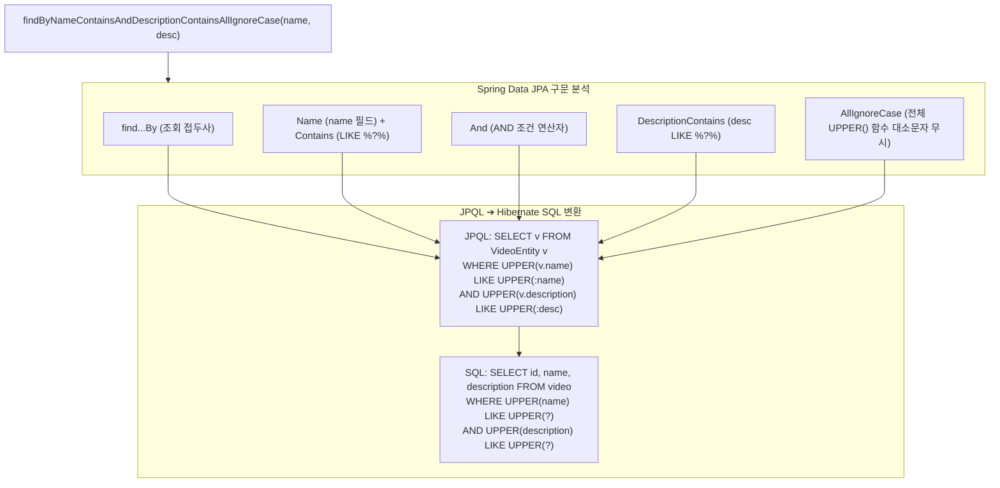

# 파생 쿼리 메서드와 정렬 및 페이징 처리

## 한눈에 보기
| 쿼리 메서드 패턴 | 생성되는 SQL WHERE 절 | 설명 |
|------------------|-----------------------|------|
| `findByName(String name)` | `WHERE name = ?` | 단일 조건 정확 일치 검색 |
| `findByNameContainsIgnoreCase(String part)` | `WHERE UPPER(name) LIKE UPPER(?)` | 대소문자 무시 부분 문자열(LIKE %part%) 검색 |
| `findTop5ByOrderByNameAsc()` | `ORDER BY name ASC LIMIT 5` | 정렬 후 상위 5개 레코드 제한 조회 |
| `findByName(String name, Pageable pageable)` | `WHERE name = ? LIMIT ? OFFSET ?` | 정렬 및 페이징 정보 동적 적용 |

## 1. 왜 이게 필요한가

### 이런 상황을 상상해 보자
동영상 스트리밍 서비스에서 사용자가 검색창에 "spring"이라는 단어를 입력했을 때, 제목에 "Spring", "SPRING", "spring boot"가 포함된 모든 동영상을 대소문자 구분 없이 최신순으로 10개씩 페이징하여 조회하려 한다.

```java
public interface VideoRepository extends JpaRepository<VideoEntity, Long> {
    List<VideoEntity> findByNameContainsIgnoreCase(String partialName);
    Page<VideoEntity> findByNameContainsIgnoreCase(String partialName, Pageable pageable);
}
```

개발자는 리포지토리 인터페이스에 위와 같이 메서드 시그니처만 작성했다.

### 여기서 뭐가 무너지나
과거에는 검색 조건이 바뀔 때마다 복잡한 SQL 문자열을 작성하고, `LIKE '%...%'` 처리, 대소문자 무시를 위한 `UPPER()` 함수 적용, 정렬(`ORDER BY`) 및 페이징(`LIMIT`, `OFFSET`) 쿼리를 손수 조립해야 했다.

특히 페이징 처리를 위해 전체 데이터 개수를 세는 `COUNT(*)` 쿼리와 실제 데이터 목록을 가져오는 `SELECT` 쿼리를 따로따로 작성하다가 조건문이 서로 어긋나 전체 페이지 수 계산이 틀어지는 버그가 빈번했다.

### 그래서 나온 생각
Spring Data JPA는 메서드 이름의 키워드를 분석하여 쿼리를 자동으로 조립하는 **[[파생-쿼리]]**(= 메서드 명명 규칙에 따라 SQL/JPQL을 자동 생성해 주는 스프링 데이터의 쿼리 유도 기술) 메커니즘을 제공한다.

개발자가 `findByNameContainsIgnoreCase`라고 이름을 붙이면, 프레임워크가 이를 문법적으로 해석하여 적절한 `WHERE UPPER(name) LIKE UPPER(?)` 조건절을 생성한다. 또한 `Pageable` 파라미터를 넘기면 전체 레코드 수 카운트 쿼리와 정렬된 슬라이스 조회를 하나의 `Page` 객체로 일괄 처리해 준다.

쉽게 비유하자면, 스마트 음성 비서에게 명령을 내리는 것과 같다. "데이터베이스에 접속해서 video 테이블을 열고 name 컬럼에 대소문자를 무시하고 spring이 들어간 행들을 골라서 이름순으로 정렬해 줘"라고 장황하게 매크로 스크립트를 짜지 않고, "이름에 spring 들어간 것 10개만 찾아줘(파생 쿼리 메서드 호출)"라고 명확한 단어로 말하기만 하면 비서가 알아서 SQL을 조립해 실행한다.

→ 비유가 깨지는 지점: 음성 비서는 모호한 명령도 대충 알아듣지만, 파생 쿼리는 `find...By...`, `Contains`, `IgnoreCase`, `OrderBy` 등 엄격한 예약어 문법 규칙을 따라야 하며, 엔티티에 존재하지 않는 필드명을 쓰면 애플리케이션 기동 시점에 즉시 컴파일/부팅 에러를 발생시켜 잘못된 쿼리가 프로덕션에 나가는 것을 방지한다.

## 2. 어떻게 동작하는가
1. **메서드 이름 구문 분석 (Parsing)**: 애플리케이션 시작 시 스프링 데이터는 **[[제이피에이-리포지토리]]** 인터페이스에 선언된 메서드 이름을 토큰 단위로 분해한다 — `find` (접두사), `ByName` (대상 엔티티 필드), `Contains` (연산자), `IgnoreCase` (대소문자 무시 수식어)를 식별하기 위해서다.
2. **대상 엔티티 필드 검증**: **[[엔티티]]** 클래스에 해당 이름(`name`)의 자바 필드가 실제로 존재하는지 타입을 검증한다 — 런타임 SQL 실행 에러를 애플리케이션 부팅 시점에 원천 차단하기 위해서다.
3. **JPQL 및 네이티브 SQL 생성**: 분석된 트리 구조를 바탕으로 **[[하이버네이트]]** ORM 엔진이 실행할 JPQL 추상 구문 트리를 만들고 DB 전용 SQL로 변환한다 — 데이터베이스에 최적화된 조건절을 준비하기 위해서다.
4. **페이징 파라미터 적용 (`Pageable`)**: 호출 시 `PageRequest.of(page, size, Sort.by("name"))`가 전달되면, 하이버네이트가 자동으로 메인 조회 쿼리에 `LIMIT ? OFFSET ?`를 붙이고 백그라운드에서 `SELECT COUNT(v) FROM VideoEntity v WHERE ...` 쿼리를 함께 실행한다 — 클라이언트가 전체 페이지 수와 다음 페이지 존재 여부를 즉시 계산할 수 있게 하기 위해서다.
5. **엔티티 리스트 및 Page 객체 반환**: DB로부터 조회된 행들을 엔티티 객체 목록으로 인스턴스화하고, 페이징 메타데이터(총 페이지 수, 현재 페이지, 데이터 개수)와 함께 `Page<VideoEntity>` 형태로 반환한다 — 호출자가 간결하게 UI 페이징 네비게이션을 그릴 수 있게 하기 위해서다.

## 3. 그림으로 보기



## 4. 이 노트에 나온 용어
| 용어 | 한 줄 풀이 | 용어집 링크 |
|------|------------|-------------|
| 파생-쿼리 | 메서드 명명 규칙에 따라 SQL/JPQL을 자동 생성해 주는 스프링 데이터 쿼리 메서드 | [[_glossary#파생-쿼리]] |
| 제이피에이-리포지토리 | 영속성 계층의 CRUD 및 쿼리 파싱을 관장하는 핵심 인터페이스 | [[_glossary#제이피에이-리포지토리]] |
| 엔티티 | 데이터베이스 테이블과 매핑되는 영속성 관리 대상 자바 클래스 | [[_glossary#엔티티]] |
| 하이버네이트 | 파생 쿼리 JPQL을 최적화된 네이티브 데이터베이스 SQL로 변환하는 ORM 엔진 | [[_glossary#하이버네이트]] |

## 5. 자주 헷갈리는 것
- **`Page<T>` vs `Slice<T>`**: `Page<T>`는 전체 데이터 개수를 구하는 `COUNT` 쿼리를 추가 실행하여 총 페이지 수를 제공하지만, 무한 스크롤(Infinite Scroll) UI처럼 "다음 페이지가 있는가"만 알면 되는 경우에는 `COUNT` 쿼리를 생략하여 성능을 대폭 절약하는 `Slice<T>`를 쓰는 것이 훨씬 유리하다.
- **메서드 이름이 너무 길어질 때**: 검색 조건이 4~5개 이상으로 늘어나 `findByNameAndAgeAndCityAndStatus...`처럼 메서드 이름이 지나치게 길어지면, 파생 쿼리 대신 `@Query` JPQL이나 Query By Example(QBE)을 사용해야 한다.

## 6. 언제 안 쓰나 / 경계
- **동적 다중 필터 검색 (동적 WHERE 절)**: 사용자가 웹 화면에서 제목만 입력할 수도 있고, 설명만 입력할 수도 있고, 둘 다 비워둘 수도 있는 동적 검색(Dynamic Query) 환경에서는 파생 쿼리로 모든 조합의 메서드를 만들 수 없으므로 Query By Example이나 QueryDSL/Criteria를 써야 한다.

## 7. 연결
- [[01-spring-data-jpa-repositories]] — JpaRepository가 기본 제공하는 CRUD 외에 비즈니스 맞춤형 조회 기능을 파생 쿼리로 확장한다.
- [[04-query-by-example-and-custom-jpa]] — 파생 쿼리의 한계를 넘어서는 동적 조건 검색(QBE) 및 EntityManager 직접 제어 기법으로 이어진다.

## 8. 스스로 확인
1. `findByNameContainsIgnoreCase`라는 메서드 이름이 스프링 데이터 JPA 내부에서 파싱되어 SQL로 변환되는 과정을 설명할 수 있는가?
2. `Page<T>`와 `Slice<T>`의 차이점과 대규모 트래픽 환경에서 `Slice<T>`가 성능상 유리한 이유는 무엇인가?
3. 파생 쿼리 메서드 이름에 엔티티에 없는 오타 필드명을 적었을 때 스프링 부트는 언제 에러를 감지하는가?

<!-- ==== 아래는 내 영역 · 스킬 수정 금지 ==== -->

## 내 설명 시도

## 막혔던 지점

## 리뷰 이력
