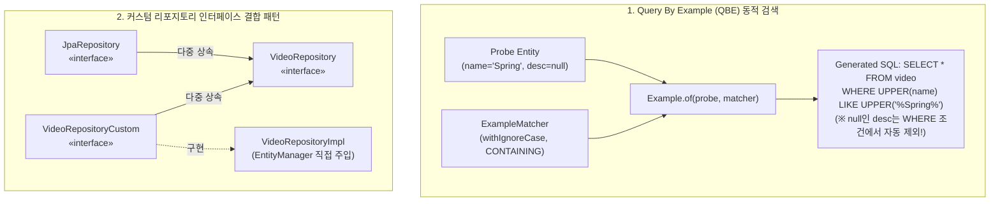

# Query By Example 동적 쿼리와 커스텀 리포지토리 구현

## 한눈에 보기
| 접근 방식 | 적용 상황 | 핵심 코드 형태 |
|-----------|-----------|----------------|
| Query By Example (QBE) | 여러 필드의 선택적 부분 일치/대소문자 무시 동적 검색 | `Example.of(probeEntity, matcher)` |
| Custom Repository (`*Impl`) | JPA `EntityManager` 직접 제어 또는 복잡한 네이티브 조인 | `VideoRepositoryCustom` + `VideoRepositoryImpl` |

## 1. 왜 이게 필요한가

### 이런 상황을 상상해 보자
동영상 관리 백엔드 시스템에서 관리자용 상세 검색 화면을 개발하고 있다. 검색 폼에는 제목(`name`), 설명(`description`), 카테고리(`category`) 세 개의 입력창이 있으며, 관리자는 제목만 넣고 검색할 수도 있고, 제목과 설명을 둘 다 넣거나 아무것도 입력하지 않고 전체 조회를 할 수도 있다.

```java
// 사용자가 입력한 필드만 골라서 WHERE 조건을 동적으로 만들어야 한다!
```

### 여기서 뭐가 무너지나
파생 쿼리 메서드(`findByNameAndDescription...`)만 사용하면 3개 필드의 조합(8가지 경우의 수)마다 서로 다른 메서드를 인터페이스에 수동으로 선언해야 하는 "메서드 폭발(Method Explosion)" 문제가 발생한다.

또한 문자열 연결로 SQL `WHERE 1=1 AND ...`를 조립하면 SQL 인젝션 공격에 노출되거나 띄어쓰기 오타로 인해 쿼리가 깨지는 취약점이 발생한다.

### 그래서 나온 생각
Spring Data는 검색 조건으로 사용할 도메인 객체 인스턴스(Probe)에 원하는 값만 채워 넣고 매칭 규칙(ExampleMatcher)과 함께 전달하면, 프레임워크가 `null`이 아닌 필드들만 자동으로 감지하여 동적 WHERE 조건을 안전하게 조립해 주는 **[[쿼리-바이-이그잼플]]**(= 도메인 객체의 채워진 필드값을 바탕으로 동적 쿼리를 생성하는 QBE 기술)을 제공한다.

또한 QBE로도 해결하기 어려운 초고난도 복잡 쿼리나 벌크 연산이 필요할 때는, `EntityManager`를 직접 주입받아 커스텀 로직을 작성하고 이를 표준 **[[제이피에이-리포지토리]]**(= 스프링 데이터 리포지토리 인터페이스)와 단일 인터페이스로 자연스럽게 결합하는 커스텀 리포지토리 확장 패턴을 제공한다.

쉽게 비유하자면, 경찰의 몽타주 기반 용의자 검색과 같다. "키 180cm, 검은색 모자 착용"이라는 단서 객체(Probe)를 검색 시스템에 집어넣으면, 시스템(QBE 엔진)이 단서가 존재하는 항목들만 데이터베이스(전체 엔티티)에서 대조하여 일치하는 인물들을 골라내는 것과 같다.

→ 비유가 깨지는 지점: 몽타주 검색은 주관적인 유사도 점수로 판별하지만, QBE는 `matchingAny()`, `CONTAINING`, `IGNORECASE` 등의 정밀한 매처 규칙에 따라 데이터베이스 SQL의 정확한 `AND/OR` 및 `LIKE` 연산자로 변환되어 수학적으로 엄밀하게 일치하는 레코드만 반환한다.

## 2. 어떻게 동작하는가
1. **Probe 객체 생성**: 검색 조건으로 사용할 **[[엔티티]]** 인스턴스를 만들고, 사용자가 입력한 필드값(예: `name="Spring"`, `description="Boot"`)을 채워 넣는다 — 검색할 예시(Example) 데이터를 준비하기 위해서다.
2. **ExampleMatcher 규칙 정의**: `ExampleMatcher.matchingAny().withIgnoreCase().withStringMatcher(CONTAINING)`를 선언하여 부분 일치 및 대소문자 무시 규칙을 지정한다 — 쿼리 연산자(LIKE %..%) 동작 방식을 커스터마이징하기 위해서다.
3. **Example 래퍼 캡슐화**: `Example<VideoEntity> example = Example.of(probe, matcher)`로 프로브와 매처를 하나의 검색 명세 객체로 묶는다 — 리포지토리 메서드의 단일 인자로 전달하기 위해서다.
4. **리포지토리 조회 실행**: `videoRepository.findAll(example)`을 호출하면, 스프링 데이터가 **[[파생-쿼리]]**를 만들 때처럼 널이 아닌 필드들만 조합하여 최적화된 동적 SQL을 자동 실행한다 — 복잡한 동적 쿼리 조립 코드 없이 결과를 얻기 위해서다.
5. **커스텀 리포지토리 결합 (Custom JPA)**: QBE로 부족한 복잡한 연산은 `VideoRepositoryCustom` 인터페이스를 만들고 `VideoRepositoryImpl` 클래스에서 `EntityManager`로 직접 작성한 뒤, 메인 인터페이스가 이를 다중 상속(`public interface VideoRepository extends JpaRepository<...>, VideoRepositoryCustom`)하게 한다 — 단일 리포지토리 주입만으로 표준 메서드와 커스텀 메서드를 동시에 호출할 수 있게 하기 위해서다.

## 3. 그림으로 보기



## 4. 이 노트에 나온 용어
| 용어 | 한 줄 풀이 | 용어집 링크 |
|------|------------|-------------|
| 쿼리-바이-이그잼플 | 도메인 객체 필드값을 조건 예시로 삼아 동적 WHERE 쿼리를 생성하는 기술 (QBE) | [[_glossary#쿼리-바이-이그잼플]] |
| 엔티티 | 데이터베이스 테이블과 매핑되는 영속성 관리 객체 | [[_glossary#엔티티]] |
| 제이피에이-리포지토리 | 영속성 데이터 접근을 총괄하는 스프링 데이터 인터페이스 | [[_glossary#제이피에이-리포지토리]] |
| 파생-쿼리 | 메서드 명명 규칙에 따라 고정된 SQL을 생성해 주는 쿼리 메서드 | [[_glossary#파생-쿼리]] |

## 5. 자주 헷갈리는 것
- **QBE의 한계 (중첩 속성 및 범위 검색)**: QBE는 문자열의 `STARTING_WITH`, `CONTAINING`, 정확 일치에는 매우 강력하지만, 날짜 범위 검색(`BETWEEN`), 숫자 대소 비교(`> 100`), 중첩 객체의 복잡한 조인 조건에는 제약이 있으므로 이때는 QueryDSL이나 Criteria API를 써야 한다.
- **커스텀 리포지토리 네이밍 규칙**: 스프링 데이터의 자동 감지를 위해 커스텀 구현체 클래스의 이름은 반드시 `기본인터페이스이름 + Impl` (예: `VideoRepositoryImpl`) 규칙을 따라야 컨테이너가 자동으로 조립해 준다.

## 6. 언제 안 쓰나 / 경계
- **복잡한 통계 서브쿼리 및 DTO 직접 조회**: 수십 개의 테이블이 얽힌 통계 집계나 특정 화면 전용 DTO로 직접 `SELECT new ...` 프로젝션하는 고성능 조회 쿼리는 커스텀 리포지토리에서 `JdbcClient`나 `jOOQ`를 쓰는 것이 유지보수에 유리하다.

## 7. 연결
- [[01-spring-data-jpa-repositories]] — 기본적인 JpaRepository 인터페이스를 동적 검색(QBE) 및 커스텀 구현체로 확장하는 핵심 기법이다.
- [[03-derived-queries-and-pagination]] — 정적 조건에 적합한 파생 쿼리와 대비되는 동적 필터링의 대안을 제공한다.

## 8. 스스로 확인
1. 다중 필터 검색 화면에서 파생 쿼리 대신 Query By Example(QBE)을 사용하는 핵심 이유는 무엇인가?
2. `ExampleMatcher`를 사용하여 부분 일치(LIKE %..%)와 대소문자 무시를 설정하는 원리는 무엇인가?
3. 표준 JpaRepository에 `EntityManager`를 활용한 커스텀 구현 메서드를 매끄럽게 결합하는 네이밍 및 인터페이스 구성 규칙은 무엇인가?

<!-- ==== 아래는 내 영역 · 스킬 수정 금지 ==== -->

## 내 설명 시도

## 막혔던 지점

## 리뷰 이력
