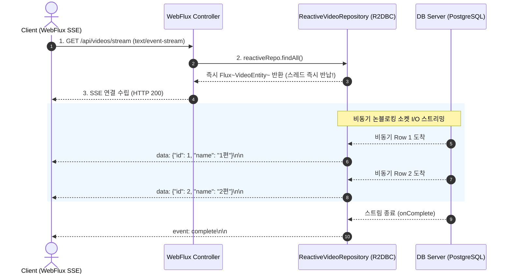

# R2DBC와 리액티브 데이터베이스 논블로킹 접근

## 한눈에 보기
| 항목 | 전통적 데이터 접근 (JPA / JDBC) | 리액티브 데이터 접근 (R2DBC) |
|------|--------------------------------|------------------------------|
| I/O 실행 모델 | 블로킹 (DB 응답까지 스레드 대기) | 논블로킹 비동기 (이벤트 기반 소켓 통신) |
| 반환 타입 | `List<T>`, `Optional<T>` | `Flux<T>` (0..N 스트림), `Mono<T>` (0..1) |
| 핵심 컴포넌트 | `JpaRepository`, `EntityManager` | `ReactiveCrudRepository`, `R2dbcEntityTemplate` |

## 1. 왜 이게 필요한가

### 이런 상황을 상상해 보자
수만 명의 동시 접속자가 실시간으로 동영상 목록을 스트리밍 조회하는 고성능 리액티브 웹 애플리케이션을 구축하고 있다. 웹 계층은 Spring WebFlux로 완벽한 논블로킹 비동기 이벤트 루프를 구축했다.

```java
public interface ReactiveVideoRepository extends ReactiveCrudRepository<VideoEntity, Long> {
    Flux<VideoEntity> findByNameContainsIgnoreCase(String name);
}
```

이제 컨트롤러에서 리포지토리를 호출하여 `Flux<VideoEntity>` 데이터 스트림을 클라이언트로 실시간 흘려보내려 한다.

### 여기서 뭐가 무너지나
웹 계층이 아무리 논블로킹 리액티브(WebFlux)로 짜여 있어도, 데이터베이스 통신에 전통적인 JDBC나 JPA/Hibernate를 쓰는 순간 모든 이점이 파괴된다. JDBC 드라이버는 본질적으로 소켓 I/O가 끝날 때까지 CPU 스레드를 차단(Block)하는 구조이기 때문이다. 소수의 이벤트 루프 스레드가 DB 응답을 기다리며 멈춰 서면, 전체 서버의 모든 동시 요청 처리가 마비되는 "리액티브 체인 단절" 현상이 발생한다.

### 그래서 나온 생각
관계형 데이터베이스(PostgreSQL, MySQL, H2, Oracle)와의 네트워크 통신 자체를 완전한 논블로킹 비동기 Reactive Streams 표준으로 재설계한 **[[알투디비씨]]**(= 관계형 DB와 완전한 논블로킹 통신을 수행하는 리액티브 드라이버 규격, R2DBC)를 도입했다.

스프링 데이터 R2DBC는 기존의 **[[제이피에이-리포지토리]]**(= 전통적 JPA 리포지토리)와 동일한 감각으로 사용할 수 있는 `ReactiveCrudRepository`를 제공하며, 모든 쿼리 결과를 스레드 차단 없이 `Mono`와 `Flux` 스트림으로 발행한다.

쉽게 비유하자면, 식당의 비동기 호출 벨 시스템과 같다. 손님(웹 요청)이 음식을 주문했을 때 주방(DB) 앞에서 음식이 완성될 때까지 서서 기다리는 것(블로킹 JDBC)이 아니라, 진동벨(Mono/Flux 스트림)을 받아 자리로 돌아간다. 주방에서 음식이 완성되면 진동벨이 울려(비동기 데이터 발행) 음식을 수령하므로, 카운터 직원(이벤트 루프 스레드)은 단 1초도 멈추지 않고 다른 수백 명의 손님 주문을 연속해서 받을 수 있다.

→ 비유가 깨지는 지점: 식당 진동벨은 음식이 한 번에 나오지만, R2DBC의 `Flux` 스트림은 데이터베이스에서 검색된 수천 개의 레코드를 메모리에 한꺼번에 올리지 않고 버퍼가 준비되는 대로 1개씩 실시간 백프레셔(Backpressure)를 조절하며 파이프라인으로 흘려보낸다.

## 2. 어떻게 동작하는가
1. **R2DBC 커넥션 팩토리 연결**: 애플리케이션 시작 시 `ConnectionFactory`가 비동기 소켓 채널을 열어 데이터베이스와 논블로킹 연결 풀을 수립한다 — 스레드 블로킹 없는 I/O 파이프라인을 준비하기 위해서다.
2. **리포지토리 메서드 호출 (`findByName`)**: 서비스 계층에서 `repository.findByName("Spring")`을 호출하면 즉시 `Flux<VideoEntity>` 퍼블리셔 객체가 반환된다 — 쿼리 완료를 기다리지 않고 스레드를 즉시 다음 작업으로 반환하기 위해서다.
3. **논블로킹 SQL 전송 및 이벤트 대기**: R2DBC 드라이버가 데이터베이스로 SQL 쿼리 바이트 스트림을 전송하고, OS의 비동기 I/O(epoll/kqueue) 이벤트 루프에 콜백을 등록한다 — DB가 연산하는 동안 CPU 스레드가 다른 HTTP 요청을 처리하게 하기 위해서다.
4. **결과 행(Row) 스트리밍 수신**: DB가 레코드를 인출하여 소켓으로 보내오면, 드라이버가 패킷을 수신하여 자바 **[[엔티티]]** 인스턴스로 조립하고 `Flux`의 `onNext()` 이벤트를 발행한다 — 대용량 데이터 조회 시에도 메모리 점유율을 일정하게 유지하기 위해서다.
5. **WebFlux 스트리밍 응답 (SSE / JSON Stream)**: WebFlux 컨트롤러는 이 `Flux`를 받아 클라이언트 웹 브라우저로 `text/event-stream` 또는 NDJSON 포맷으로 한 줄씩 실시간 전송한다 — 최종 사용자에게 데이터가 조회되는 족족 즉각적인 화면 반응을 제공하기 위해서다.

## 3. 그림으로 보기



## 4. 이 노트에 나온 용어
| 용어 | 한 줄 풀이 | 용어집 링크 |
|------|------------|-------------|
| 알투디비씨 | 관계형 DB와 완전한 논블로킹 비동기 통신을 수행하는 리액티브 드라이버 규격 (R2DBC) | [[_glossary#알투디비씨]] |
| 제이피에이-리포지토리 | 전통적인 블로킹 JDBC 기반의 데이터 접근 리포지토리 | [[_glossary#제이피에이-리포지토리]] |
| 엔티티 | 데이터베이스 테이블과 매핑되는 도메인 객체 | [[_glossary#엔티티]] |
| 디티오 | 네트워크 전송 및 뷰 바인딩을 위한 불변 데이터 객체 | [[_glossary#디티오]] |

## 5. 자주 헷갈리는 것
- **JPA와 R2DBC의 공존 불가**: R2DBC는 JPA(Hibernate)의 상위 기술이 아니며 완전히 별개의 기술 스택이다. JPA의 핵심 기능인 지연 로딩(Lazy Loading), 더티 체킹, 1차 캐시는 블로킹 getter 호출을 전제로 설계되었기 때문에 논블로킹 R2DBC에서는 지원되지 않는다.
- **R2dbcEntityTemplate의 역할**: 리포지토리 인터페이스 외에 복잡한 동적 쿼리나 프로그래밍 방식의 세밀한 데이터 조작이 필요할 때는 `R2dbcEntityTemplate`을 주입받아 유려한(Fluent) API로 쿼리를 실행할 수 있다.

## 6. 언제 안 쓰나 / 경계
- **대다수의 일반적인 CRUD 비즈니스 애플리케이션**: 복잡한 테이블 연관관계와 객체 그래프 탐색이 주를 이루는 엔터프라이즈 애플리케이션에서는 R2DBC의 리액티브 학습 곡선보다, Java 25 가상 스레드(Virtual Threads, `05-async-reactive`)와 전통적인 JPA/Hibernate를 조합하는 것이 개발 생산성 면에서 훨씬 우수하다.

## 7. 연결
- [[01-spring-data-jpa-repositories]] — 전통적인 블로킹 JPA 데이터 접근 방식과 대칭되는 리액티브 논블로킹 대안 패러다임이다.
- [[03-derived-queries-and-pagination]] — R2DBC 리포지토리에서도 동일한 파생 쿼리 메서드 문법을 사용하여 `Flux` 및 `Mono`를 반환받을 수 있다.

## 8. 스스로 확인
1. Spring WebFlux 환경에서 전통적인 JDBC/JPA를 사용했을 때 전체 시스템 성능이 저하되는 근본적인 원인은 무엇인가?
2. R2DBC가 관계형 데이터베이스와의 통신에서 논블로킹 I/O와 백프레셔(Backpressure)를 달성하는 원리는 무엇인가?
3. JPA의 지연 로딩(Lazy Loading)이 R2DBC에서는 지원되지 않는 아키텍처적 이유는 무엇인가?

<!-- ==== 아래는 내 영역 · 스킬 수정 금지 ==== -->

## 내 설명 시도

## 막혔던 지점

## 리뷰 이력
