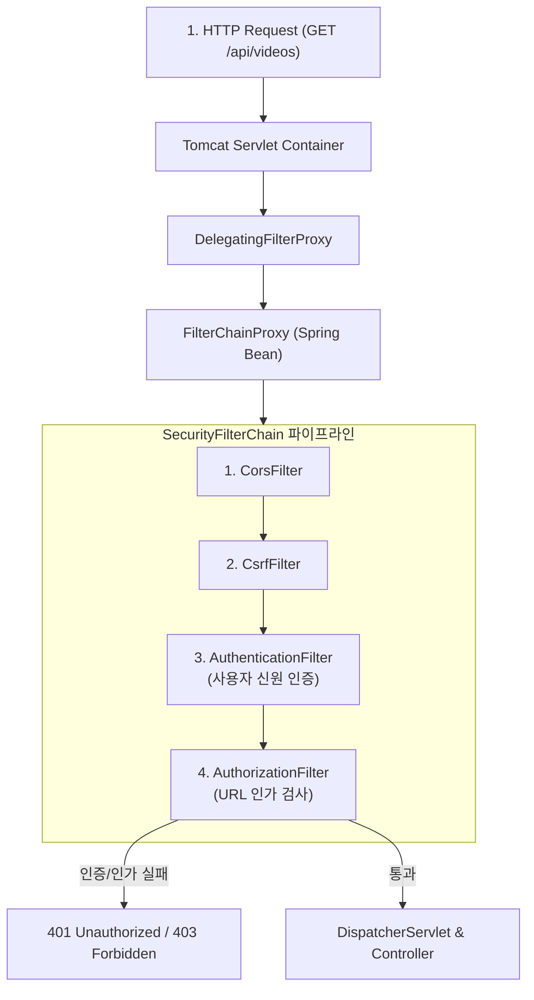

# Spring Security 7 아키텍처와 SecurityFilterChain

## 한눈에 보기
| 개념 | 역할 | 구현 방식 |
|------|------|-----------|
| `DelegatingFilterProxy` | 서블릿 필터와 스프링 컨테이너 빈 연결 | 서블릿 컨테이너에 등록되어 요청을 Spring 빈인 FilterChainProxy로 위임 |
| `SecurityFilterChain` | HTTP 보안 규칙을 정의하는 필터 체인 빈 | 람다 DSL 기반의 `http.authorizeHttpRequests(...).formLogin(...)` 구성 |
| SecurityContextHolder | 현재 인증된 사용자(Principal) 정보 보관 | 스레드 로컬(ThreadLocal) 기반으로 전 계층에서 인증 객체 접근 가능 |

## 1. 왜 이게 필요한가

### 이런 상황을 상상해 보자
동영상 웹 애플리케이션에 `spring-boot-starter-security` 스타터 의존성을 추가하고 아무런 추가 설정 없이 서버를 실행한 뒤 `http://localhost:8080`에 접속했다. 브라우저 화면에는 내가 만든 메인 페이지 대신 스프링 시큐리티가 자동 생성한 로그인 폼 화면이 뜨고, 터미널 콘솔에는 임의로 생성된 무작위 비밀번호 문자열이 출력된다.

이처럼 애플리케이션의 모든 엔드포인트를 기본적으로 굳게 걸어 잠그고 안전한 필터 검문을 수행하는 아키텍처를 **[[보안-필터체인]]**(= 서블릿 요청을 가로채어 인증과 인가를 순차적으로 수행하는 필터 파이프라인)이라 한다.

### 여기서 뭐가 무너지나
보안 프레임워크가 없다면, 개발자는 컨트롤러 메서드마다 `if (session.getAttribute("user") == null)` 세션 검사 코드를 수작업으로 붙여야 한다. 실수로 컨트롤러 하나에 검사 로직을 빼먹는 순간 해커가 인증 없이 관리자 API를 호출하는 치명적인 보안 구멍이 발생한다.

또한 과거 스프링 시큐리티의 XML이나 구형 체계에서는 보안 필터의 순서와 우선순위를 파악하기 어려워 필터 충돌로 인한 403 에러 디버깅에 수많은 시간을 낭비했다.

### 그래서 나온 생각
Spring Security는 서블릿 컨테이너(Tomcat)로 들어오는 모든 요청을 가장 앞단에서 가로채는 필터 체인 구조를 설계했다. 

먼저 사용자가 누구인지 신원을 확인하는 **[[인증]]**(= 사용자의 신원을 증명하는 프로세스)을 거치고, 인증된 사용자에게 해당 URL에 접근할 자격이 있는지 확인하는 **[[인가]]**(= 자원에 대한 접근 권한을 확인하는 프로세스)를 순차적으로 수행한다.

Spring Boot 4에서는 람다 DSL 스타일의 `SecurityFilterChain` `@Bean` 설정을 통해, 복잡한 상속 없이 함수형으로 간결하고 직관적인 보안 규칙을 구성할 수 있게 되었다.

쉽게 비유하자면, 공항의 다단계 출국 보안 검색대와 같다. 공항 터미널(서블릿 컨테이너)에서 비행기 탑승 게이트(비즈니스 컨트롤러)로 가려면 반드시 보안 검색 라인(SecurityFilterChain)을 통과해야 한다. 첫 번째 부스에서 여권과 신분증(인증)을 대조하여 본인임을 확인하고, 두 번째 게이트에서 비행기 티켓 등급(인가)을 확인하여 퍼스트 클래스 라운지나 일반 탑승구로 안내하는 것과 같다.

→ 비유가 깨지는 지점: 공항 검색대는 물리적 대기 줄이 길어지면 병목이 발생하지만, 스프링 시큐리티의 필터 체인은 메모리 상에서 비트 연산 및 해시 맵 조회로 마이크로초 단위로 초고속 검증을 마치며 통과된 사용자 정보를 `SecurityContextHolder`에 캐싱하여 재검사 비용을 없앤다.

## 2. 어떻게 동작하는가
1. **HTTP 요청 가로채기 (DelegatingFilterProxy)**: 서블릿 컨테이너로 들어온 요청을 `DelegatingFilterProxy`가 가로채 스프링 컨테이너의 `FilterChainProxy` 빈으로 넘긴다 — 서블릿 생태계와 스프링 IoC 빈 생태계를 매끄럽게 연결하기 위해서다.
2. **SecurityFilterChain 순회**: 등록된 보안 필터들(UsernamePasswordAuthenticationFilter, CsrfFilter, AuthorizationFilter 등)이 순서대로 실행된다 — 인증, CSRF 방어, 세션 관리 규칙을 체계적으로 점검하기 위해서다.
3. **사용자 신원 인증 (AuthenticationManager)**: 로그인 요청이 들어오면 **[[유저-디테일즈-서비스]]**를 통해 DB에서 사용자를 조회하고, **[[패스워드-인코더]]**로 비밀번호 일치 여부를 검증한다 — 비밀번호 평문 유출 없이 안전하게 본인을 확인하기 위해서다.
4. **SecurityContext 저장**: 인증에 성공하면 사용자의 신원과 권한 목록이 담긴 `Authentication` 토큰 객체를 생성하여 `SecurityContextHolder`에 저장한다 — 이후 서비스 계층과 뷰 템플릿 어디서든 로그인 사용자 정보에 즉시 접근할 수 있게 하기 위해서다.
5. **인가 평가 및 디스패처 서블릿 통과**: `AuthorizationFilter`가 요청된 URL의 권한 규칙(예: `.requestMatchers("/admin/**").hasRole("ADMIN")`)을 검사하여 합격하면 비로소 디스패처 서블릿과 컨트롤러로 요청을 통과시킨다 — 미인가 사용자의 비즈니스 접근을 원천 차단하기 위해서다.

## 3. 그림으로 보기

## 4. 이 노트에 나온 용어
| 용어 | 한 줄 풀이 | 용어집 링크 |
|------|------------|-------------|
| 보안-필터체인 | 서블릿 요청을 가로채 인증/인가를 순차 수행하는 필터 파이프라인 | [[_glossary#보안-필터체인]] |
| 인증 | 사용자가 주장하는 본인이 맞는지 신원을 증명하는 프로세스 (Who you are) | [[_glossary#인증]] |
| 인가 | 인증된 사용자가 특정 자원에 접근할 권한이 있는지 검증하는 프로세스 (What you can do) | [[_glossary#인가]] |
| 유저-디테일즈-서비스 | DB 등 저장소에서 사용자 신원과 권한 정보를 조회하는 표준 인터페이스 | [[_glossary#유저-디테일즈-서비스]] |
| 패스워드-인코더 | 비밀번호를 단방향 암호화 해시로 안전하게 변환하고 검증하는 인터페이스 | [[_glossary#패스워드-인코더]] |

## 5. 자주 헷갈리는 것
- **인증(Authentication)과 인가(Authorization)의 차이**: 인증은 "당신이 누구인가(로그인)"를 확인하는 것이고, 인가는 "당신이 이 페이지에 들어갈 수 있는가(권한 확인)"를 결정하는 것이다. 인증이 선행되어야 인가를 수행할 수 있다.
- **`SecurityContextHolder`의 기본 전략**: 기본적으로 `MODE_THREADLOCAL`을 사용하여 각 HTTP 요청 스레드마다 독립된 보안 컨텍스트를 유지하므로, 멀티스레드 환경에서도 사용자 간 정보 혼선이 발생하지 않는다.

## 6. 언제 안 쓰나 / 경계
- **공개 정적 리소스 (css, js, images)**: 정적 파일까지 모든 보안 필터를 태우면 불필요한 성능 오버헤드가 발생하므로, `webSecurityCustomizer`나 `permitAll()`을 통해 정적 리소스는 필터 체인을 즉시 통과하도록 설정해야 한다.

## 7. 연결
- [[02-authentication-user-details-service]] — 필터 체인이 사용자 인증을 수행할 때 UserDetailsService와 PasswordEncoder를 호출하는 세부 구현으로 이어진다.
- [[03-authorization-and-method-security]] — 필터 체인의 URL 기반 인가에서 더 나아가 비즈니스 메서드 수준의 세밀한 권한 제어로 확장된다.

## 8. 스스로 확인
1. 서블릿 컨테이너(Tomcat)의 일반 Filter와 스프링 빈으로 관리되는 SecurityFilterChain을 연결해 주는 브리지 컴포넌트의 이름과 역할은 무엇인가?
2. 인증(Authentication)과 인가(Authorization)의 명확한 차이점을 현실의 비유를 들어 30초로 설명할 수 있는가?
3. Spring Security에서 람다 DSL을 이용해 커스텀 `SecurityFilterChain` 빈을 정의하는 기본 구조는 어떻게 되는가?

<!-- ==== 아래는 내 영역 · 스킬 수정 금지 ==== -->

## 내 설명 시도

## 막혔던 지점

## 리뷰 이력
