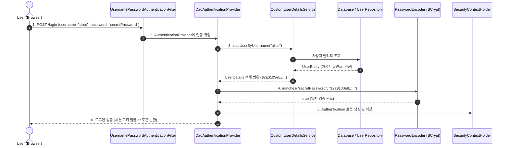

# UserDetailsService와 PasswordEncoder 기반 인증

## 한눈에 보기
| 컴포넌트 | 핵심 인터페이스 / 메서드 | 역할 |
|----------|--------------------------|------|
| `UserDetailsService` | `UserDetails loadUserByUsername(String username)` | DB에서 사용자 계정, 암호화된 비밀번호, 권한 목록을 조회 |
| `PasswordEncoder` | `String encode(CharSequence raw)`, `boolean matches(...)` | 비밀번호의 안전한 단방향 해시화 및 솔트(Salt) 기반 일치 검증 |
| `UserDetails` | `getUsername()`, `getPassword()`, `getAuthorities()` | Spring Security가 이해하는 표준 사용자 신원 인터페이스 |

## 1. 왜 이게 필요한가

### 이런 상황을 상상해 보자
동영상 서비스에 수만 명의 실제 고객이 회원가입을 하고 로그인을 해야 한다. 초기 프로토타입에서는 `InMemoryUserDetailsManager`에 `"user"`, `"password"`를 하드코딩해 두었지만, 이제 실제 데이터베이스의 `users` 테이블과 연동하여 동적으로 로그인을 처리해야 한다.

```java
@Service
public class CustomUserDetailsService implements UserDetailsService {
    private final UserRepository userRepository;

    public CustomUserDetailsService(UserRepository userRepository) {
        this.userRepository = userRepository;
    }

    @Override
    public UserDetails loadUserByUsername(String username) {
        return userRepository.findByUsername(username)
            .map(user -> User.withUsername(user.getUsername())
                .password(user.getPassword())
                .roles(user.getRoles())
                .build())
            .orElseThrow(() -> new UsernameNotFoundException("User not found: " + username));
    }
}
```

이때 사용자의 비밀번호를 데이터베이스에 어떻게 저장하고 검증해야 안전한가의 문제가 핵심이 된다.

### 여기서 뭐가 무너지나
첫째, **평문(Plaintext) 비밀번호 저장의 대재앙이다.** 데이터베이스에 비밀번호를 `"1234"` 그대로 저장하면, DB가 해킹당하거나 내부 관리자 로그를 통해 수많은 사용자의 패스워드가 통째로 유출된다. 사용자는 여러 사이트에서 동일한 비밀번호를 재사용하므로 연쇄 피해가 발생한다.

둘째, **단순 MD5/SHA-256 해시의 취약성이다.** 단순 해시는 레인보우 테이블(Rainbow Table, 미리 계산된 해시값 사전) 공격이나 GPU 무차별 대입 공격에 몇 초 만에 뚫려버린다.

### 그래서 나온 생각
Spring Security는 사용자 저장소의 위치(JPA, MyBatis, LDAP, NoSQL)에 상관없이 단 하나의 표준 조회 메서드만 구현하도록 **[[유저-디테일즈-서비스]]**(= 아이디로 사용자 신원과 암호화된 비밀번호를 조회하는 표준 인터페이스)를 추상화했다.

동시에 비밀번호를 저장할 때마다 무작위 솔트(Salt)를 자동 생성하여 추가하고 수천 번의 키 스트레칭(Key Stretching)을 수행하는 적응형 단방향 암호화 인터페이스인 **[[패스워드-인코더]]**(= 비밀번호를 BCrypt/Argon2로 해시화하고 검증하는 인터페이스, `PasswordEncoderFactories.createDelegatingPasswordEncoder()`)를 필수화했다.

쉽게 비유하자면, 은행 금고의 디지털 도어록과 같다. 고객이 비밀번호 "1234"를 등록하면, 금고(데이터베이스)는 "1234"를 기억하는 것이 아니라 고유한 모래 알갱이(솔트)를 섞어 갈아 만든 독특한 합금 조각(BCrypt 해시값)만 보관한다. 나중에 고객이 "1234"를 누르면 도어록(PasswordEncoder)이 동일한 방식으로 새 합금을 만들어 금고 속 조각과 모양이 같은지(matches)만 비교한다. 도어록을 분해해도 원래 번호 "1234"는 결코 역추적할 수 없다.

→ 비유가 깨지는 지점: 물리적 금고는 열쇠가 하나지만, 스프링 시큐리티의 `PasswordEncoder`는 동일한 비밀번호 "1234"를 가진 두 명의 사용자에게 매번 서로 완전히 다른 무작위 솔트 기반 해시 문자열을 생성하므로 두 사람의 DB 저장값이 완전히 달라진다.

## 2. 어떻게 동작하는가
1. **로그인 요청 및 폼 데이터 수신**: 사용자가 아이디(`username`)와 평문 비밀번호(`password`)를 제출하면 **[[보안-필터체인]]**의 `UsernamePasswordAuthenticationFilter`가 가로챈다 — 인증 토큰을 생성하기 위해서다.
2. **UserDetailsService 조회**: `AuthenticationProvider`가 **[[유저-디테일즈-서비스]]**의 `loadUserByUsername()`을 호출하여 DB로부터 사용자의 `UserDetails`를 가져온다 — 저장된 암호화 해시 비밀번호와 권한 목록을 확보하기 위해서다.
3. **PasswordEncoder 비밀번호 검증**: `passwordEncoder.matches(rawPassword, encodedPassword)`가 실행되어 사용자가 입력한 평문 암호에 DB에 저장된 솔트를 적용하여 해시를 재계산하고 대조한다 — 평문 암호와 해시 암호의 일치 여부를 안전하게 확인하기 위해서다.
4. **인증 토큰 생성 및 세션 등록**: 비밀번호가 일치하면 사용자의 신원과 부여된 권한(Roles/Authorities)이 포함된 `UsernamePasswordAuthenticationToken`을 생성하고 `SecurityContextHolder`에 보관한다 — 로그인 **[[인증]]**을 완료하고 이후 요청에서 로그인 상태를 유지하기 위해서다.

## 3. 그림으로 보기



## 4. 이 노트에 나온 용어
| 용어 | 한 줄 풀이 | 용어집 링크 |
|------|------------|-------------|
| 유저-디테일즈-서비스 | DB 등에서 사용자 신원과 암호화된 비밀번호를 조회하는 표준 인터페이스 | [[_glossary#유저-디테일즈-서비스]] |
| 패스워드-인코더 | 비밀번호를 단방향 암호화 해시(BCrypt)로 안전하게 변환 및 검증하는 인터페이스 | [[_glossary#패스워드-인코더]] |
| 인증 | 사용자가 주장하는 본인이 맞는지 자격 증명을 통해 확인하는 절차 | [[_glossary#인증]] |
| 보안-필터체인 | 서블릿 요청을 가로채어 인증 필터를 구동하는 스프링 시큐리티 파이프라인 | [[_glossary#보안-필터체인]] |

## 5. 자주 헷갈리는 것
- **`{bcrypt}`, `{noop}` 접두사 (DelegatingPasswordEncoder)**: Spring Security의 기본 PasswordEncoder는 `{bcrypt}$2a$10$...`, `{argon2}$...`처럼 해시 문자열 앞에 알고리즘 식별자 접두사를 붙여, 구형 암호화 방식을 점진적으로 최신 알고리즘으로 자동 마이그레이션할 수 있게 지원한다.
- **Role과 Authority의 차이**: Spring Security에서 `hasRole("ADMIN")`은 내부적으로 `ROLE_ADMIN`이라는 접두사가 붙은 권한(Authority)을 검사하는 편의 메서드이며, `hasAuthority("OP_DELETE")`는 접두사 없이 정확한 권한 문자열을 대조한다.

## 6. 언제 안 쓰나 / 경계
- **Stateless JWT 또는 OAuth 2.0 리소스 서버**: 세션 기반 폼 로그인이 아니라 JWT 토큰을 사용하는 분산 마이크로서비스 환경에서는 매 요청마다 DB의 `UserDetailsService`를 조회하면 DB 병목이 생기므로, 토큰 자체의 서명과 클레임(Claim)을 검증하여 인증 객체를 생성하는 것이 표준이다.

## 7. 연결
- [[01-spring-security-architecture-filterchain]] — SecurityFilterChain 내부의 AuthenticationProvider가 UserDetailsService와 PasswordEncoder를 조율한다.
- [[03-authorization-and-method-security]] — 인증된 UserDetails의 권한 목록을 기반으로 세밀한 메서드 수준 인가를 수행한다.

## 8. 스스로 확인
1. 데이터베이스에 비밀번호를 단순 해시가 아니라 솔트(Salt)가 포함된 적응형 해시(BCrypt)로 저장해야 하는 보안적 이유는 무엇인가?
2. `UserDetailsService` 인터페이스가 데이터베이스 접근 기술(JPA, MyBatis, NoSQL)과 스프링 시큐리티 인증 엔진 사이에서 수행하는 추상화 역할은 무엇인가?
3. `passwordEncoder.matches()`가 원본 비밀번호를 복호화하지 않고도 일치 여부를 검증하는 원리를 설명할 수 있는가?

<!-- ==== 아래는 내 영역 · 스킬 수정 금지 ==== -->

## 내 설명 시도

## 막혔던 지점

## 리뷰 이력
