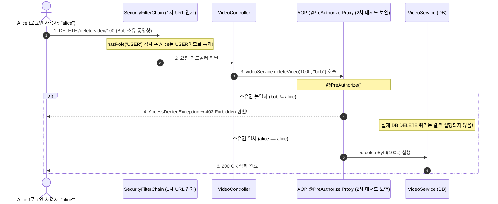

# HTTP 인가 규칙과 메서드 수준 소유권 보안

## 한눈에 보기
| 인가 계층 | 선언 위치 / 방식 | 보안 검증 범위 |
|-----------|-----------------|----------------|
| 웹 URL / HTTP Verb 인가 | `http.authorizeHttpRequests(auth -> auth.requestMatchers(POST, "/admin/**").hasRole("ADMIN"))` | 거친 입도(Coarse-grained) 보안: URL 경로와 HTTP 메서드 기반 접근 통제 |
| 메서드 수준 보안 (Method Security) | `@PreAuthorize("#username == authentication.name or hasRole('ADMIN')")` | 세밀한 입도(Fine-grained) 보안: 실제 데이터 엔티티의 작성자/소유권 일치 검증 |

## 1. 왜 이게 필요한가

### 이런 상황을 상상해 보자
동영상 공유 웹 플랫폼에서 사용자가 자신이 업로드한 동영상을 삭제하는 기능을 제공하려 한다. 웹 URL 인가 규칙으로 "동영상 삭제 API(`/delete-video/{id}`)는 로그인한 사용자(ROLE_USER)만 접근 가능"하게 설정해 두었다.

```java
// Alice로 로그인한 사용자가 Bob이 올린 동영상 ID(100번)의 삭제 버튼을 눌렀다!
```

Alice는 정당하게 로그인한 일반 사용자(ROLE_USER)이므로 URL 보안 검문대를 통과한다. 만약 컨트롤러나 서비스 계층에서 "이 동영상의 진짜 소유자가 Alice인가?"를 검증하지 않는다면, Alice가 Bob의 동영상을 무단 삭제해 버리는 심각한 보안 사고가 발생한다.

### 여기서 뭐가 무너지나
URL 기반 인가만으로는 "특정 리소스 인스턴스의 작성자 본인인가(Data Ownership)?"를 판별할 수 없다. URL은 오직 요청 경로(`/delete-video/100`)와 사용자의 역할(`ROLE_USER`)만 볼 수 있을 뿐, 100번 동영상이 데이터베이스에서 누구의 소유인지 비즈니스 데이터를 알지 못하기 때문이다.

서비스 메서드마다 `if (!video.getOwner().equals(currentUser))` 코드를 개발자가 일일이 수작업으로 작성하다 보면, 실수로 누락된 단 하나의 엔드포인트를 통해 악의적인 사용자가 타인의 자원을 탈취/변조하는 BOLA(Broken Object Level Authorization) 취약점이 발생한다.

### 그래서 나온 생각
Spring Security는 URL 검문을 넘어 자바 비즈니스 메서드가 호출되는 바로 그 순간 메서드 파라미터와 현재 로그인 사용자 정보를 대조하여 실행 여부를 결정하는 **[[메서드-수준-보안]]**(= `@PreAuthorize` 등의 어노테이션으로 데이터 소유권과 세밀한 권한을 검증하는 보안 체계)을 제공한다.

개발자는 `@EnableMethodSecurity`를 켜고, 메서드 위에 SpEL(Spring Expression Language)을 활용하여 `@PreAuthorize("#username == authentication.name")` 한 줄만 선언하면 된다. 프레임워크는 AOP 프록시를 통해 메서드 진입 직전에 소유권을 검증하고, 일치하지 않으면 즉시 403 Forbidden(AccessDeniedException)을 던져 비즈니스 로직 실행을 완벽히 차단한다.

쉽게 비유하자면, 아파트 단지의 2단계 보안 시스템과 같다. 단지 정문 차단기(URL 기반 인가)는 입주민 카드(ROLE_USER)만 있으면 누구에게나 문을 열어준다. 하지만 각 세대의 개별 현관문(메서드 수준 보안)은 정문을 통과한 입주민이라도 오직 해당 호수의 진짜 주인(소유권 일치)의 지문이나 열쇠로만 열 수 있는 것과 같다.

→ 비유가 깨지는 지점: 아파트 현관문은 열쇠가 물리적으로 필요하지만, 메서드 수준 보안은 스프링 시큐리티의 SpEL 표현식 엔진이 런타임에 메모리의 `SecurityContextHolder`와 메서드 아규먼트 객체를 동적으로 인터셉트하여 나노초 단위로 평가한다.

## 2. 어떻게 동작하는가
1. **`@EnableMethodSecurity` 활성화**: 설정 클래스에 어노테이션을 부여하여 스프링 빈들의 메서드 보안 AOP 인터셉터를 가동한다 — 서비스 및 리포지토리 계층의 모든 메서드 호출을 감시하기 위해서다.
2. **HTTP 요청 수신 및 1차 URL 검문**: **[[보안-필터체인]]**의 `AuthorizationFilter`가 URL 경로와 HTTP 메서드(GET, POST, DELETE)에 따른 기본 역할(Role)을 점검한다 — 비로그인자나 미인증 접근을 웹 계층에서 1차 차단하기 위해서다.
3. **서비스 메서드 호출 및 SpEL 평가**: 컨트롤러가 서비스의 `deleteVideo(Long id, String username)`를 호출하면, 스프링 시큐리티의 AOP 프록시가 가로채어 `@PreAuthorize` 안의 SpEL 표현식을 평가한다 — 메서드 실행 전에 소유자 일치 여부를 판별하기 위해서다.
4. **인증 주체 대조 (`authentication.name`)**: 현재 `SecurityContextHolder`에 담긴 로그인된 사용자(Alice)와 메서드 인자로 넘어온 데이터 소유자(`username`)가 일치하는지 확인한다 — 본인의 자원만 수정/삭제할 수 있도록 강제하기 위해서다.
5. **인가 승인 또는 403 차단**: 소유권이 일치하면 비즈니스 로직(DB 삭제 SQL)을 실행하고, 일치하지 않으면 `AccessDeniedException`을 발생시켜 HTTP 403 Forbidden 응답을 클라이언트에 반환한다 — 타인의 데이터 훼손을 원천 방지하기 위해서다.

## 3. 그림으로 보기



## 4. 이 노트에 나온 용어
| 용어 | 한 줄 풀이 | 용어집 링크 |
|------|------------|-------------|
| 인가 | 인증된 사용자가 특정 자원에 접근할 수 있는 권한이 있는지 검증하는 프로세스 | [[_glossary#인가]] |
| 메서드-수준-보안 | `@PreAuthorize` 등을 통해 비즈니스 메서드 실행 직전 데이터 소유권을 검증하는 체계 | [[_glossary#메서드-수준-보안]] |
| 인증 | 사용자가 본인이 맞는지 신원을 증명하는 프로세스 | [[_glossary#인증]] |
| 보안-필터체인 | 서블릿 요청을 가로채어 1차 웹 URL 인가를 수행하는 필터 파이프라인 | [[_glossary#보안-필터체인]] |

## 5. 자주 헷갈리는 것
- **`@PreAuthorize` vs `@PostAuthorize`**: `@PreAuthorize`는 메서드가 실행되기 전에 인자를 검사하여 진입을 막고, `@PostAuthorize`는 메서드를 먼저 실행한 뒤 반환된 결과 객체(`returnObject`)의 소유자 필드를 검사하여 접근 권한을 판단한다.
- **Spring Security 7의 `@EnableMethodSecurity`**: 과거의 `@EnableGlobalMethodSecurity(prePostEnabled = true)`는 폐기(Deprecated)되었으며, 최신 표준인 `@EnableMethodSecurity`는 기본적으로 Pre/Post 어노테이션이 활성화되어 있어 훨씬 간결하다.

## 6. 언제 안 쓰나 / 경계
- **대량 리스트 필터링 시 성능 병목**: 수천 건의 데이터 목록을 조회할 때 `@PostFilter`로 메모리 상에서 하나씩 소유권을 검사하면 심각한 성능 저하가 발생하므로, 이때는 DB 쿼리 자체에 `WHERE owner = :username` 조건을 걸어 인출하는 것이 올바르다.

## 7. 연결
- [[01-spring-security-architecture-filterchain]] — 서블릿 필터체인의 1차 거친 입도(URL) 인가를 보완하는 2차 세밀한 입도(Method) 보안이다.
- [[02-authentication-user-details-service]] — UserDetailsService가 적재한 사용자의 신원(`authentication.name`)과 권한 목록이 SpEL 평가의 핵심 데이터가 된다.

## 8. 스스로 확인
1. URL 기반 인가 규칙만으로는 BOLA(Broken Object Level Authorization) 취약점을 막을 수 없는 이유는 무엇인가?
2. `@PreAuthorize("#owner == authentication.name")`가 메서드 실행 직전에 동작하여 403 Forbidden을 발생시키는 AOP 원리는 무엇인가?
3. Spring Security 7에서 메서드 보안을 활성화하는 표준 어노테이션은 무엇인가?

<!-- ==== 아래는 내 영역 · 스킬 수정 금지 ==== -->

## 내 설명 시도

## 막혔던 지점

## 리뷰 이력
