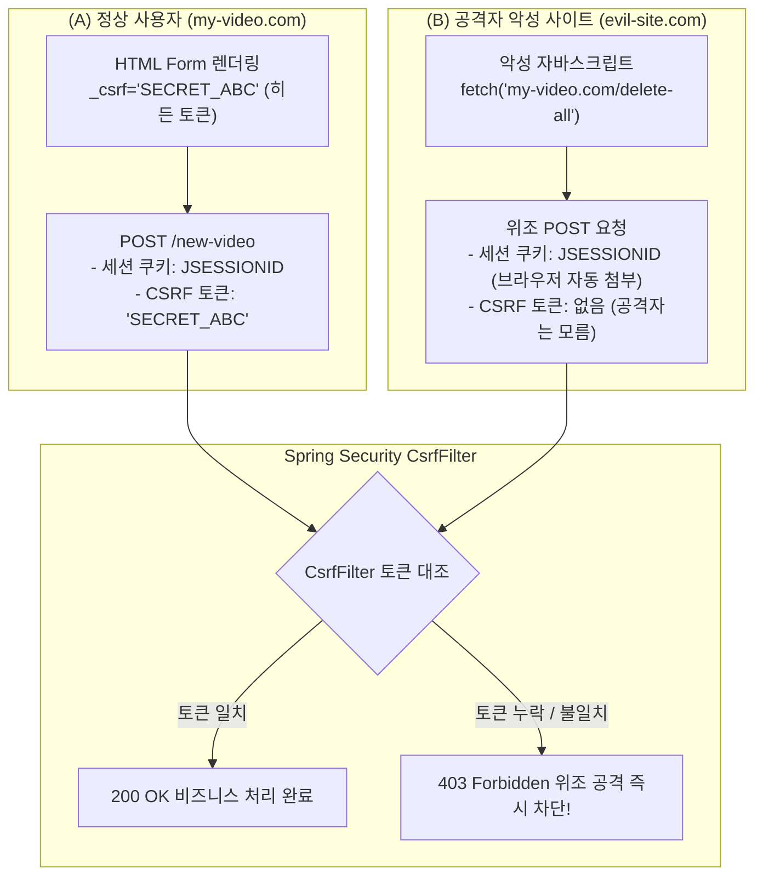

# CSRF 공격 방어와 세션 보안 메커니즘

## 한눈에 보기
| 애플리케이션 유형 | CSRF 활성화 여부 | 방어 메커니즘 |
|-------------------|------------------|---------------|
| 전통적 웹 앱 (Thymeleaf / 세션 쿠키 기반) | **반드시 활성화 (기본값)** | Synchronizer Token Pattern (HTML 폼 내 `_csrf` 히든 토큰 검증) |
| Stateless REST API (JWT / 모바일 앱) | **비활성화 (`csrf.disable()`)** | 쿠키를 사용하지 않고 `Authorization: Bearer` 헤더를 직접 검증 |

## 1. 왜 이게 필요한가

### 이런 상황을 상상해 보자
어떤 사용자가 인터넷 뱅킹이나 동영상 사이트(`my-video.com`)에 로그인한 상태에서 다른 탭을 열어 인터넷 서핑을 하다가 피싱 공격자가 만든 악성 사이트(`evil-site.com`)에 방문했다. 

악성 사이트에는 사용자가 모르게 백그라운드에서 `my-video.com/delete-all` 또는 송금 API로 `POST` 요청을 쏘는 숨겨진 자바스크립트 코드가 심어져 있었다. 브라우저는 `my-video.com`으로 요청을 보낼 때, 브라우저에 저장되어 있던 사용자의 로그인 세션 쿠키(`JSESSIONID`)를 자동으로 함께 실어 보낸다.

이처럼 사용자의 로그인된 브라우저 권한을 도용하여 원치 않는 악의적인 상태 변경 요청을 보내게 만드는 해킹 공격을 **[[크로스-사이트-요청-위조]]**(= 로그인 세션을 악용하여 제3자 사이트가 사용자를 사칭해 상태 변경 요청을 보내는 CSRF 취약점)라 부른다.

### 여기서 뭐가 무너지나
서버가 단순히 "요청에 유효한 세션 쿠키가 실려있는가?"만 확인한다면, 이 요청이 사용자가 진짜 내 웹 페이지 폼 버튼을 눌러서 보낸 것인지, 악성 사이트가 뒤에서 몰래 쏜 것인지 구분할 수 없다. 사용자의 모든 동영상이 삭제되거나 계좌의 전 재산이 공격자의 계좌로 이체되는 치명적인 재앙이 발생한다.

### 그래서 나온 생각
Spring Security는 브라우저가 자동으로 실어 보내는 쿠키 외에, 오직 우리 서버가 정상적으로 렌더링한 HTML 폼 화면을 통해서만 알 수 있는 일회성 무작위 난수 토큰(CSRF Token)을 발행하여 검증하는 "Synchronizer Token Pattern"을 기본 탑재했다.

서버는 `CsrfFilter`를 **[[보안-필터체인]]**(= 서블릿 보안 필터 파이프라인)에 배치하여, 상태를 변경하는 모든 HTTP 메서드(POST, PUT, DELETE, PATCH) 요청에 대해 올바른 `_csrf` 토큰이 함께 제출되었는지를 검사한다.

쉽게 비유하자면, 은행 창구의 일회용 비밀 번호표와 같다. 신분증(세션 쿠키)만 들고 은행에 들어왔다고 해서 돈을 인출할 수 없다. 은행 창구 직원이 방금 번호표 발급기에서 직접 뽑아준 진짜 번호표(CSRF 토큰)를 손에 쥐고 창구에 제출해야만 인출(상태 변경 작업)을 승인해 주는 것과 같다. 해커는 길 건너편에서 내 신분증을 복사해 보여줄 수는 있어도, 은행 내부에서 방금 출력된 실물 번호표는 결코 훔쳐낼 수 없다.

→ 비유가 깨지는 지점: 은행 번호표는 사람이 눈으로 확인하지만, 스프링 시큐리티의 `CsrfFilter`는 메모리나 세션에 저장된 암호학적 토큰 해시와 HTTP 요청 파라미터/헤더의 토큰 값을 상수 시간(Constant-time) 문자열 비교 알고리즘으로 대조하여 타이밍 공격까지 차단한다.

## 2. 어떻게 동작하는가
1. **CSRF 토큰 발행 및 저장**: 사용자가 로그인하거나 웹 페이지를 요청하면, 스프링 시큐리티는 무작위 UUID 난수를 생성하여 `CsrfToken` 객체를 만들고 사용자 세션(또는 쿠키)에 보관한다 — 위조 불가능한 일회성 대조 키를 준비하기 위해서다.
2. **HTML 폼 내 히든 필드 주입**: Thymeleaf 템플릿 엔진이 `<form th:action="@{/new-video}" method="post">`를 렌더링할 때, 내부적으로 `<input type="hidden" name="_csrf" value="토큰값"/>` 태그를 자동으로 삽입한다 — 사용자가 폼을 제출할 때 토큰이 함께 전송되도록 하기 위해서다.
3. **상태 변경 HTTP 요청 수신 (POST)**: 사용자가 등록 버튼을 누르면 브라우저가 세션 쿠키(`JSESSIONID`)와 함께 폼 데이터 속의 `_csrf` 토큰을 서버로 전송한다 — 데이터 저장 요청을 수행하기 위해서다.
4. **CsrfFilter 토큰 대조 검증**: **[[보안-필터체인]]**의 `CsrfFilter`가 요청 파라미터(`_csrf`) 또는 헤더(`X-CSRF-TOKEN`)에 담긴 값과 서버 세션의 원본 토큰을 비교한다 — 악성 제3자 사이트의 위조 요청인지 여부를 판별하기 위해서다.
5. **승인 또는 403 Invalid CSRF Token 거부**: 토큰이 완벽히 일치하면 컨트롤러로 요청을 넘겨 비즈니스를 수행하고, 토큰이 누락되었거나 일치하지 않으면 즉시 HTTP 403 Forbidden 에러로 요청을 즉각 파기한다 — 악의적인 요청으로부터 사용자의 데이터를 보호하기 위해서다.

## 3. 그림으로 보기

## 4. 이 노트에 나온 용어
| 용어 | 한 줄 풀이 | 용어집 링크 |
|------|------------|-------------|
| 크로스-사이트-요청-위조 | 사용자의 로그인 세션을 도용해 제3자 사이트가 위조 요청을 보내는 공격 (CSRF) | [[_glossary#크로스-사이트-요청-위조]] |
| 보안-필터체인 | 서블릿 요청을 가로채어 CSRF 검증 및 보안 필터를 구동하는 파이프라인 | [[_glossary#보안-필터체인]] |
| 인증 | 사용자가 본인이 맞는지 신원을 확인하는 절차 | [[_glossary#인증]] |
| 인가 | 인증된 사용자의 자원 접근 권한을 제어하는 절차 | [[_glossary#인가]] |

## 5. 자주 헷갈리는 것
- **REST API에서 CSRF를 끄는 이유 (`http.csrf(csrf -> csrf.disable())`)**: 모바일 앱이나 React SPA가 세션 쿠키 대신 `Authorization: Bearer <JWT>` 헤더를 사용하는 경우, 브라우저가 자동으로 헤더를 실어 보내지 않으므로 CSRF 공격 자체가 성립하지 않는다. 따라서 불필요한 토큰 검증 오버헤드를 없애기 위해 비활성화한다.
- **안전한 HTTP 메서드 (Safe Methods)**: GET, HEAD, OPTIONS, TRACE는 서버의 상태를 변경하지 않는 순수 조회 목적의 메서드이므로 `CsrfFilter`가 검증을 건너뛴다. (따라서 GET 요청으로 DB 삭제나 수정을 수행하도록 설계해서는 절대 안 된다).

## 6. 언제 안 쓰나 / 경계
- **공개 Webhook 수신 엔드포인트**: GitHub, Stripe 등 외부 서드파티 서비스가 우리 서버로 상태 변경 이벤트를 쏴주는 Webhook API는 CSRF 토큰을 알 수 없으므로, 해당 URL 경로만 `csrf.ignoringRequestMatchers("/webhook/**")`로 예외 처리해야 한다.

## 7. 연결
- [[01-spring-security-architecture-filterchain]] — SecurityFilterChain의 전면에서 모든 상태 변경 요청을 가장 먼저 검문하는 핵심 필터다.
- [[03-authorization-and-method-security]] — CSRF 검증을 통과한 요청이 이후 URL 인가 및 메서드 수준 소유권 인가로 이어진다.

## 8. 스스로 확인
1. 브라우저가 세션 쿠키를 자동으로 전송한다는 특성이 왜 CSRF 공격의 빌미가 되는지 설명할 수 있는가?
2. Synchronizer Token Pattern이 CSRF 위조 요청을 완벽하게 가려내는 원리는 무엇인가?
3. 세션 기반 템플릿 웹 앱에서는 CSRF를 반드시 켜야 하고, JWT 기반 Stateless REST API에서는 꺼도 안전한 이유는 무엇인가?

<!-- ==== 아래는 내 영역 · 스킬 수정 금지 ==== -->

## 내 설명 시도

## 막혔던 지점

## 리뷰 이력
