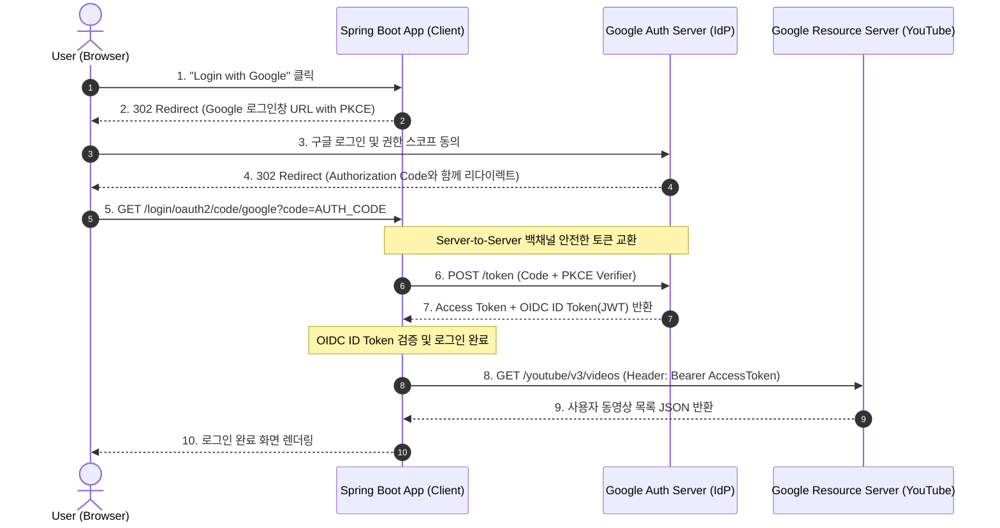

# OAuth 2.1 & OIDC 소셜 로그인과 원격 API 위임 호출

## 한눈에 보기
| 표준 프로토콜 | 주된 목적 | 발급되는 핵심 토큰 | 질문에 대한 답 |
|---------------|-----------|--------------------|----------------|
| OAuth 2.1 | 위임된 권한 인가 (Delegated Authorization) | Access Token (액세스 토큰, Scopes) | "이 앱이 사용자를 대신해 무슨 자원에 접근할 수 있는가?" |
| OpenID Connect (OIDC) | 사용자 신원 인증 (Identity Authentication) | ID Token (사용자 프로필 JWT) | "지금 로그인한 사용자가 정확히 누구인가?" |

## 1. 왜 이게 필요한가

### 이런 상황을 상상해 보자
새로 런칭하는 웹 서비스에서 사용자가 복잡하게 아이디와 비밀번호를 직접 회원가입하지 않고, 기존에 가지고 있는 구글(Google)이나 깃허브(GitHub) 계정으로 "1초 만에 간편 로그인"할 수 있게 하려 한다. 또한 사용자의 구글 드라이브나 유튜브에 업로드된 동영상 목록을 우리 서비스로 연동해 가져오려 한다.

```yaml
spring:
  security:
    oauth2:
      client:
        registration:
          google:
            client-id: ${GOOGLE_CLIENT_ID}
            client-secret: ${GOOGLE_CLIENT_SECRET}
            scope: openid, profile, email, https://www.googleapis.com/auth/youtube.readonly
```

개발자는 `application.yml`에 클라이언트 ID와 시크릿만 등록하고 `spring-boot-starter-oauth2-client`를 추가했다.

### 여기서 뭐가 무너지나
과거에는 외부 서비스의 데이터를 가져오기 위해 사용자에게 "구글 아이디와 비밀번호를 우리 사이트에 직접 입력하라"고 요구하는 위험천만한 안티패턴을 썼다. 이 경우 우리 서비스가 해킹당하면 사용자의 구글 본 계정 비밀번호가 통째로 털리고, 사용자 입장에서는 특정 권한(예: 동영상 조회만)만 부분적으로 허용할 방법이 없었다.

또한 OAuth 2.0 구형 스펙의 암시적 그랜트(Implicit Grant)는 브라우저 URL 해시 프래그먼트에 액세스 토큰을 그대로 노출하여 탈취당하는 보안 취약점이 있었다.

### 그래서 나온 생각
사용자의 비밀번호를 절대 서드파티 앱에 알려주지 않고, 신뢰할 수 있는 구글 인가 서버에서 직접 로그인한 뒤 특정 범위(Scope)의 권한만 담긴 일회용 토큰을 발급해 주는 **[[오픈오스]]**(= 비밀번호 공유 없이 권한을 위임하는 인가 표준, OAuth 2.1) 프레임워크를 도입했다. 최신 OAuth 2.1은 보안이 취약한 방식을 전면 폐기하고 PKCE(Proof Key for Code Exchange)가 적용된 인가 코드 흐름(Authorization Code Flow)만을 강제한다.

여기에 사용자 프로필 신원 정보를 안전하게 검증하기 위해 OAuth 2.1 기반 위에 표준 신원 레이어를 얹은 **[[오픈아이디-커넥트]]**(= OAuth 기반의 표준 사용자 신원 인증 프로토콜, OIDC)를 결합하여, 완벽한 소셜 로그인과 원격 API 호출을 동시에 달성했다.

쉽게 비유하자면, 호텔의 발레파킹 전용 열쇠(Valet Key)와 같다. 호텔 주차 요원(우리 애플리케이션)에게 내 자동차의 마스터 열쇠(구글 비밀번호)를 통째로 건네주면 차량 트렁크나 귀중품 보관함까지 다 열어볼 수 있어 위험하다. 대신 시동만 걸고 주차만 할 수 있는 제한된 기능의 발레파킹 열쇠(OAuth Access Token)를 건네주는 것이다. 그리고 호텔 직원의 신분증을 확인하는 절차가 바로 OIDC ID Token이다.

→ 비유가 깨지는 지점: 자동차 열쇠는 분실 시 물리적 회수가 어렵지만, OAuth 액세스 토큰은 유효기간(예: 1시간)이 만료되면 즉시 무효화되며, 사용자가 구글 계정 설정 화면에서 언제든지 해당 앱의 권한을 클릭 한 번으로 원격 취소(Revoke)할 수 있다.

## 2. 어떻게 동작하는가
1. **소셜 로그인 시작 (Redirect)**: 사용자가 "Google로 로그인" 버튼을 누르면, 스프링 시큐리티가 PKCE 코드 챌린지를 생성하고 브라우저를 구글 인가 서버의 로그인 창으로 리다이렉트한다 — 사용자가 안전한 구글 도메인에서 직접 비밀번호를 입력하게 하기 위해서다.
2. **사용자 동의 및 인가 코드 발급**: 사용자가 구글에서 로그인하고 권한 요청(프로필 조회, 유튜브 조회)을 승인하면, 구글 서버는 일회용 인가 코드(Authorization Code)를 브라우저를 통해 우리 백엔드 콜백 URL로 전달한다 — 브라우저에 민감한 액세스 토큰을 직접 노출하지 않기 위해서다.
3. **서버 간 토큰 교환 (Back-channel)**: 스프링 부트 백엔드 서버가 인가 코드를 들고 구글 토큰 엔드포인트로 직접 통신(Server-to-Server)하여 ID Token과 Access Token을 교환한다 — 중간자 공격에 의한 토큰 탈취를 원천 차단하기 위해서다.
4. **OIDC 신원 검증 및 사용자 등록**: 백엔드는 OIDC ID Token(JWT)의 전자서명을 검증하여 사용자의 이메일, 이름, 프로필 사진을 추출하고 **[[인증]]** 객체를 완성한다 — 별도의 비밀번호 입력 없이 회원 신원을 확인하기 위해서다.
5. **원격 API 호출 위임 (`OAuth2AuthorizedClient`)**: 컨트롤러나 서비스에서 `@RegisteredOAuth2AuthorizedClient("google")`을 주입받아 구글 YouTube REST API를 호출할 때 헤더에 `Authorization: Bearer <Access-Token>`을 실어 보낸다 — 사용자를 대신하여 안전하게 원격 리소스를 조회하기 위해서다.

## 3. 그림으로 보기



## 4. 이 노트에 나온 용어
| 용어 | 한 줄 풀이 | 용어집 링크 |
|------|------------|-------------|
| 오픈오스 | 비밀번호 공유 없이 서드파티 앱에 접근 권한을 안전하게 위임하는 인가 표준 | [[_glossary#오픈오스]] |
| 오픈아이디-커넥트 | OAuth 2.1 인가 프레임워크 위에 사용자 신원 인증 레이어를 추가한 표준 규격 | [[_glossary#오픈아이디-커넥트]] |
| 인증 | 사용자가 누구인지 신원을 확인하는 절차 (ID Token 검증) | [[_glossary#인증]] |
| 인가 | 사용자가 허용한 권한(Scope)에 따라 자원 접근을 통제하는 절차 (Access Token) | [[_glossary#인가]] |

## 5. 자주 헷갈리는 것
- **OAuth vs OIDC의 명확한 경계**: OAuth는 "무엇을 할 수 있는가(권한 위임)"를 다루므로 Access Token만 주고 사용자 이름이나 이메일은 표준화하지 않는다. 반면 OIDC는 "누구인가(신원 인증)"를 다루기 위해 표준화된 JWT 형태의 ID Token을 발급한다.
- **Access Token vs ID Token의 용도**: ID Token은 우리 애플리케이션 백엔드가 사용자를 로그인시키고 프로필을 읽는 용도로만 사용하며, 외부 원격 API(구글 캘린더, 유튜브 등)를 호출할 때는 반드시 Access Token을 `Bearer` 헤더에 담아야 한다.

## 6. 언제 안 쓰나 / 경계
- **외부 인터넷 연결이 차단된 폐쇄망 엔터프라이즈 환경**: 구글, 깃허브 등 외부 퍼블릭 IdP에 접근할 수 없는 폐쇄망 인트라넷에서는 사내 자체 인증 서버(Keycloak, Spring Authorization Server, 사내 사설 LDAP)를 구축하여 사내 SSO를 연동해야 한다.

## 7. 연결
- [[01-spring-security-architecture-filterchain]] — OAuth2LoginAuthenticationFilter가 필터체인에 통합되어 소셜 로그인 리다이렉트와 토큰 교환을 가로챈다.
- [[02-authentication-user-details-service]] — 전통적인 로컬 DB 패스워드 인증 방식을 대체하거나 소셜 계정과 연동(소셜 연동 매핑)하는 확장 구조를 이룬다.

## 8. 스스로 확인
1. 비밀번호를 직접 건네주는 방식과 비교하여 OAuth 2.1 인가 프레임워크가 가지는 보안적 강점은 무엇인가?
2. OAuth와 OpenID Connect(OIDC)의 기능적 차이점을 Access Token과 ID Token의 관점에서 설명할 수 있는가?
3. Authorization Code Flow에서 토큰 교환이 브라우저가 아닌 서버 간(Server-to-Server) 백채널로 일어나는 이유는 무엇인가?

<!-- ==== 아래는 내 영역 · 스킬 수정 금지 ==== -->

## 내 설명 시도

## 막혔던 지점

## 리뷰 이력
