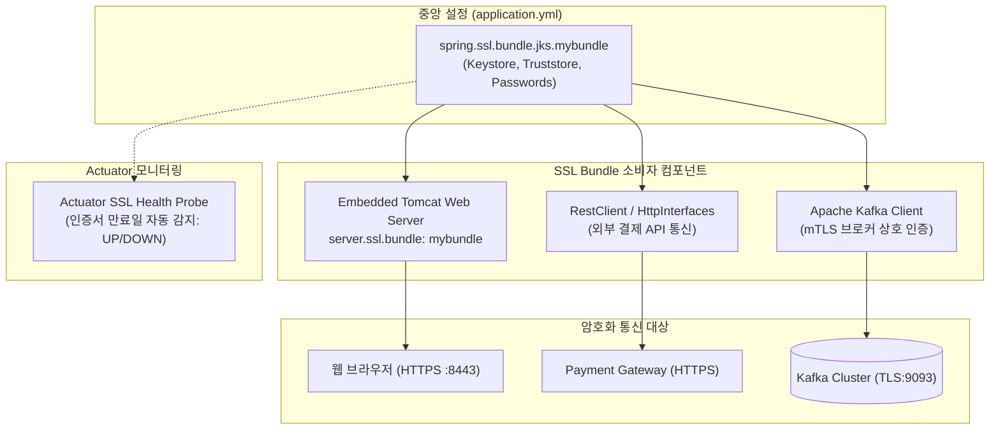

# SSL Bundles와 전송 및 저장 데이터 암호화

## 한눈에 보기
| 보안 영역 | 적용 기술 / 기능 | 보호하는 위협 |
|-----------|-----------------|---------------|
| 전송 중 데이터 보호 (In Transit) | HTTPS, TLS 1.3, SSL Bundles (`spring.ssl.bundle`) | 패킷 스니핑, 중간자(MITM) 도청 및 변조 공격 |
| 저장 데이터 보호 (At Rest) | 컬럼 레벨 AES 암호화, DB TDE (Transparent Data Encryption) | 물리적 DB 스토리지 탈취 및 원시 파일 유출 |
| 인증서 수명주기 관리 | Spring Boot 4 Actuator SSL Health Probe | 인증서 만료로 인한 서비스 전면 중단 사전 예방 |

## 1. 왜 이게 필요한가

### 이런 상황을 상상해 보자
동영상 서비스에서 사용자들의 신용카드 결제 정보나 주민번호, 비밀번호 등의 민감한 데이터를 다루고 있다. 사용자의 브라우저와 우리 서버 간의 통신, 그리고 우리 서버와 백엔드 데이터베이스 간의 통신을 완벽한 HTTPS/TLS 암호화 채널로 잠그려 한다.

```yaml
spring:
  ssl:
    bundle:
      jks:
        mybundle:
          key:
            alias: "mycert"
          keystore:
            location: "classpath:keystore.p12"
            password: "secretpassword"
            type: "PKCS12"
  security:
    ssl:
      bundle: "mybundle"
```

기존 스프링 부트에서는 웹 서버(Tomcat)의 SSL 설정과 원격 REST 클라이언트의 SSL 설정 프로퍼티가 제각각 분리되어 있어 키스토어 경로와 비밀번호를 여러 곳에 중복해서 복사해야 했다.

### 여기서 뭐가 무너지나
서버의 TLS 인증서가 갱신되거나 mTLS(상호 TLS) 환경에서 신뢰스토어(Truststore)를 교체할 때마다 프로젝트의 톰캣 설정, RestTemplate 설정, WebClient 설정, Kafka SSL 설정 코드를 일일이 찾아다니며 수정해야 했다.

또한 설정 파일에 오타가 있거나 인증서 유효기간 만료일을 깜빡 잊고 방치했다가, 어느 날 아침 전 세계 수백만 명의 사용자가 "안전하지 않은 연결" 경고 화면을 마주하며 서비스가 마비되는 대형 장애가 발생했다.

### 그래서 나온 생각
Spring Boot는 애플리케이션에 필요한 모든 키스토어, 신뢰스토어, PEM 파일, 암호화 키를 하나의 논리적인 이름(Alias)으로 묶어 중앙 관리하는 **[[에스에스엘-번들]]**(= 키스토어와 인증서 체인을 하나의 묶음으로 선언하여 웹 서버와 클라이언트에 공유 적용하는 기능)을 도입했다.

개발자는 이제 `mybundle`이라는 이름으로 번들을 한 번만 정의해 두면, 내장 톰캣 웹 서버(`server.ssl.bundle=mybundle`), RestClient, Kafka 클라이언트에 동일한 인증서 설정을 한 줄로 재사용할 수 있다.

또한 Spring Boot 4에서는 액추에이터(Actuator) 헬스 엔드포인트에 SSL 인증서 만료일 자동 감지 프로브가 기본 통합되어, 인증서가 만료되기 전에 모니터링 시스템에서 사전 경고를 받을 수 있게 되었다.

쉽게 비유하자면, 종합 보안 마스터 키 링(Key-ring)과 같다. 회사 건물 정문(웹 서버), 금고실(데이터베이스), 전용 통신실(마이크로서비스 클라이언트)마다 서로 다른 모양의 열쇠를 일일이 주머니에 따로 챙겨 다니는 대신, 암호화된 마스터 스마트 키 링(SSL Bundle) 하나를 발급받아 모든 보안 도어에 태그하여 통과하는 것과 같다.

→ 비유가 깨지는 지점: 실물 열쇠는 분실 시 보안에 치명적이지만, SSL Bundles는 암호화된 PKCS12/PEM 규격과 비밀번호로 강력히 보호되며 환경 변수를 통해 운영 클라우드 시크릿 매니저(Vault, AWS Secrets Manager)와 무중단으로 연동된다.

## 2. 어떻게 동작하는가
1. **SSL Bundle 정의**: `application.yml`에 `spring.ssl.bundle.jks.mybundle` 또는 `pem`으로 키스토어 위치와 자격 증명을 선언한다 — 애플리케이션 전역에서 사용할 TLS 암호화 인증서 묶음을 등록하기 위해서다.
2. **웹 서버 HTTPS 포트 바인딩**: 스프링 부트 기동 시 내장 톰캣 서버가 `mybundle`의 비대칭 개인키와 공개키 인증서를 로드하여 8443(HTTPS) 포트를 개방한다 — 브라우저와의 모든 통신 패킷을 전송 구간(In Transit)에서 암호화하기 위해서다.
3. **HTTP 통신 핸드셰이크**: 클라이언트 브라우저가 접속하면 TLS 1.3 핸드셰이크를 통해 대칭 세션 키를 안전하게 교환한다 — 도청이나 변조 없이 안전한 암호화 터널을 수립하기 위해서다.
4. **인증 및 인가 필터 통과**: 암호화 터널을 통해 안전하게 도달한 평문 HTTP 패킷이 **[[보안-필터체인]]**으로 넘어가 **[[인증]]**과 **[[인가]]** 검문을 거친다 — 안전한 전송 계층 위에서 비즈니스 보안 정책을 실행하기 위해서다.
5. **Actuator SSL 헬스 모니터링**: 스프링 부트 4의 헬스 인디케이터가 주기적으로 번들 내부 인증서의 `NotAfter` 유효기간을 체크하여, 만료 임박 시 헬스 상태를 `DOWN` 또는 경고로 리포팅한다 — 프로덕션 운영 중 인증서 만료 사고를 사전에 차단하기 위해서다.

## 3. 그림으로 보기



## 4. 이 노트에 나온 용어
| 용어 | 한 줄 풀이 | 용어집 링크 |
|------|------------|-------------|
| 에스에스엘-번들 | 키스토어와 인증서 체인을 묶음으로 선언하여 서버와 클라이언트에 공유 적용하는 기능 | [[_glossary#에스에스엘-번들]] |
| 보안-필터체인 | HTTPS 터널을 통과한 요청을 가로채 인증/인가를 수행하는 필터 파이프라인 | [[_glossary#보안-필터체인]] |
| 인증 | 사용자가 본인이 맞는지 확인하는 신원 증명 절차 | [[_glossary#인증]] |
| 인가 | 인증된 사용자의 권한을 검증하는 자원 접근 제어 절차 | [[_glossary#인가]] |

## 5. 자주 헷갈리는 것
- **PEM 번들 vs JKS 번들**: Java의 전통적인 바이너리 키스토어 형식은 JKS/PKCS12(`.p12`)이며, 쿠버네티스(Kubernetes)나 Let's Encrypt 환경에서 주로 사용하는 텍스트 기반 인증서 파일(`.crt`, `.key`)은 `spring.ssl.bundle.pem` 설정을 사용하면 별도의 포맷 변환 없이 원본 그대로 로드할 수 있다.
- **mTLS (Mutual TLS, 상호 인증)**: 일반적인 HTTPS는 클라이언트가 서버의 신원만 검증하지만, mTLS는 서버도 클라이언트의 인증서를 검증(`client-auth: need`)하여 마이크로서비스 간에 제로 트러스트(Zero Trust) 보안을 달성한다.

## 6. 언제 안 쓰나 / 경계
- **클라우드 API 게이트웨이 TLS 종단 (TLS Offloading)**: AWS ALB나 Nginx 같은 전면 로드밸런서가 HTTPS 트래픽을 복호화하고 내부 사설망에서는 순수 HTTP로 통신하는 아키텍처에서는 백엔드 스프링 부트 서버에 직접 SSL 번들을 세팅하지 않아도 된다.

## 7. 연결
- [[01-spring-security-architecture-filterchain]] — SSL Bundles가 생성한 안전한 HTTPS 전송 계층 위에서 SecurityFilterChain이 동작한다.
- [[05-oauth2-oidc-social-login]] — OAuth 2.1 인가 서버 및 구글 API와의 통신 시 필수적인 TLS 암호화 보안의 물리적 토대가 된다.

## 8. 스스로 확인
1. 전송 중 데이터 보호(In Transit)와 저장 데이터 보호(At Rest)의 차이점을 설명할 수 있는가?
2. SSL Bundles 기능이 도입됨으로써 얻은 인증서 재사용 및 관리상의 이점은 무엇인가?
3. Spring Boot 4 Actuator에서 제공하는 SSL 인증서 만료 모니터링이 프로덕션 환경에서 중요한 이유는 무엇인가?

<!-- ==== 아래는 내 영역 · 스킬 수정 금지 ==== -->

## 내 설명 시도

## 막혔던 지점

## 리뷰 이력
