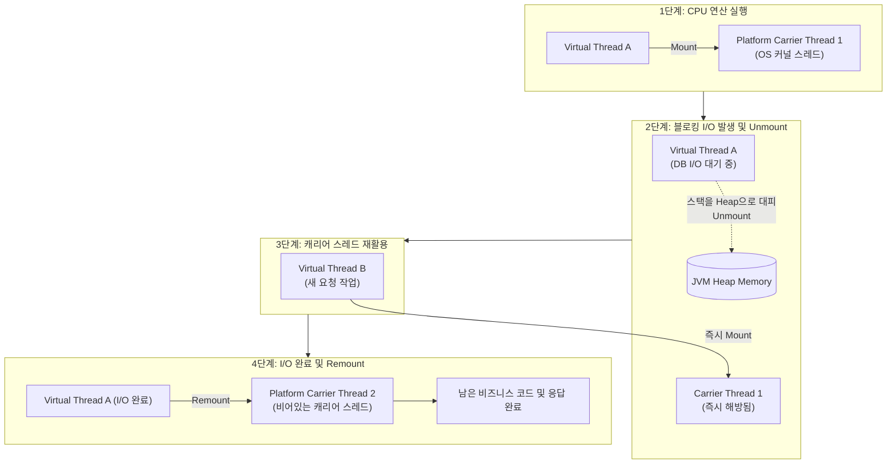

# Java 25 가상 스레드와 Spring Boot 동시성 모델

## 한눈에 보기
| 동시성 모델 | 기본 스레드 매핑 | 블로킹 I/O 처리 방식 | 코드 작성 스타일 |
|-------------|------------------|----------------------|------------------|
| Platform Threads (전통적 방식) | OS 커널 스레드와 1:1 매핑 (최대 수백~수천 개) | I/O 완료까지 OS 스레드가 멈춰 서서 대기 | 동기식 명령형 코드 (`try-catch`, 디버깅 용이) |
| Virtual Threads (Project Loom) | JVM 유저 스레드가 캐리어 스레드에 M:N 매핑 (수백만 개 가능) | 블로킹 I/O 발생 시 플랫폼 스레드 자동 양보 (Unmount) | **동기식 명령형 코드 그대로 유지하면서 고성능 달성** |
| Reactive (Spring WebFlux) | 소수의 이벤트 루프 스레드 (CPU 코어 수 수준) | 콜백 및 함수형 파이프라인 기반 완전 비동기 | 함수형 리액티브 체인 (`Mono`, `Flux`, 높은 학습 곡선) |

## 1. 왜 이게 필요한가

### 이런 상황을 상상해 보자
1초에 수천 개의 동시 요청이 쏟아지는 동영상 검색 서비스가 있다. 각 요청은 내부 데이터베이스를 조회하고(50ms 소요), 외부 결제 및 추천 마이크로서비스 API를 원격 호출(100ms 소요)하여 총 150ms 동안 I/O 응답을 기다린다.

```properties
spring.threads.virtual.enabled=true
```

스프링 부트 4에서는 `application.properties`에 위와 같이 단 한 줄의 설정을 활성화했다. 그리고 자바 비즈니스 코드는 리액티브(WebFlux)로 뜯어고칠 필요 없이 친숙한 `restClient.get()` 동기 블로킹 코드를 그대로 유지했다.

이처럼 JVM 수준에서 가볍게 생성되고 블로킹 I/O 시 알아서 OS 스레드를 양보하는 혁신적인 경량 스레드를 **[[가상-스레드]]**(= Project Loom 기반으로 수백만 개를 생성할 수 있는 JVM 관리 경량 스레드)라 한다.

### 여기서 뭐가 무너지나
과거 전통적인 톰캣 웹 서버는 1개의 HTTP 요청마다 1개의 **[[플랫폼-스레드]]**(= OS 커널 스레드와 1:1 매핑되는 고비용 스레드)를 할당하는 "Thread-per-request" 모델을 썼다. 플랫폼 스레드는 1개당 약 1MB의 메모리 스택을 차지하므로 톰캣 스레드 풀 크기는 보통 200개 정도로 제한되었다.

만약 외부 API 호출이 지연되면 200개의 스레드가 아무 일도 안 하면서 블로킹 대기 상태로 묶여버리고, 뒤이어 들어오는 수천 명의 신규 사용자는 스레드를 할당받지 못해 `504 Gateway Timeout` 또는 연결 거부 에러를 맞닥뜨리는 "스레드 풀 고갈" 장애가 발생했다.

이를 해결하기 위해 WebFlux 같은 리액티브 프로그래밍이 등장했으나, 리액티브 코드는 복잡한 함수형 체인, 디버깅 난이도(StackTrace 단절), 블로킹 라이브러리 사용 불가 등의 극심한 진입 장벽을 안겨주었다.

### 그래서 나온 생각
Java 21/25와 Spring Boot 4는 "코드는 가장 읽기 쉬운 전통적 동기 블로킹 방식(imperative style)으로 작성하되, 런타임 실행은 리액티브에 버금가는 초고성능 논블로킹으로 돌아가게 하자"는 철학으로 가상 스레드를 1급 시민으로 지원했다.

가상 스레드는 블로킹 I/O(DB 조회, 소켓 읽기, sleep)가 호출되는 순간, 자신이 타고 있던 OS 플랫폼 스레드(캐리어 스레드)에서 스스로 뛰어내려(Unmount) 대기 큐로 들어가고, OS 플랫폼 스레드는 즉시 다른 가상 스레드의 작업을 처리하도록 양보한다. I/O 작업이 완료되면 가상 스레드는 비어있는 플랫폼 스레드에 다시 올라타(Mount) 멈췄던 다음 줄의 코드를 자연스럽게 실행한다.

쉽게 비유하자면, 놀이공원의 롤러코스터 좌석(OS 플랫폼 스레드)과 탑승객(가상 스레드)의 관계와 같다. 과거에는 탑승객 1명이 롤러코스터 좌석 1개를 독점하고 탑승객이 밥을 먹거나 화장실을 가는 동안(블로킹 I/O) 롤러코스터 전체를 멈춰 세워두었다. 가상 스레드 방식에서는 탑승객이 사진을 찍거나 멈추는 순간 좌석에서 즉시 내리게 하고, 대기 중인 다른 수천 명의 승객이 롤러코스터에 번갈아 타면서 레일을 24시간 100% 쉼 없이 돌리는 것과 같다.

→ 비유가 깨지는 지점: 놀이공원은 승객이 내리고 타는 데 물리적 시간이 걸리지만, JVM의 가상 스레드 컨텍스트 스위칭은 유저 영역 메모리 포인터 교체(몇 나노초)만으로 이루어지므로 OS 커널을 거치지 않아 오버헤드가 거의 0에 수렴한다.

## 2. 어떻게 동작하는가
1. **HTTP 요청 수신 및 가상 스레드 즉시 생성**: 톰캣 웹 서버로 요청이 들어오면 스레드 풀에서 스레드를 빌려오는 대신, 새로운 **[[가상-스레드]]** 인스턴스를 즉각 `new`하여 요청을 배정한다 — 스레드 풀 크기 제한(200개) 없이 수만 개의 동시 요청을 즉시 수용하기 위해서다.
2. **동기식 비즈니스 로직 실행**: 가상 스레드가 JVM 내부의 적은 수(CPU 코어 수)의 캐리어 **[[플랫폼-스레드]]** 위에 안착(Mount)하여 컨트롤러와 서비스를 순차 실행한다 — 익숙한 동기식 코드로 비즈니스를 수행하기 위해서다.
3. **블로킹 I/O 감지 및 Unmount**: `restClient.get()`이나 JDBC DB 조회가 호출되는 순간, JVM 런타임이 I/O 블로킹을 감지하고 가상 스레드의 호출 스택을 힙(Heap) 메모리로 대피시킨 뒤 캐리어 스레드에서 분리(Unmount)한다 — 비싼 OS 스레드가 유휴 상태로 낭비되는 것을 방지하기 위해서다.
4. **캐리어 스레드의 다른 작업 처리**: 해방된 플랫폼 스레드는 대기열에 있던 다른 가상 스레드를 즉시 탑승시켜 CPU 연산을 이어간다 — 시스템의 하드웨어 자원 처리량을 100% 한계까지 끌어올리기 위해서다.
5. **I/O 완료 및 Remount 후 응답**: OS 비동기 소켓으로부터 DB/원격 응답이 도착하면 가상 스레드가 다시 깨어나 비어있는 플랫폼 스레드에 재장착(Mount)되어 다음 자바 코드를 실행하고 HTTP 200 OK 응답을 완성한다 — 개발자가 복잡한 콜백 없이 마치 멈추지 않고 실행된 것처럼 결과를 받아보게 하기 위해서다.

## 3. 그림으로 보기



## 4. 이 노트에 나온 용어
| 용어 | 한 줄 풀이 | 용어집 링크 |
|------|------------|-------------|
| 가상-스레드 | JVM이 관리하여 수백만 개를 동시에 띄울 수 있는 초경량 자바 스레드 | [[_glossary#가상-스레드]] |
| 플랫폼-스레드 | OS 커널 스레드에 1:1 매핑되어 생성 비용이 크고 무거운 전통적 스레드 | [[_glossary#플랫폼-스레드]] |
| 웹플럭스 | 이벤트 루프 기반의 완전 비동기 리액티브 웹 프레임워크 | [[_glossary#웹플럭스]] |
| 리액티브-스트림즈 | 백프레셔를 지원하는 비동기 논블로킹 데이터 스트림 표준 명세 | [[_glossary#리액티브-스트림즈]] |

## 5. 자주 헷갈리는 것
- **가상 스레드를 위한 스레드 풀 생성 금지**: 가상 스레드는 생성 비용이 거의 공짜(수 킬로바이트 메모리)이므로, `Executors.newFixedThreadPool()`처럼 풀링해서 재사용하면 절대 안 된다. 필요한 순간마다 새로 만들고 쓰고 버리는 태스크 단위 생성이 표준이다.
- **Thread Pinning(스레드 고정) 주의**: `synchronized` 블록 내부에서 블로킹 I/O를 호출하거나 C 네이티브 JNI 코드를 실행하면 가상 스레드가 캐리어 스레드에서 Unmount되지 못하고 플랫폼 스레드를 물고 늘어지는 현상(Pinning)이 발생할 수 있으므로, `synchronized` 대신 `ReentrantLock`을 사용하는 것이 권장된다.

## 6. 언제 안 쓰나 / 경계
- **순수 CPU 연산 집중 작업 (CPU-bound)**: 블로킹 I/O 없이 암호화 계산, 대규모 행렬 연산, 동영상 인코딩 등 CPU를 100% 계속 사용하는 작업은 가상 스레드를 수백만 개 띄워도 OS 플랫폼 스레드(CPU 코어 수)의 한계를 넘을 수 없으므로 성능 향상이 없다.

## 7. 연결
- [[02-reactive-streams-reactor-core]] — 가상 스레드와 대비되는 또 다른 고성능 비동기 패러다임인 Reactive Streams(Project Reactor)의 원리로 이어진다.
- [[05-event-driven-architecture-kafka-basics]] — 가상 스레드를 활용한 동기 통신의 한계를 넘어 서비스 간 완전 비동기 분리를 달성하는 Kafka 이벤트 기반 아키텍처로 확장된다.

## 8. 스스로 확인
1. 가상 스레드가 블로킹 I/O를 만났을 때 플랫폼 캐리어 스레드를 양보(Unmount)하고 복귀(Mount)하는 메커니즘을 30초로 설명할 수 있는가?
2. `spring.threads.virtual.enabled=true`를 켰을 때 전통적인 Thread-per-request 모델의 스레드 풀 고갈 문제가 해결되는 원리는 무엇인가?
3. 가상 스레드를 사용할 때 `synchronized` 블록 사용을 피하고 `ReentrantLock`을 권장하는 이유는 무엇인가?

<!-- ==== 아래는 내 영역 · 스킬 수정 금지 ==== -->

## 내 설명 시도

## 막혔던 지점

## 리뷰 이력
