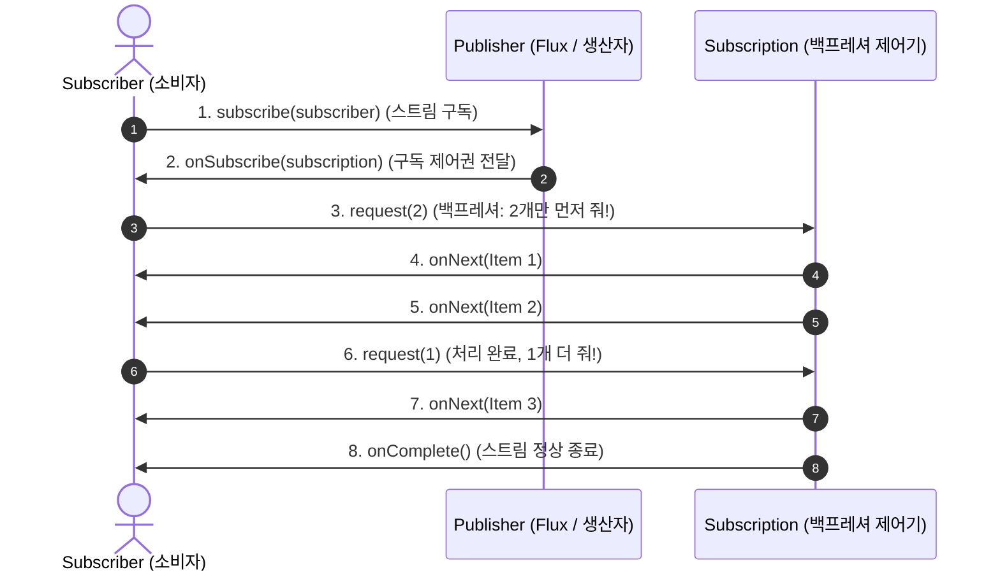

# Reactive Streams 표준과 Project Reactor 핵심 원리

## 한눈에 보기
| 타입 / 컴포넌트 | 데이터 방출 수량 | 주요 용도 |
|-----------------|------------------|-----------|
| `Mono<T>` | 0 또는 1개의 단일 비동기 데이터 | 단건 조회, 저장 결과, 비동기 완료 신호 (`Mono<Void>`) |
| `Flux<T>` | 0부터 무한대(N)개의 비동기 데이터 스트림 | 목록 조회, 실시간 이벤트 피드, 연속적 센서 데이터 |
| Backpressure (`request(n)`) | 소비자가 요청한 만큼만 생산 | 생산자-소비자 속도 불일치로 인한 메모리 고갈 방지 |

## 1. 왜 이게 필요한가

### 이런 상황을 상상해 보자
초당 수만 개의 실시간 주식 시세 데이터나 대용량 IoT 센서 스트림을 수신하여 실시간으로 가공하고 웹 브라우저로 내려보내는 시스템을 구축하려 한다.

```java
Flux<StockPrice> stream = stockExchange.getFeed()
    .filter(price -> price.amount() > 1000)
    .map(this::enrichWithCompanyInfo);
```

이때 데이터 공급자가 1초에 10만 건을 쏟아붓는데, 데이터를 받아서 DB에 쓰거나 화면에 그리는 소비자는 1초에 1,000건밖에 처리하지 못하는 속도 불일치 상황이 발생한다.

### 여기서 뭐가 무너지나
전통적인 컬렉션(`List<T>`)이나 단순 옵저버 패턴에서는 생산자가 데이터를 일방적으로 밀어 넣는다(Push). 소비자의 처리 속도가 따라가지 못하면 메모리 큐에 처리되지 못한 수백만 건의 데이터가 쌓이다가 결국 `java.lang.OutOfMemoryError` (OOM)를 터뜨리며 서버가 다운된다.

또한 데이터를 다 가져올 때까지 클라이언트가 빈 화면을 보며 기다려야 하므로 실시간 데이터 전달의 가치가 사라진다.

### 그래서 나온 생각
비동기 논블로킹 방식으로 데이터가 흐르는 파이프라인을 구축하고, 소비자가 자신이 처리할 수 있는 양만큼만 생산자에게 데이터를 역으로 요구하는 흐름 제어인 **[[백프레셔]]**(= 소비자의 처리 속도에 맞춰 생산자의 발행 속도를 제어하는 흐름 제어 메커니즘)를 표준화한 **[[리액티브-스트림즈]]**(= 비동기 논블로킹 스트림 처리 표준 명세) 표준이 제정되었다.

스프링 생태계는 이 표준의 핵심 구현체인 **Project Reactor**를 채택하여, 단일 데이터를 다루는 `Mono`와 다중 데이터 스트림을 다루는 `Flux`를 제공한다.

쉽게 비유하자면, 뷔페 식당의 주방(생산자)과 손님(소비자)의 관계와 같다. 주방장이 손님의 속도와 상관없이 스테이크를 100장씩 손님 접시 위에 쏟아부으면 접시가 넘쳐 음식이 바닥에 쏟아진다(OOM). 리액티브 백프레셔는 손님이 "지금 2조각만 주세요(`request(2)`)"라고 요청하면 주방이 정확히 2조각만 구워 건네주고, 손님이 다 먹은 뒤 다시 "다음 2조각 주세요"라고 요청하는 신사적인 상호작용과 같다.

→ 비유가 깨지는 지점: 식당은 손님이 말을 걸어야 하지만, 리액티브 스트림즈는 소비자가 구독(`subscribe()`)하는 바로 그 순간부터 완전히 비동기 논블로킹 이벤트 루프 상에서 마이크로초 단위로 고속 스트리밍된다.

## 2. 어떻게 동작하는가
1. **파이프라인 선언 및 조립**: 개발자는 `Flux.fromIterable(...)`이나 `Mono.just(...)` 위에 `map()`, `flatMap()`, `filter()` 연산자를 조립한다 — 단, 이때는 데이터가 흐르지 않는 순수한 '설계도(Cold Publisher)' 상태다.
2. **구독 (Subscribe)**: 최종 소비자(WebFlux 엔진이나 클라이언트)가 `subscribe()`를 호출한다 — "아무것도 구독하지 않으면 아무 일도 일어나지 않는다(Nothing happens until you subscribe)"는 리액티브 대원칙에 따라 파이프라인을 작동시키기 위해서다.
3. **구독 객체 전달 (`onSubscribe`)**: 생산자가 `Subscription` 객체를 소비자에게 전달한다 — 소비자가 데이터 요청 및 취소 권한을 쥐게 하기 위해서다.
4. **백프레셔 데이터 요청 (`request(n)`)**: 소비자가 `subscription.request(10)`으로 자신이 수용 가능한 개수(10개)를 생산자에게 요청한다 — 메모리 버퍼 오버플로우를 원천 차단하기 위해서다.
5. **데이터 방출 (`onNext`) 및 완료 (`onComplete`)**: 생산자는 정확히 요청받은 개수만큼 `onNext(data)`를 호출해 데이터를 흘려보내고, 모든 데이터가 끝나면 `onComplete()` 신호를 보내 파이프라인을 종료한다 — 실시간 비동기 스트리밍을 안전하게 완수하기 위해서다.

## 3. 그림으로 보기



## 4. 이 노트에 나온 용어
| 용어 | 한 줄 풀이 | 용어집 링크 |
|------|------------|-------------|
| 리액티브-스트림즈 | 백프레셔를 지원하는 비동기 논블로킹 데이터 스트림 표준 규격 | [[_glossary#리액티브-스트림즈]] |
| 백프레셔 | 소비자가 요청한 개수만큼만 생산자가 데이터를 방출하는 흐름 제어 | [[_glossary#백프레셔]] |
| 웹플럭스 | 리액티브 스트림즈를 기반으로 동작하는 Spring의 완전 논블로킹 웹 프레임워크 | [[_glossary#웹플럭스]] |
| 가상-스레드 | 블로킹 코드를 경량화하여 리액티브의 복잡성을 우회하는 Java 25 대안 기술 | [[_glossary#가상-스레드]] |

## 5. 자주 헷갈리는 것
- **`Mono`와 `Flux`의 변환**: `Flux.collectList()`를 호출하면 다중 스트림이 단일 `Mono<List<T>>`로 묶이고, 반대로 `Mono.flatMapMany()`를 호출하면 단일 객체 속의 리스트를 펼쳐 `Flux<T>` 스트림으로 방출할 수 있다.
- **Cold Sequence vs Hot Sequence**: Cold는 구독할 때마다 데이터를 처음부터 다시 방출(VOD 재생)하고, Hot은 구독 시점과 상관없이 실시간으로 데이터가 계속 흐르며 구독자는 접속한 시점 이후의 데이터만 수신한다(라이브 방송).

## 6. 언제 안 쓰나 / 경계
- **전통적인 동기 블로킹 라이브러리와의 혼용**: 리액티브 체인 내부에서 `Thread.sleep()`이나 전통적인 JPA/JDBC 블로킹 메서드를 직접 호출하면 이벤트 루프 전체가 멈춰 서므로, 블로킹 작업은 반드시 `publishOn(Schedulers.boundedElastic())`으로 격리하거나 Java 25 가상 스레드를 도입해야 한다.

## 7. 연결
- [[01-virtual-threads-loom-concurrency]] — 가상 스레드와 리액티브 스트림즈는 고성능 동시성을 달성하는 서로 다른 두 갈래의 접근법이다.
- [[03-spring-webflux-controllers-streaming]] — Reactor의 `Flux`와 `Mono`가 Spring WebFlux 컨트롤러의 HTTP 응답 모델로 직접 매핑된다.

## 8. 스스로 확인
1. 생산자가 일방적으로 데이터를 밀어 넣는 전통적인 푸시 모델과 비교하여 리액티브 백프레셔(Backpressure)가 시스템 안정성을 보장하는 원리는 무엇인가?
2. `Mono<T>`와 `Flux<T>`의 개념적 차이를 실무 API 설계 관점에서 설명할 수 있는가?
3. 리액티브 프로그래밍에서 "구독(subscribe)하기 전까지는 아무 일도 일어나지 않는다"는 문장의 의미는 무엇인가?

<!-- ==== 아래는 내 영역 · 스킬 수정 금지 ==== -->

## 내 설명 시도

## 막혔던 지점

## 리뷰 이력
