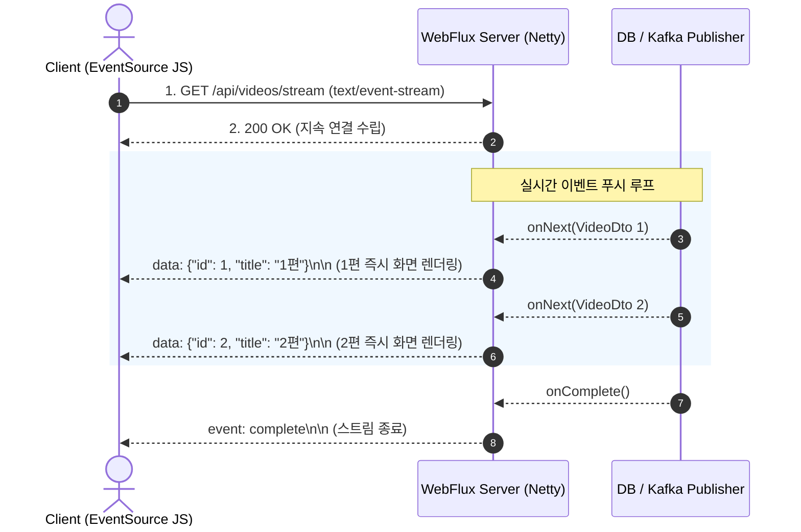

# Spring WebFlux 컨트롤러와 실시간 스트리밍

## 한눈에 보기
| 응답 미디어 타입 | HTTP 응답 헤더 | 데이터 전송 동작 방식 |
|------------------|----------------|------------------------|
| 단일 JSON 응답 | `application/json` | `Mono<Video>`가 완료되면 단일 JSON 객체 반환 |
| Server-Sent Events (SSE) | `text/event-stream` | `Flux<Video>`에서 데이터가 방출될 때마다 브라우저로 실시간 푸시 |
| NDJSON 스트림 | `application/x-ndjson` | 줄바꿈(`\n`)으로 구분된 JSON 객체를 청크 단위로 끊임없이 전송 |
| 리액티브 Thymeleaf | `text/html;charset=UTF-8` | `ReactiveDataDriverContextVariable`를 통해 데이터가 생성되는 족족 HTML 렌더링 스트리밍 |

## 1. 왜 이게 필요한가

### 이런 상황을 상상해 보자
실시간 주식 호가창, 라이브 채팅 피드, 또는 대용량 동영상 트랜스코딩 진행률을 사용자 웹 브라우저 화면에 실시간으로 깜빡임 없이 보여주어야 한다.

```java
@RestController
public class LiveVideoController {
    @GetMapping(value = "/api/videos/stream", produces = MediaType.TEXT_EVENT_STREAM_VALUE)
    public Flux<VideoDto> streamVideos() {
        return videoService.getLiveVideoFeed();
    }
}
```

기존의 전통적인 Spring MVC 컨트롤러에서는 `List<VideoDto>`를 모아서 한꺼번에 응답하거나, 클라이언트가 1초마다 무한 폴링(Polling)을 날려야 했다.

### 여기서 뭐가 무너지나
클라이언트의 짧은 주기 무한 폴링은 서버의 CPU와 네트워크 트래픽을 무의미하게 고갈시킨다. 또한 대용량 데이터 조회 시 100만 건의 데이터가 DB에서 모두 메모리로 올라올 때까지 사용자는 하얀 화면(로딩 스피너)을 보며 수 초 동안 기다려야 한다.

서블릿 기반의 톰캣 서버에서는 1개의 연결마다 1개의 OS 스레드가 묶여 있으므로, 수만 명의 사용자가 실시간 스트리밍 연결을 유지하면 서버의 스레드 풀이 즉각 폭발한다.

### 그래서 나온 생각
적은 수의 이벤트 루프 스레드(Netty 엔진)로 수십만 개의 연결을 동시 유지하며, 데이터가 준비되는 즉시 파이프라인을 통해 한 줄씩 밀어주는 **[[웹플럭스]]**(= 비동기 논블로킹 방식으로 대규모 스트리밍을 처리하는 Spring의 리액티브 웹 프레임워크)를 도입했다.

WebFlux 컨트롤러는 **[[리액티브-스트림즈]]**(= 비동기 논블로킹 스트림 표준)의 `Flux`를 그대로 반환하기만 하면, 프레임워크가 알아서 클라이언트의 수신 속도(**[[백프레셔]]**)에 맞춰 Server-Sent Events(SSE)나 청크 스트림으로 데이터를 지속적으로 흘려보낸다.

심지어 HTML 템플릿(Thymeleaf)조차도 리액티브 데이터 드라이버 변수를 활용해 데이터가 DB에서 인출되는 족족 HTML 태그를 한 줄씩 실시간으로 브라우저에 렌더링하여 전송할 수 있다.

쉽게 비유하자면, 물탱크 배관 시스템과 같다. 과거 방식(Spring MVC)은 100리터짜리 물탱크가 가득 찰 때까지 기다렸다가 한 번에 쏟아붓는 방식(전체 리스트 일괄 전송)이었다. WebFlux 스트리밍은 수도꼭지를 틀어두면 물방울이 맺히는 족족 파이프를 통해 실시간으로 콸콸 흘러나오는 직수형 정수기(실시간 스트림 전송)와 같다.

→ 비유가 깨지는 지점: 수도꼭지는 잠그지 않으면 물이 넘치지만, WebFlux는 클라이언트가 창을 닫거나 연결을 끊으면 즉시 `cancel()` 신호가 업스트림 DB까지 전달되어 불필요한 데이터 조회를 즉시 중단한다.

## 2. 어떻게 동작하는가
1. **HTTP SSE 연결 수립**: 클라이언트 브라우저가 `GET /api/videos/stream`으로 접속하면, Netty 서버가 논블로킹 채널을 열고 `Content-Type: text/event-stream` 헤더로 응답 연결을 유지한다 — 지속적인 실시간 데이터 푸시 통로를 확보하기 위해서다.
2. **컨트롤러 Flux 반환**: 컨트롤러가 `Flux<VideoDto>`를 반환하면 프레임워크가 이를 내부적으로 구독(`subscribe()`)한다 — 비동기 데이터 이벤트 리스너를 가동하기 위해서다.
3. **onNext 이벤트 발생 시 패킷 전송**: 비즈니스 서비스나 DB(R2DBC)에서 새로운 데이터가 도착하여 `onNext(video)`가 호출될 때마다, Jackson이 해당 단일 객체만 JSON으로 직렬화하여 `data: {...}\n\n` 포맷으로 소켓에 쓴다 — 버퍼 지연 없이 즉각적으로 데이터를 클라이언트에 전달하기 위해서다.
4. **브라우저 EventSource 렌더링**: 브라우저의 자바스크립트 `const es = new EventSource('/api/videos/stream')`가 메시지를 수신하여 화면 UI 컴포넌트를 실시간 갱신한다 — 새로고침 없이 동적으로 최신 상태를 반영하기 위해서다.
5. **연결 종료 및 리소스 정리**: 모든 데이터가 끝나 `onComplete()`가 오거나 사용자가 페이지를 이탈하면, 프레임워크가 소켓 채널을 안전하게 닫고 메모리를 해제한다 — 서버 리소스 누수를 완벽히 차단하기 위해서다.

## 3. 그림으로 보기



## 4. 이 노트에 나온 용어
| 용어 | 한 줄 풀이 | 용어집 링크 |
|------|------------|-------------|
| 웹플럭스 | Netty 기반으로 대규모 비동기 논블로킹 스트리밍을 처리하는 웹 프레임워크 | [[_glossary#웹플럭스]] |
| 리액티브-스트림즈 | 백프레셔를 지원하는 표준 데이터 스트림 명세 (Mono & Flux) | [[_glossary#리액티브-스트림즈]] |
| 백프레셔 | 소비자의 처리 역량에 맞춰 데이터 방출 속도를 조절하는 흐름 제어 | [[_glossary#백프레셔]] |
| 하이퍼미디어 | 응답 데이터와 함께 다음에 가능한 액션 링크를 동봉하는 RESTful 원칙 | [[_glossary#하이퍼미디어]] |

## 5. 자주 헷갈리는 것
- **SSE vs WebSocket**: WebSocket은 클라이언트와 서버가 양방향(Full-duplex)으로 자유롭게 바이너리/텍스트를 주고받는 프로토콜인 반면, SSE(Server-Sent Events)는 표준 HTTP 위에서 서버가 클라이언트로 일방향(Server-to-Client) 실시간 이벤트를 전송하는 가볍고 방화벽 친화적인 표준 기술이다.
- **`ReactiveDataDriverContextVariable`**: 리액티브 Thymeleaf 템플릿에서 대량 데이터를 렌더링할 때 이 래퍼 객체를 사용하면, 템플릿 엔진이 전체 데이터 완료를 기다리지 않고 청크 단위로 분할하여 HTML을 실시간 렌더링 스트리밍한다.

## 6. 언제 안 쓰나 / 경계
- **단순 단건 CRUD 및 블로킹 라이브러리 위주 시스템**: 실시간 스트리밍이 필요 없는 일반 웹 시스템에서는 Java 25 가상 스레드와 Spring MVC를 조합하는 것이 코드 가독성과 유지보수 면에서 훨씬 직관적이다.

## 7. 연결
- [[02-reactive-streams-reactor-core]] — Reactor의 Flux 파이프라인이 WebFlux 컨트롤러를 통해 HTTP 네트워크 스트림으로 실체화된다.
- [[04-reactive-hypermedia-hateoas]] — 실시간 리액티브 응답에 상태 전이 하이퍼미디어 링크를 동적으로 엮어내는 기법으로 이어진다.

## 8. 스스로 확인
1. Spring MVC의 폴링(Polling) 방식과 비교하여 WebFlux SSE 스트리밍이 가지는 네트워크 및 서버 리소스적 이점은 무엇인가?
2. WebFlux 컨트롤러에서 `Flux<T>`를 반환할 때 클라이언트와의 연결 및 백프레셔가 동작하는 원리는 무엇인가?
3. Thymeleaf 템플릿 엔진이 리액티브 환경에서 HTML을 부분 스트리밍 렌더링하는 메커니즘은 무엇인가?

<!-- ==== 아래는 내 영역 · 스킬 수정 금지 ==== -->

## 내 설명 시도

## 막혔던 지점

## 리뷰 이력
