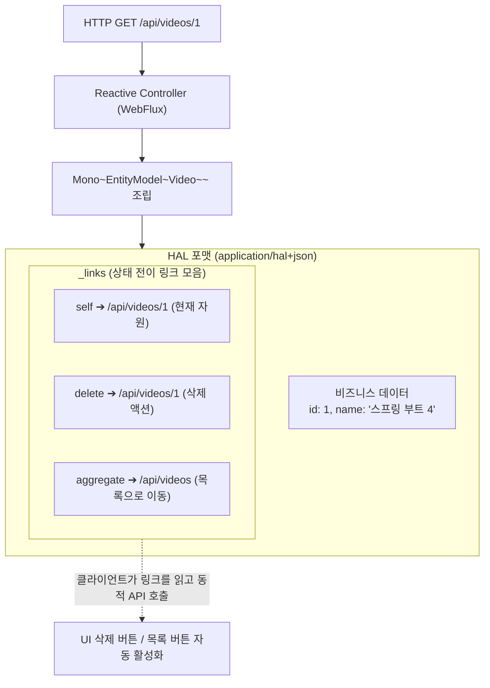

# Spring HATEOAS 기반 반응형 하이퍼미디어 구축

## 한눈에 보기
| 개념 | 역할 | 핵심 코드 / 응답 구조 |
|------|------|-----------------------|
| HATEOAS | 리소스 데이터와 함께 다음에 실행 가능한 상태 전이 링크 제공 | `_links: { self: { href: "..." }, delete: { href: "..." } }` |
| `EntityModel<T>` | 단일 도메인 엔티티를 하이퍼미디어 링크로 감싸는 모델 | `EntityModel.of(video, selfLink, deleteLink)` |
| `WebFluxLinkBuilder` | 비동기 WebFlux 컨트롤러 메서드로부터 타입 세이프한 링크 동적 생성 | `linkTo(methodOn(VideoController.class).getVideo(id)).withSelfRel()` |

## 1. 왜 이게 필요한가

### 이런 상황을 상상해 보자
동영상 스트리밍 서비스의 REST API를 이용해 클라이언트 개발자가 앱을 만들고 있다. 동영상 단건 조회 API(`GET /api/videos/1`)를 호출했을 때, 클라이언트는 "이 동영상을 재생하려면 어느 URL로 가야 하는가?", "삭제나 수정은 가능한가?"를 알고 싶어 한다.

전통적인 REST API에서는 아래와 같이 순수 데이터 필드만 반환했다.

```json
{
  "id": 1,
  "name": "스프링 부트 4 완벽 가이드"
}
```

이 방식에서는 클라이언트 개발자가 API 문서를 일일이 찾아보며 `/api/videos/1/stream`, `/api/videos/1/delete` 같은 다음 행동 URL 규칙을 하드코딩해야 했다.

### 여기서 뭐가 무너지나
서버의 엔드포인트 URL 구조가 리팩토링되어 변경되는 순간, 전 세계 사용자 스마트폰에 깔린 모든 모바일 앱이 일제히 404 Not Found 에러를 뿜으며 깨져버린다. 서버와 클라이언트가 강하게 결합되어 있어 API의 자율적인 진화가 불가능해진다.

또한 리액티브 비동기 환경(`Flux`, `Mono`)에서는 링크를 생성하는 연산조차 비동기 파이프라인 안에서 논블로킹으로 안전하게 조립되어야 한다.

### 그래서 나온 생각
웹 브라우저에서 웹 서핑을 할 때 링크(`<a>` 태그)를 클릭하며 자연스럽게 다음 페이지로 이동하듯이, REST API 응답 본문에도 데이터와 함께 다음 가능한 액션들의 URI 링크를 동봉하여 전달하는 **[[하이퍼미디어]]**(= 애플리케이션의 상태 전이를 링크로 안내하는 HATEOAS 설계 원칙)를 도입했다.

Spring HATEOAS는 **[[웹플럭스]]**(= 리액티브 웹 프레임워크) 환경을 완벽히 지원하여, 비동기 논블로킹 체인 안에서 `WebFluxLinkBuilder`를 통해 타입 세이프한 링크를 `Mono<EntityModel<Video>>` 형태로 매끄럽게 결합할 수 있게 해준다.

쉽게 비유하자면, 스마트폰 내비게이션의 추천 경로 안내와 같다. 내비게이션(HATEOAS API)은 단순히 현재 내 위치 좌표(데이터)만 알려주는 것이 아니라, "직진 후 300m 앞 우회전(self 링크)", "주유소 경유(다음 액션 링크)" 등 다음에 갈 수 있는 길들을 버튼(하이퍼링크)으로 함께 띄워준다. 도로 공사로 우회로(서버 URL 변경)가 생겨도 내비게이션이 주는 새 안내 링크를 누르기만 하면 목적지에 도달할 수 있다.

→ 비유가 깨지는 지점: 내비게이션은 운전자가 눈으로 경로를 보고 터치하지만, HATEOAS API는 클라이언트 프로그램(React, 모바일 SDK)이 `_links.self.href` 키를 프로그램적으로 읽어 동적으로 HTTP 요청을 발송한다.

## 2. 어떻게 동작하는가
1. **리액티브 데이터 인출**: 컨트롤러가 비즈니스 서비스로부터 `Mono<Video>`를 전달받는다 — 원본 도메인 데이터를 비동기로 확보하기 위해서다.
2. **WebFluxLinkBuilder 링크 조립**: `linkTo(methodOn(ReactiveVideoController.class).getVideo(id)).withSelfRel()`를 호출하여 실제 컨트롤러 메서드 매핑을 기반으로 한 완전한 URL 링크를 생성한다 — URL 문자열 하드코딩 오타를 컴파일 타임에 방지하기 위해서다.
3. **EntityModel 래핑**: `EntityModel.of(video, selfLink, deleteLink)`를 통해 데이터와 링크 목록을 결합한다 — HAL(Hypertext Application Language) 표준 JSON 포맷으로 패키징하기 위해서다.
4. **리액티브 스트림 체이닝 (`map`)**: **[[리액티브-스트림즈]]** 파이프라인의 `mono.map(video -> buildEntityModel(video))` 연산자를 통해 논블로킹으로 변환한다 — 이벤트 루프의 스레드를 차단하지 않고 변환 연산을 수행하기 위해서다.
5. **HAL JSON 응답 반환**: 프레임워크가 이를 `application/hal+json` 포맷으로 직렬화하여 클라이언트에 전송한다 — 클라이언트가 `_links` 필드를 해석하여 자율적으로 다음 API를 호출할 수 있게 하기 위해서다.

## 3. 그림으로 보기



## 4. 이 노트에 나온 용어
| 용어 | 한 줄 풀이 | 용어집 링크 |
|------|------------|-------------|
| 하이퍼미디어 | 응답 데이터와 함께 다음 상태 전이 URL 링크를 동봉하는 REST 설계 원칙 (HATEOAS) | [[_glossary#하이퍼미디어]] |
| 웹플럭스 | 비동기 논블로킹 방식으로 HTTP 스트림을 처리하는 리액티브 웹 프레임워크 | [[_glossary#웹플럭스]] |
| 리액티브-스트림즈 | Mono와 Flux를 기반으로 비동기 스트림을 제어하는 표준 명세 | [[_glossary#리액티브-스트림즈]] |
| 백프레셔 | 소비자의 처리량에 맞춰 데이터 발행을 조절하는 흐름 제어 | [[_glossary#백프레셔]] |

## 5. 자주 헷갈리는 것
- **REST의 4단계 성숙도 모델 (Richardson Maturity Model)**: Level 0(단일 URI), Level 1(개별 리소스 URI), Level 2(HTTP 메서드 준수)를 넘어 진정한 최고 수준의 완성형 RESTful 시스템(Level 3)에 도달하기 위한 핵심 요건이 바로 HATEOAS 하이퍼미디어 통제다.
- **Affordances(행위 유도성)**: Spring HATEOAS는 단순 링크뿐만 아니라, 해당 리소스에 대해 클라이언트가 보낼 수 있는 HTTP 메서드(PUT/DELETE)와 필요한 요청 본문 스키마(Input Model) 메타데이터까지 함께 제공할 수 있다.

## 6. 언제 안 쓰나 / 경계
- **초경량 저지연 내부 통신**: 마이크로서비스 간에 초당 수십만 건의 고속 통신이 일어나는 내부 사설 네트워크에서는 HATEOAS 메타데이터 링크로 인한 페이로드 크기 증가가 오버헤드가 될 수 있으므로 gRPC나 순수 경량 DTO를 쓰는 것이 효율적이다.

## 7. 연결
- [[03-spring-webflux-controllers-streaming]] — WebFlux 스트리밍 컨트롤러에서 하이퍼미디어 모델을 결합하여 자가 기술적(Self-descriptive) API를 완성한다.
- [[05-event-driven-architecture-kafka-basics]] — 동기식 REST 하이퍼미디어 통신에서 비동기 분산 메시징 아키텍처로 확장된다.

## 8. 스스로 확인
1. REST API에서 HATEOAS(하이퍼미디어)를 적용했을 때 클라이언트와 서버 간의 결합도가 낮아지는 이유는 무엇인가?
2. `EntityModel`과 `WebFluxLinkBuilder`가 비동기 리액티브 파이프라인에서 링크를 안전하게 생성하는 원리는 무엇인가?
3. HAL(Hypertext Application Language) 포맷의 `_links` 필드가 클라이언트 애플리케이션에 제공하는 실질적 가치는 무엇인가?

<!-- ==== 아래는 내 영역 · 스킬 수정 금지 ==== -->

## 내 설명 시도

## 막혔던 지점

## 리뷰 이력
