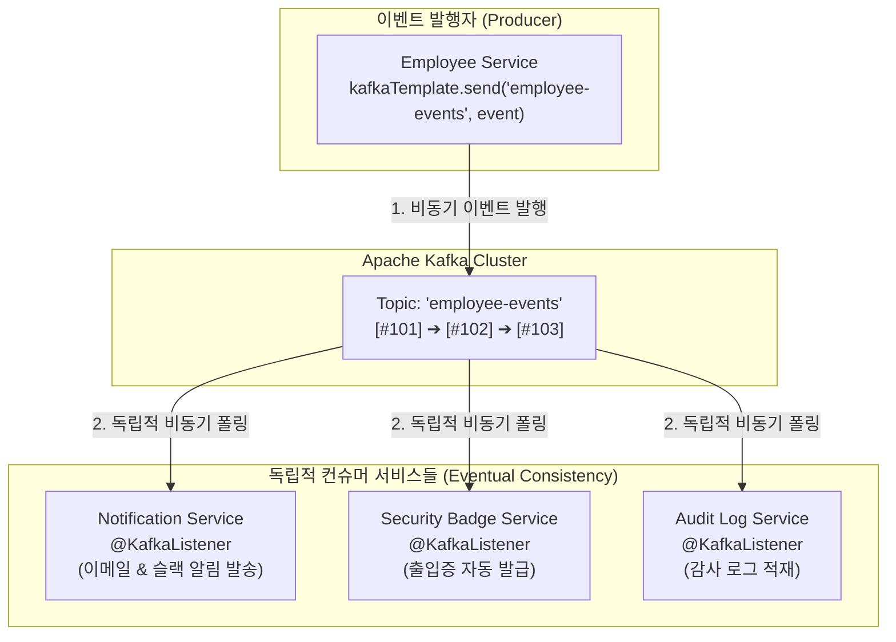

# 이벤트 기반 아키텍처와 Apache Kafka 기초

## 한눈에 보기
| 항목 | 동기식 REST API 통신 | 비동기 이벤트 기반 통신 (Kafka) |
|------|----------------------|---------------------------------|
| 결합도 | 강한 결합 (수신자의 IP, 포트, 가용성에 직접 종속) | 극단적인 느슨한 결합 (발행자와 구독자가 서로를 전혀 모름) |
| 장애 전파 | 수신 서비스 다운 시 송신 서비스도 함께 장애 (연쇄 장애) | 수신 서비스가 다운되어도 브로커에 큐잉되어 나중에 재처리 |
| 확장성 | 점대점(Point-to-point) 호출로 확장 시 복잡도 폭증 | 토픽에 브로드캐스트 발행하여 새 구독자 무제한 추가 가능 |

## 1. 왜 이게 필요한가

### 이런 상황을 상상해 보자
인사 관리 시스템에서 새로운 직원이 등록되는 비즈니스 시나리오를 개발하고 있다. 직원이 등록되면(1) 사원 데이터베이스에 저장하고, (2) 이메일 알림을 발송하고, (3) 보안 출입증 발급 시스템에 등록하고, (4) 사내 슬랙 채널에 환영 메시지를 보내야 한다.

전통적인 REST 동기 방식으로 작성하면, 사원 등록 컨트롤러 안에서 3개의 외부 마이크로서비스 HTTP API를 순차적으로 호출해야 한다.

```java
// 동기식: 3개 서비스 중 하나라도 500 에러를 내거나 지연되면 전체 트랜잭션 롤백!
```

### 여기서 뭐가 무너지나
첫째, **연쇄 장애(Cascading Failure)의 위험이다.** 슬랙 서버에 장애가 나거나 이메일 발송 서버의 응답이 10초 동안 지연되면, 정작 가장 중요한 사원 등록 비즈니스 전체가 멈춰 서서 사용자에게 에러 화면을 띄운다.

둘째, **시스템 확장의 한계다.** 나중에 "신규 입사자 교육 일정 자동 예약"이라는 새로운 요구사항이 추가되면, 기존 사원 서비스 코드를 또 열어서 수정하고 재배포해야 한다.

### 그래서 나온 생각
서비스들이 서로를 직접 알지 못하게 하고, 단지 "신규 사원이 등록되었다(EmployeeCreatedEvent)"는 과거형 사건을 중앙 브로커에 던져두면 관심 있는 서비스들이 알아서 가져가 처리하게 만드는 **[[이벤트-기반-아키텍처]]**(= 사건의 발행과 구독을 통해 서비스 간 결합도를 낮추는 분산 아키텍처)를 도입했다.

그리고 이 대규모 이벤트를 초당 수백만 건씩 영속화하고 파티션 단위로 분산 처리할 수 있는 분산 스트리밍 플랫폼인 **[[아파치-카프카]]**(= 분산 환경에서 실시간 이벤트 스트림을 고성능으로 중계하는 브로커 시스템)를 연동했다.

스프링 부트는 `spring-kafka` 스타터를 통해 `KafkaTemplate`으로 이벤트를 간단히 발행하고, `@KafkaListener` 어노테이션으로 이벤트를 손쉽게 수신할 수 있게 지원한다.

쉽게 비유하자면, 신문사(발행자)와 독자(구독자)의 관계와 같다. 신문사는 신문 기사(이벤트)를 인쇄하여 가판대(카프카 토픽)에 올려놓기만 하면 자기 일을 끝마친다. 독자(알림 서비스, 출입증 서비스)가 오늘 신문을 아침에 읽든 저녁에 읽든 신문사의 인쇄 일정에는 아무런 영향이 없다. 새로운 구독자가 늘어나도 신문사 기자는 그 독자의 집 주소나 전화번호를 전혀 알 필요가 없다.

→ 비유가 깨지는 지점: 신문은 시간이 지나면 버려지지만, 카프카 토픽은 디스크에 이벤트를 순서대로 영속 저장(Commit Log)하므로 새로운 구독자 서비스가 1주일 뒤에 배포되어도 과거 1주일 치 이벤트를 처음부터 다시 읽어(Replay) 데이터를 복원할 수 있다.

## 2. 어떻게 동작하는가
1. **이벤트 정의 및 발행**: 사원 서비스에서 새 직원을 DB에 저장한 뒤, `kafkaTemplate.send("employee-events", employeeId, event)`를 호출한다 — 사원 등록 사실을 외부에 브로드캐스트하기 위해서다.
2. **카프카 토픽 파티셔닝**: 카프카 브로커가 메시지 키(`employeeId`)의 해시값을 계산하여 지정된 파티션(Partition)의 Commit Log 끝에 순차적으로 기록(Append-only)한다 — 동일 사원에 대한 이벤트 순서를 물리적으로 완벽히 보장하기 위해서다.
3. **독립적 컨슈머 폴링**: 알림 서비스와 출입증 서비스의 `@KafkaListener(topics = "employee-events")`가 백그라운드에서 주기적으로 브로커를 폴링한다 — 송신자의 호출을 기다리지 않고 자율적으로 이벤트를 가져오기 위해서다.
4. **비즈니스 처리 및 오프셋 커밋**: 알림 서비스가 이메일을 성공적으로 발송하면, 자신이 어디까지 읽었는지를 나타내는 오프셋(Offset)을 브로커에 기록(Commit)한다 — 중복 처리 없이 다음 이벤트로 전진하기 위해서다.
5. **완벽한 서비스 격리**: 이메일 서버가 다운되어 있어도 사원 등록은 0.01초 만에 정상 완료되며, 이메일 서버가 복구되면 카프카에 쌓여있던 이벤트를 순차적으로 소비하여 최종 일관성(Eventual Consistency)을 달성한다 — 시스템 전체의 내결함성(Fault Tolerance)을 극대화하기 위해서다.

## 3. 그림으로 보기



## 4. 이 노트에 나온 용어
| 용어 | 한 줄 풀이 | 용어집 링크 |
|------|------------|-------------|
| 이벤트-기반-아키텍처 | 사건의 발행과 구독을 통해 서비스 간 결합도를 낮추는 분산 아키텍처 (EDA) | [[_glossary#이벤트-기반-아키텍처]] |
| 아파치-카프카 | 실시간 이벤트 스트림을 파티션 로그에 영속화하고 중계하는 분산 메시지 플랫폼 | [[_glossary#아파치-카프카]] |
| 가상-스레드 | 동기 블로킹 코드를 경량화하는 기술로 비동기 이벤트 처리와 상호 보완됨 | [[_glossary#가상-스레드]] |
| 데드-레터-토픽 | 처리 실패한 불량 메시지를 별도로 격리 수집하는 전용 토픽 | [[_glossary#데드-레터-토픽]] |

## 5. 자주 헷갈리는 것
- **이벤트(Event) vs 메시지(Message)**: 메시지는 "특정 수신자에게 무엇을 하라"고 명령하는 직접적 의도가 담긴 것(Command)인 반면, 이벤트는 "이미 시스템에 어떤 사건이 발생했다"는 객관적 사실(Fact)을 불특정 다수에게 공표하는 것이다.
- **Consumer Group의 로드 밸런싱**: 동일한 `groupId`를 가진 컨슈머 인스턴스들은 토픽의 파티션을 나누어 병렬 처리(로드 밸런싱)하고, 서로 다른 `groupId`를 가진 컨슈머들은 동일한 메시지를 각각 독립적으로 복제 수신(Pub/Sub)한다.

## 6. 언제 안 쓰나 / 경계
- **즉각적인 결과 반환이 필수적인 트랜잭션**: "아이디 중복 검사"나 "로그인 비밀번호 확인"처럼 호출 즉시 참/거짓 결과값을 반환받아 화면에 표시해야 하는 동기식 요청-응답 상호작용에는 카프카 대신 동기식 REST API를 써야 한다.

## 7. 연결
- [[01-virtual-threads-loom-concurrency]] — 단일 인스턴스 내부의 고성능 동시성(Virtual Threads)과 분산 시스템 간의 비동기 분리(Kafka)가 상호 결합된다.
- [[06-kafka-reliability-retries-dlq-idempotency]] — 카프카 통신 시 발생하는 분산 네트워크 실패를 극복하기 위한 신뢰성 패턴으로 이어진다.

## 8. 스스로 확인
1. 동기식 REST API 통신과 비교하여 이벤트 기반 아키텍처(EDA)가 연쇄 장애를 방지하는 원리는 무엇인가?
2. 이벤트(Event)와 메시지(Message)의 개념적 차이는 무엇인가?
3. 카프카의 파티션(Partition)과 컨슈머 그룹(Consumer Group)이 결합하여 병렬 처리와 이벤트 순서 보장을 동시에 달성하는 메커니즘은 무엇인가?

<!-- ==== 아래는 내 영역 · 스킬 수정 금지 ==== -->

## 내 설명 시도

## 막혔던 지점

## 리뷰 이력
