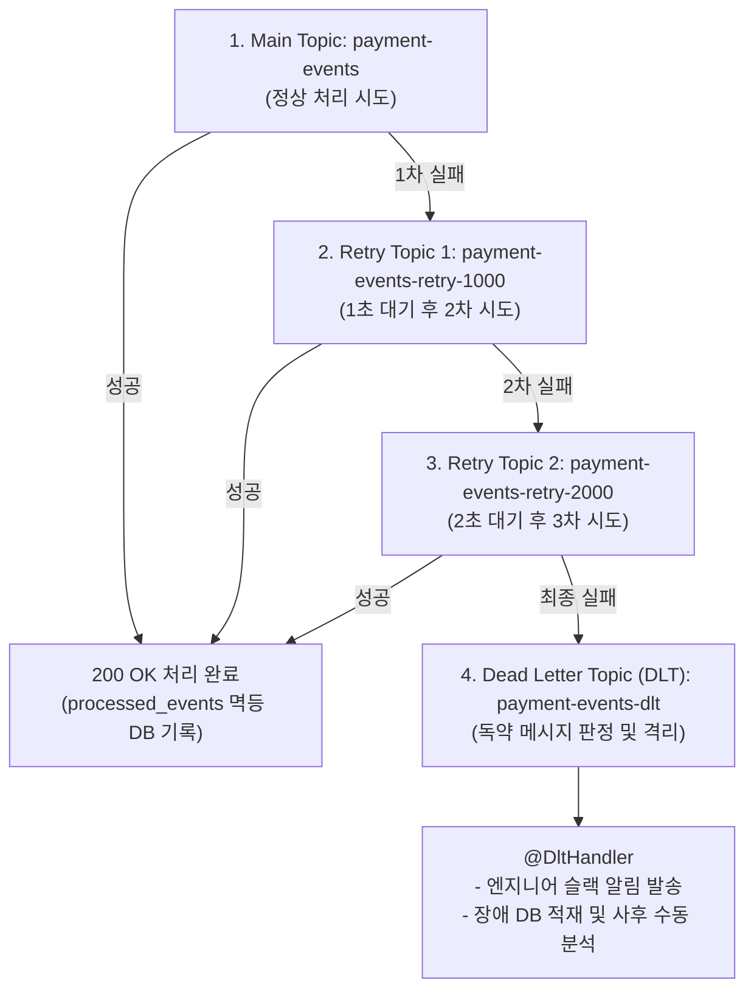

# Kafka 신뢰성 패턴과 재시도, DLT 및 멱등성

## 한눈에 보기
| 신뢰성 패턴 | 적용 대상 / 문제 상황 | Spring Boot 4 구현 방식 |
|-------------|----------------------|-------------------------|
| Exponential Backoff Retry | 일시적 네트워크 끊김, 외부 API 순간 지연 | `@RetryableTopic(attempts = "4", backoff = @Backoff(delay = 1000, multiplier = 2.0))` |
| Dead Letter Topic (DLT) | 포맷 오류, 복구 불가능한 독약 메시지(Poison Pill) | `@DltHandler`를 통해 실패 메시지를 `*.DLT` 토픽으로 격리 적재 |
| Idempotent Consumer | 네트워크 재전송으로 인한 중복 메시지 수신 | 메시지 고유 식별자(UUID)를 DB 유니크 키 또는 Redis로 검증 |

## 1. 왜 이게 필요한가

### 이런 상황을 상상해 보자
온라인 쇼핑몰에서 고객이 주문을 완료하면 카프카 토픽으로 `PaymentProcessedEvent`가 발행되고, 알림 서비스가 이를 수신하여 카카오톡 알림톡을 발송하려 한다.

```java
@KafkaListener(topics = "payment-events")
public void handlePayment(PaymentEvent event) {
    notificationService.sendKakaoTalk(event.userId(), event.amount());
}
```

그런데 외부 카카오톡 통신망이 3초간 순간적으로 끊기거나(일시적 장애), 어떤 사용자의 전화번호 데이터가 깨져서 `NullPointerException`이 발생하는 상황(영구적 장애)이 닥쳤다.

### 여기서 뭐가 무너지나
첫째, **전체 파티션의 멈춤 현상(Head-of-Line Blocking)이다.** 예외가 발생했을 때 단순 무한 재시도를 걸어두면, 1개의 불량 메시지 때문에 컨슈머가 오프셋을 전진시키지 못하고 영원히 멈춰 서서 그 뒤에 대기 중인 정상적인 수만 건의 결제 알림까지 전부 밀려버린다.

둘째, **중복 결제 및 중복 알림 발송 사고다.** 분산 네트워크에서는 "적어도 한 번(At-least-once)" 전송이 표준이므로 일시적 네트워크 재전송 시 동일한 이벤트가 2번 들어올 수 있다. 컨슈머가 멱등성을 고려하지 않고 작성되었다면 고객에게 똑같은 알림이 2번 발송되거나 포인트가 2배로 적립되는 금전적 손실이 발생한다.

### 그래서 나온 생각
Spring for Kafka는 일시적인 장애를 점진적 시간 간격으로 다시 시도하는 지수 백오프(Exponential Backoff) 재시도와, 끝까지 실패한 메시지만 따로 빼서 격리하는 **[[데드-레터-토픽]]**(= 복구 불가능한 실패 메시지를 별도로 수집 격리하는 전용 카프카 토픽, DLT) 패턴을 어노테이션(`@RetryableTopic`) 하나로 자동 구성해 준다.

또한 수신된 이벤트의 고유 식별자를 검증하여 중복 처리를 방지하는 **[[멱등-소비자]]**(= 동일한 메시지가 여러 번 들어와도 시스템 상태를 단 1회만 반영하는 안전한 컨슈머 패턴)를 적용하여 분산 시스템의 신뢰성을 완성했다.

쉽게 비유하자면, 우체국의 반송 처리 시스템과 같다. 집배원(카프카 컨슈머)이 배달을 갔는데 수취인이 잠시 부재중(일시적 장애)이면 1시간 뒤, 다음 날 아침(지수 백오프 재시도)에 다시 방문한다. 3번을 찾아가도 주소가 없는 유령 주소(영구적 독약 메시지)라면 길거리에서 계속 서성이지 않고, 해당 편지를 반송 보관함(Dead Letter Topic)에 넣은 뒤 다음 편지 배달을 즉시 이어간다. 그리고 이미 배달 완료 서명을 받은 등기 우편이 실수로 또 오면 "이미 전달 완료됨(멱등성 검증)"이라며 중복 전달을 거부하는 것과 같다.

→ 비유가 깨지는 지점: 우체국 반송함은 사람이 손으로 확인하지만, 카프카의 DLT는 별도의 전용 자동화 모니터링 컨슈머나 Grafana 대시보드와 연동되어 장애 원인을 실시간 추적하고 알림을 발생시킨다.

## 2. 어떻게 동작하는가
1. **이벤트 수신 및 비즈니스 실행**: 컨슈머가 메인 토픽(`payment-events`)에서 메시지를 폴링하여 비즈니스 로직을 수행한다 — 결제 알림 발송 작업을 처리하기 위해서다.
2. **일시적 실패 감지 및 지수 백오프 재시도**: 일시적 통신 에러가 발생하면, 스프링 카프카가 메인 파티션을 멈추지 않고 재시도 전용 토픽(`payment-events-retry-1000`, `payment-events-retry-2000`)으로 메시지를 포워딩한다 — 메인 파이프라인의 후속 메시지 처리를 방해하지 않기 위해서다.
3. **최대 재시도 초과 시 DLT 전송**: 4회의 재시도 후에도 계속 실패하면, 메시지는 최종적으로 `payment-events-dlt` **[[데드-레터-토픽]]**으로 발행된다 — 불량 메시지를 안전하게 격리하고 데이터 유실을 방지하기 위해서다.
4. **`@DltHandler` 사후 조치**: DLT 전용 핸들러가 동작하여 실패한 메시지의 페이로드와 예외 스택트레이스를 에러 로그에 남기고 담당 엔지니어에게 슬랙 알림을 쏜다 — 관리자가 수동으로 데이터를 검토하고 재처리할 수 있게 하기 위해서다.
5. **멱등 소비자 중복 체크**: 정상 수신 시 `processed_events` 테이블에 이벤트 UUID가 이미 존재하는지 먼저 조회하여, 존재하지 않을 때만 비즈니스를 수행하고 DB에 ID를 기록한다 — 네트워크 재전송 시 중복 실행을 100% 차단하는 **[[멱등-소비자]]**를 완성하기 위해서다.

## 3. 그림으로 보기



## 4. 이 노트에 나온 용어
| 용어 | 한 줄 풀이 | 용어집 링크 |
|------|------------|-------------|
| 데드-레터-토픽 | 재시도 실패한 불량 메시지를 격리하여 파이프라인 마비를 막는 전용 토픽 (DLT) | [[_glossary#데드-레터-토픽]] |
| 멱등-소비자 | 동일한 메시지가 중복 수신되어도 단 1회만 정확히 실행되도록 보장하는 패턴 | [[_glossary#멱등-소비자]] |
| 아파치-카프카 | 분산 환경에서 대규모 실시간 메시징을 지원하는 핵심 이벤트 브로커 | [[_glossary#아파치-카프카]] |
| 이벤트-기반-아키텍처 | 비동기 메시지 발행/구독을 통해 서비스 간 결합도를 낮추는 아키텍처 | [[_glossary#이벤트-기반-아키텍처]] |

## 5. 자주 헷갈리는 것
- **Blocking Retry vs Non-blocking Retry**: 메인 스레드에서 `Thread.sleep()`으로 재시도하면 해당 파티션 전체가 멈춰 서는 치명적인 블로킹이 발생하지만, Spring Boot 4의 `@RetryableTopic`은 재시도 전용 토픽을 백그라운드로 활용하는 논블로킹 재시도(Non-blocking Retry)를 완벽히 지원한다.
- **REST vs Messaging 선택 기준**: 즉각적인 클라이언트 피드백이 필요한 동기적 요청-응답은 REST API를 쓰고, 서비스 간의 느슨한 결합, 트래픽 버퍼링, 복수 구독자 전파가 필요한 작업은 Kafka 메시징을 선택한다.

## 6. 언제 안 쓰나 / 경계
- **순서가 절대적으로 중요한 금융 원장 거래**: 파티션 단위의 엄격한 순서 보장이 필요한 트랜잭션에서 무분별한 Non-blocking 재시도 토픽을 쓰면 재시도 메시지가 후속 정상 메시지보다 늦게 처리되는 순서 역전이 발생할 수 있으므로, 이때는 정밀한 순서 보장형 재시도 전략을 설계해야 한다.

## 7. 연결
- [[05-event-driven-architecture-kafka-basics]] — 카프카 기본 토픽 및 컨슈머 구조 위에 구축되는 고도화된 프로덕션 신뢰성 패턴이다.
- [[01-virtual-threads-loom-concurrency]] — 카프카 컨슈머가 가상 스레드 풀 위에서 동작하여 I/O 집약적 재시도 연산을 가볍게 수행할 수 있다.

## 8. 스스로 확인
1. 메시지 처리 실패 시 단순 무한 재시도를 걸었을 때 발생하는 Head-of-Line Blocking 장애의 위험성은 무엇인가?
2. Spring for Kafka의 `@RetryableTopic`과 DLT가 파이프라인의 전체 마비를 막아주는 메커니즘을 설명할 수 있는가?
3. 네트워크 재전송 환경에서 멱등 소비자(Idempotent Consumer) 패턴을 데이터베이스와 연동하여 구현하는 구체적인 원리는 무엇인가?

<!-- ==== 아래는 내 영역 · 스킬 수정 금지 ==== -->

## 내 설명 시도

## 막혔던 지점

## 리뷰 이력
