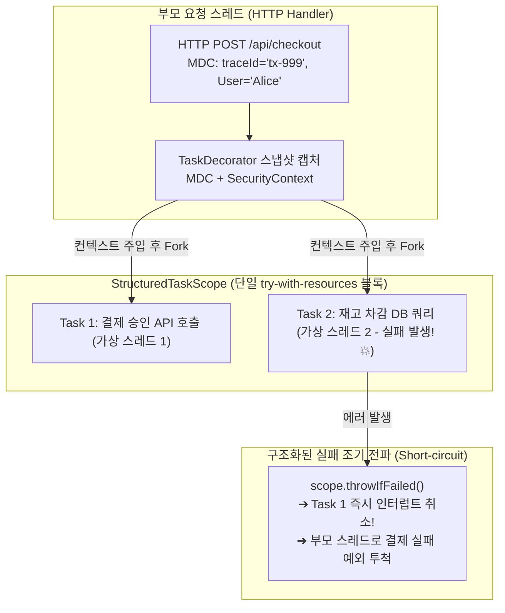

## 한눈에 보기
- 가상 스레드로 수천 개의 동시 작업을 띄울 때 가장 큰 문제는 비구조화된 비동기 실행으로 인한 "스레드 누수(Thread Leak)"와 "컨텍스트 유실(MDC/보안 유실)"이다.
- Java 25의 **[[구조화된-동시성]]**(`StructuredTaskScope`)은 병렬 하위 작업들을 단일 코드 블록 스코프로 결합하여 실패 시 즉시 조기 취소(Short-circuit)하고 스레드 누수를 원천 봉쇄한다.
- Spring Boot 4의 **[[태스크-데코레이터]]**(`TaskDecorator`) 체인은 비동기 스레드로 작업이 넘어갈 때 부모 스레드의 MDC 로깅 추적 ID와 SecurityContext를 자식 **[[가상-스레드]]**로 완벽히 복제·전파한다.

## 1. 왜 이게 필요한가

### 여기서 뭐가 무너지나
과거 `CompletableFuture`나 비구조화된 스레드 풀 환경에서는 여러 원격 API(주문 조회, 결제 확인, 배송 상태)를 병렬 호출할 때, 1개 작업이 500 에러로 즉시 실패해도 나머지 2개 작업은 취소되지 않고 끝까지 실행되어 CPU와 네트워크를 낭비했다.

또한 `ThreadLocal`에 보관되던 사용자 인증 정보(SecurityContext)나 분산 추적 MDC 로그 ID가 비동기 자식 스레드로 넘어가는 순간 유실되어, 비동기 메서드 내부에서 로그를 찍으면 `traceId=null`로 기록되어 장애 분석이 불가능해졌다.

### 그래서 나온 생각
Java 25는 부모-자식 작업의 생명주기를 엄격한 단일 블록(`try-with-resources`)으로 강제하는 `StructuredTaskScope.ShutdownOnFailure()`를 도입했다. 하위 작업 중 하나라도 터지면 즉시 다른 모든 하위 작업을 인터럽트하여 리소스 낭비와 고아 스레드(Orphan Thread) 생성을 방지한다.

동시에 Spring Boot 4는 `TaskDecorator` 인터페이스를 강화하여, 부모 스레드의 모든 컨텍스트를 스냅샷으로 캡처한 뒤 자식 스레드 실행 전 주입하고 종료 후 정리하는 라이프사이클 훅을 표준화했다 (Spring Boot 4에서는 복수의 `TaskDecorator` 빈 등록을 공식 지원).

쉽게 비유하자면, 가족 단위로 출발하는 해외 패키지여행(구조화된 동시성)과 같다. 가족 구성원(하위 작업) 중 한 명이 공항에서 여권을 분실(치명적 에러)하면 즉시 전원 여행 일정을 취소하고 집으로 돌아와야지, 나머지 사람만 따로 비행기를 타고 가버리는 비구조적 여행(고아 스레드 발생)을 막는 것이다. 또한 가이드(TaskDecorator)가 부모의 여행자 보험과 긴급 연락처(MDC/SecurityContext)를 자녀들에게도 동일하게 복사 배부해 주는 것과 같다.

→ 비유가 깨지는 지점: 여행 취소는 사람이 대화로 조율하지만, `StructuredTaskScope`는 JVM 커널 인터럽트 신호를 통해 마이크로초 단위로 실행 중인 소켓 I/O를 즉시 강제 차단한다.

## 2. 어떻게 동작하는가
1. **MDC 및 SecurityContext 캡처**: 부모 요청 스레드에서 `TaskDecorator`가 `MDC.getCopyOfContextMap()` 및 `SecurityContextHolder.getContext()`를 메모리에 스냅샷한다 — 자식 스레드로 전달할 메타데이터를 준비하기 위해서다.
2. **자식 가상 스레드 래핑 및 실행**: 스프링의 `ThreadPoolTaskExecutor`가 가상 스레드를 생성하고 데코레이터를 적용하여, 작업 실행 직전 `MDC.setContextMap(contextMap)`을 자식 스레드의 `ThreadLocal`에 주입한다 — 비동기 로직 내부에서도 동일한 traceId로 로깅하기 위해서다.
3. **StructuredTaskScope 진입 및 Fork**: 비즈니스 서비스가 `try (var scope = new StructuredTaskScope.ShutdownOnFailure())` 블록을 열고 `scope.fork(() -> fetchOrder())`와 `scope.fork(() -> fetchPayment())`를 호출한다 — 독립적인 하위 태스크를 병렬 가상 스레드로 기동하기 위해서다.
4. **결과 결합 및 조기 실패 전파 (Join & Throw)**: `scope.join().throwIfFailed()`를 호출하면, 두 작업이 모두 성공할 때까지 대기하다가 한쪽에서 예외가 발생하는 즉시 반대쪽 작업을 취소하고 즉시 예외를 부모 스레드로 전파한다 — 비정상 상태의 부분 처리를 막기 위해서다.
5. **리소스 및 ThreadLocal 클린업**: `try` 블록 종료 시 `scope.close()`가 호출되어 모든 가상 스레드가 완전 수거되고, `TaskDecorator`의 `finally` 블록이 자식 스레드의 MDC를 초기화한다 — 스레드 누수와 메모리 오염을 원천 차단하기 위해서다.

## 3. 그림으로 보기

## 4. 이 노트에 나온 용어
| 용어 | 한 줄 풀이 | 용어집 링크 |
|------|------------|-------------|
| 구조화된-동시성 | 하위 비동기 작업들을 단일 블록으로 묶어 실패 시 자동 취소하는 동시성 패러다임 | [[_glossary#구조화된-동시성]] |
| 태스크-데코레이터 | 비동기 스레드로 MDC 로깅 ID와 인증 컨텍스트를 복제 전파하는 스프링 인터페이스 | [[_glossary#태스크-데코레이터]] |
| 가상-스레드 | JVM이 관리하는 초경량 동시성 스레드 (Project Loom) | [[_glossary#가상-스레드]] |
| 플랫폼-스레드 | OS 커널에 1:1로 매핑되는 전통적인 무거운 자바 스레드 | [[_glossary#플랫폼-스레드]] |

## 5. 자주 헷갈리는 것
- **`CompletableFuture.allOf()`와의 차이**: `CompletableFuture.allOf()`는 1개 작업이 실패해도 나머지 작업이 백그라운드에서 끝까지 돌며 리소스를 낭비하지만, `StructuredTaskScope`는 1개 실패 시 즉시 나머지 모든 형제 작업에 인터럽트를 날려 즉각 중단시킨다.
- **가상 스레드에서의 `ThreadLocal` 비용**: 가상 스레드는 수백만 개가 뜰 수 있으므로 무거운 객체를 `ThreadLocal`에 넣으면 안 되며, 가벼운 키/값 맵이나 Java 25의 `ScopedValue`를 사용하는 것이 최신 권장 사항이다.

## 6. 언제 안 쓰나 / 경계
- **백그라운드 독립 화재-망각(Fire-and-Forget) 작업**: 부모 요청이 끝나도 백그라운드에서 독립적으로 10분 동안 돌아야 하는 배치성 이메일 발송 등은 부모 스코프에 묶이는 구조화된 동시성에 넣지 말고 전용 비동기 큐나 카프카로 위임해야 한다.

## 7. 연결
- [[01-virtual-threads-loom-concurrency]] — 가상 스레드의 경량 블로킹 특성이 구조화된 동시성의 기반이 된다.
- [[06-kafka-reliability-retries-dlq-idempotency]] — 비동기 작업 실패 시 이벤트 브로커와의 신뢰성 연동 패턴으로 이어진다.

## 8. 스스로 확인
1. 기존 `CompletableFuture` 비동기 프로그래밍 방식 대비 Java 25 `StructuredTaskScope`가 가지는 핵심 장점은 무엇인가?
2. 비동기 `@Async` 또는 가상 스레드 환경에서 MDC 로그 추적 ID가 유실되는 이유와 `TaskDecorator`의 해결 원리는 무엇인가?
3. `ShutdownOnFailure`와 `ShutdownOnSuccess`의 동작 차이점은 무엇인가?

<!-- ==== 아래는 내 영역 · 스킬 수정 금지 ==== -->

## 내 설명 시도

## 막혔던 지점

## 리뷰 이력
