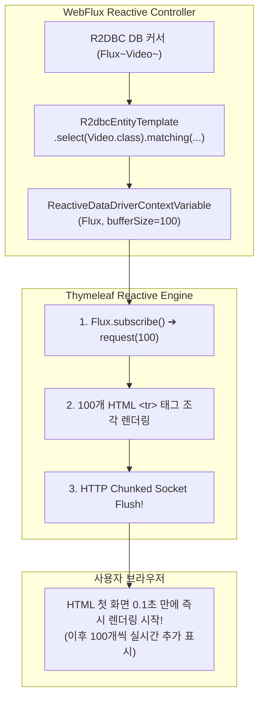

## 한눈에 보기
- 대용량 데이터 조회 시 전체 목록을 메모리에 다 담은 뒤 렌더링하면 서버 메모리가 폭발하고 첫 바이트 도달 시간(TTFB)이 심각하게 지연된다.
- **[[리액티브-데이터-드라이버]]**(`ReactiveDataDriverContextVariable`)는 Thymeleaf 템플릿이 `Flux` 스트림을 구독하여 10개/100개 단위의 청크 버퍼가 채워지는 즉시 HTML 조각을 브라우저로 실시간 밀어내기(Push) 렌더링을 수행한다.
- **[[리액티브-데이터-템플릿]]**(`R2dbcEntityTemplate`, `DatabaseClient`)은 정적 인터페이스 리포지토리의 한계를 넘어 동적 검색 조건과 복잡한 비동기 SQL을 유려한 Fluent API로 조립한다.

## 1. 왜 이게 필요한가

### 여기서 뭐가 무너지나
사용자가 10만 건의 주문 내역 페이지를 요청했을 때, 전통적인 템플릿 엔진(기존 MVC Thymeleaf)은 데이터베이스가 10만 건을 전부 전송하고 자바 힙 메모리에 `List<Order>` 객체 10만 개가 완전히 올라올 때까지 1바이트의 HTML도 브라우저에 보내지 못한다.

그 결과 서버는 순간적으로 수백 MB의 힙 메모리를 소모하며 GC 스파이크가 발생하고, 브라우저는 흰 화면(Blank Screen) 상태로 수 초간 멈춰있게 된다.

### 그래서 나온 생각
Spring **[[웹플럭스]]**와 Thymeleaf는 리액티브 스트림 기반의 데이터 구동 렌더링 어댑터인 `ReactiveDataDriverContextVariable`을 설계했다.

템플릿 엔진이 R2DBC 데이터베이스의 **[[리액티브-스트림즈]]** `Flux`를 직접 구독(Subscribe)하여, 데이터가 생성되는 족족 설정된 청크 크기(예: 100개)마다 끊어서 HTTP 청크 전송 인코딩(Chunked Transfer Encoding)으로 브라우저에 실시간 스트리밍한다.

동시에 단순 CRUD를 넘어서는 동적 검색 조건을 처리하기 위해, JPA의 `CriteriaBuilder`처럼 논블로킹 방식으로 SQL을 조립할 수 있는 `R2dbcEntityTemplate`을 제공했다.

쉽게 비유하자면, 식당의 코스 요리 서빙 방식과 같다. 모든 요리(10만 건의 데이터)가 다 조리될 때까지 손님을 굶긴 채 1시간 동안 기다리게 하는 것(전통적인 블로킹 템플릿 렌더링)이 아니라, 요리가 하나씩 완성될 때마다(청크 버퍼링) 즉시 테이블로 날라다 주는(리액티브 데이터 드라이버 스트리밍) 것과 같다. 손님(브라우저)은 첫 요리를 즉시 먹기 시작하므로 체감 대기 시간이 0에 가까워진다.

→ 비유가 깨지는 지점: 음식은 사람이 수동으로 나르지만, 리액티브 데이터 드라이버는 Netty 논블로킹 채널과 네이티브 소켓 플러시(Socket Flush)를 통해 나노초 단위의 마이크로 버퍼로 브라우저 화면을 실시간 갱신한다.

## 2. 어떻게 동작하는가
1. **Flux 데이터 스트림 생성**: R2DBC 리포지토리 또는 **[[리액티브-데이터-템플릿]]**(`R2dbcEntityTemplate.select(Video.class).matching(query).all()`)이 논블로킹 `Flux<Video>`를 반환한다 — 메모리 적재 없이 DB 커서에서 비동기로 레코드를 흘려보내기 위해서다.
2. **ReactiveDataDriverContextVariable 포장**: 컨트롤러에서 `model.addAttribute("videos", new ReactiveDataDriverContextVariable(flux, 100))`를 생성하여 모델에 담는다 — Thymeleaf에게 100건 단위의 청크 버퍼링 규칙을 지시하기 위해서다.
3. **Thymeleaf 템플릿의 Flux 구독**: 템플릿 뷰 리졸버가 렌더링을 시작하면서 `Flux`에 `subscribe()`를 요청하고, R2DBC에 **[[백프레셔]]** 신호(`request(100)`)를 보낸다 — 필요한 만큼만 DB에서 인출하기 위해서다.
4. **청크 버퍼 렌더링 및 HTTP 소켓 플러시**: 100건의 `<tr>` HTML 태그 조각이 생성되면 렌더러가 즉시 HTTP 응답 스트림으로 버퍼를 플러시(Flush)하여 클라이언트 브라우저로 전송한다 — 브라우저가 화면 상단부터 즉시 그릴 수 있게 하기 위해서다.
5. **스트림 완료 및 연결 종료**: DB의 마지막 레코드까지 스트리밍이 완료되면 `onComplete()` 신호와 함께 HTML `</html>` 닫는 태그가 전송되고 HTTP 연결이 깔끔하게 마무리된다 — 메모리 누수 없이 대용량 페이지 서빙을 완수하기 위해서다.

## 3. 그림으로 보기

## 4. 이 노트에 나온 용어
| 용어 | 한 줄 풀이 | 용어집 링크 |
|------|------------|-------------|
| 리액티브-데이터-드라이버 | 템플릿 엔진이 대용량 Flux 스트림을 버퍼 청크 단위로 실시간 렌더링하는 어댑터 | [[_glossary#리액티브-데이터-드라이버]] |
| 리액티브-데이터-템플릿 | R2DBC에서 유려한 Fluent API로 동적 쿼리를 조립하는 고수준 데이터 컴포넌트 | [[_glossary#리액티브-데이터-템플릿]] |
| 웹플럭스 | 적은 수의 스레드로 대규모 논블로킹 I/O를 처리하는 스프링 리액티브 웹 프레임워크 | [[_glossary#웹플럭스]] |
| 리액티브-스트림즈 | 비동기 논블로킹 데이터 스트림과 백프레셔를 표준화한 인터페이스 명세 | [[_glossary#리액티브-스트림즈]] |
| 백프레셔 | 소비자가 감당할 수 있는 만큼만 데이터를 요청하여 메모리 고갈을 막는 흐름 제어 | [[_glossary#백프레셔]] |

## 5. 자주 헷갈리는 것
- **SSE(Server-Sent Events)와의 차이**: SSE(`text/event-stream`)는 자바스크립트 `EventSource`가 소비하는 JSON 데이터 이벤트 스트림인 반면, `ReactiveDataDriverContextVariable`은 일반 브라우저가 일반 웹 페이지 요청(`text/html`)을 했을 때 서버사이드 렌더링된 HTML 본문을 청크 단위로 스트리밍하는 기술이다.
- **R2DBC에서 JPA 어노테이션 사용 불가**: R2DBC는 JPA 표준이 아니므로 `@OneToMany`, `@ManyToOne` 등의 연관관계 매핑이나 지연 로딩을 지원하지 않으며, `R2dbcEntityTemplate`이나 `DatabaseClient`를 통해 직접 명시적 조인을 작성해야 한다.

## 6. 언제 안 쓰나 / 경계
- **수십 건 미만의 극소량 데이터 단순 뷰 렌더링**: 조회 결과가 10~20건에 불과한 소규모 페이지에서는 청크 버퍼링 오버헤드 없이 일반 `Mono<List<T>>`를 모델에 전달하여 한 번에 렌더링하는 것이 더 단순하고 직관적이다.

## 7. 연결
- [[02-reactive-streams-reactor-core]] — Reactor Core의 `Flux`와 백프레셔 메커니즘이 데이터 드라이버의 근간이 된다.
- [[03-spring-webflux-controllers-streaming]] — WebFlux 컨트롤러 계층에서의 스트리밍 아키텍처와 연결된다.

## 8. 스스로 확인
1. 대용량 데이터 렌더링 시 기존 MVC 모델 대비 Thymeleaf `ReactiveDataDriverContextVariable`이 갖는 메모리 및 TTFB 상의 이점은 무엇인가?
2. `R2dbcEntityTemplate`과 `DatabaseClient`가 단순 리포지토리 인터페이스 대비 제공하는 장점은 무엇인가?
3. R2DBC 환경에서 JPA의 복잡한 연관관계 어노테이션을 사용할 수 없는 근본적 이유는 무엇인가?

<!-- ==== 아래는 내 영역 · 스킬 수정 금지 ==== -->

## 내 설명 시도

## 막혔던 지점

## 리뷰 이력
