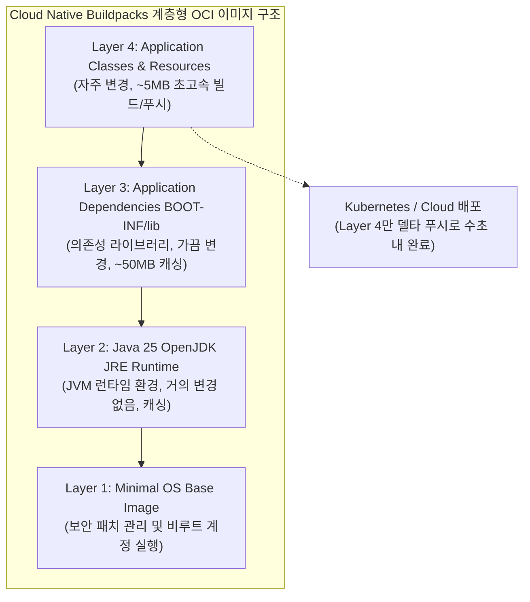

# Executable JAR 패키징과 Cloud Native Buildpacks 컨테이너화

## 한눈에 보기
| 배포 방식 | 빌드 명령어 | 생성 산출물 및 특징 |
|-----------|-------------|---------------------|
| Executable Uber JAR | `./gradlew bootJar` 또는 `./mvnw package` | 단일 독립 실행 파일 (`app.jar`), `java -jar app.jar`로 즉시 기동 |
| Cloud Native Buildpacks | `./gradlew bootBuildImage` 또는 `./mvnw spring-boot:build-image` | Dockerfile 없이 최적화된 OCI 계층형 도커 이미지 자동 생성 |

## 1. 왜 이게 필요한가

### 이런 상황을 상상해 보자
완성된 스프링 부트 애플리케이션을 AWS EC2 인스턴스나 쿠버네티스 클러스터에 배포하려 한다.

과거 레거시 자바 시절에는 서버에 별도로 톰캣(Tomcat)을 설치하고, 환경 변수를 세팅하고, 수십 개의 설정 파일을 조율한 뒤 WAR 파일을 `webapps/` 폴더에 복사해 넣는 복잡한 수작업 배포를 거쳐야 했다.

### 여기서 뭐가 무너지나
서버마다 설치된 톰캣 버전이나 JDK 환경이 조금만 달라도 "내 로컬 노트북에서는 잘 돌아가는데 운영 서버에서는 왜 안 되지?"라는 고질적인 환경 불일치 장애가 터졌다.

또한 도커(Docker) 컨테이너로 배포하기 위해 개발자가 수동으로 `Dockerfile`을 작성하다 보면, 베이스 이미지 보안 패치 누락, 불필요하게 거대한 이미지 용량(~1GB), 소스 코드 한 줄 바꿨는데 수백 메가바이트의 라이브러리 레이어가 매번 다시 빌드되는 비효율이 발생했다.

### 그래서 나온 생각
스프링 부트는 애플리케이션의 바이트코드뿐만 아니라 내장 톰캣 서버와 모든 의존성 jar 라이브러리를 단 하나의 파일로 묶어 독립 실행 가능한 **[[우버-자르]]**(= 모든 의존성과 내장 서버를 포함하여 단독 실행 가능한 실행 파일) 포맷을 기본으로 채택했다.

더 나아가 CNCF 표준인 **[[클라우드-네이티브-빌드팩]]**(= Dockerfile 없이 소스 코드를 프로덕션 표준 OCI 컨테이너 이미지로 빌드하는 도구)을 내장하여, 개발자가 Dockerfile을 단 한 줄도 쓰지 않고 `bootBuildImage` 명령어 하나만으로 레이어 캐싱과 보안 최적화가 완료된 도커 이미지를 구워낼 수 있게 했다.

쉽게 비유하자면, 가구를 직접 만들기 위해 나무 판자, 나사, 전동 드릴을 현장에 챙겨가서 조립하는 대신(과거 WAR 배포), 공장에서 완벽하게 조립되어 전원만 꽂으면 작동하는 완제품 완제품 가전(Uber JAR)을 배송하는 것과 같다. 그리고 이를 진공 압축 패키징 상자(Buildpacks OCI 컨테이너)에 넣어 어떤 트럭이나 비행기(쿠버네티스/클라우드)에도 완벽히 규격화되어 실리도록 한 것이다.

→ 비유가 깨지는 지점: 가전 완제품은 분해가 어렵지만, 스프링 부트의 Uber JAR와 Buildpacks 컨테이너는 내부 레이어(애플리케이션 코드 vs 서드파티 라이브러리)가 엄격히 분리되어 있어, 코드 한 줄을 수정해 재배포할 때 오직 수 킬로바이트의 앱 레이어만 초고속으로 다시 빌드되고 캐시된다.

## 2. 어떻게 동작하는가
1. **중첩 JAR 레이아웃 패키징**: `bootJar` 명령이 실행되면 `JarLauncher`가 포함된 특수 구조로 `BOOT-INF/classes`(내 코드)와 `BOOT-INF/lib`(외부 jar 라이브러리)를 단일 파일로 묶는다 — 표준 자바가 중첩된 jar 내부 클래스를 직접 읽지 못하는 한계를 극복하기 위해서다.
2. **Buildpacks 소스 자동 분석 (Detect)**: `bootBuildImage`가 실행되면 Paketo 빌드팩이 프로젝트 구조를 분석하여 적절한 OpenJDK 25 런타임을 감지하고 다운로드한다 — 개발자 머신에 도커 데몬만 있으면 완벽한 배포판을 재현하기 위해서다.
3. **계층화된 OCI 이미지 빌드 (Layers)**: OS 베이스 레이어, JVM 레이어, 서드파티 의존성 레이어, 내 애플리케이션 코드 레이어로 쪼개어 컨테이너 이미지를 조립한다 — 배포 시 변경된 코드 레이어만 푸시하여 네트워크 대역폭과 빌드 시간을 획기적으로 줄이기 위해서다.
4. **컨테이너 레지스트리 배포**: 완성된 도커 이미지를 Docker Hub나 사내 프라이빗 레지스트리로 푸시한다 — 쿠버네티스나 클라우드 인프라가 즉시 풀(Pull)받아 실행할 수 있게 하기 위해서다.

## 3. 그림으로 보기

## 4. 이 노트에 나온 용어
| 용어 | 한 줄 풀이 | 용어집 링크 |
|------|------------|-------------|
| 우버-자르 | 내장 웹 서버와 모든 의존성 라이브러리를 포함한 단일 독립 실행형 JAR 파일 | [[_glossary#우버-자르]] |
| 클라우드-네이티브-빌드팩 | Dockerfile 없이 표준 최적화 OCI 컨테이너 이미지를 빌드하는 도구 (CNB) | [[_glossary#클라우드-네이티브-빌드팩]] |
| 도커-컴포즈 | 다중 컨테이너 환경을 단일 설정으로 정의하고 실행하는 오케스트레이션 도구 | [[_glossary#도커-컴포즈]] |
| 그랄브이엠 | 자바 바이트코드를 머신 코드로 빌드하는 고성능 AOT 런타임 | [[_glossary#그랄브이엠]] |

## 5. 자주 헷갈리는 것
- **`java -jar` 실행 원리**: 일반 자바 JVM은 jar 파일 안에 또 다른 jar 파일이 들어있는 구조(중첩 jar)를 인식하지 못하지만, 스프링 부트의 `JarLauncher`가 커스텀 클래스로더를 통해 압축을 풀지 않고도 내부 라이브러리 클래스들을 완벽히 로드해 준다.
- **수동 Dockerfile과의 차이**: 수동 Dockerfile은 루트 권한 실행 위험이나 취약한 베이스 이미지 문제를 개발자가 직접 챙겨야 하지만, Buildpacks는 비루트(Non-root) 사용자 실행과 보안 패치 레이어 스왑을 자동으로 보장한다.

## 6. 언제 안 쓰나 / 경계
- **OS 수준의 특수 네이티브 패키지 설치가 필요한 경우**: FFmpeg 영상 인코더나 C++ 네이티브 라이브러리 등 특수한 OS 패키지를 리눅스에 직접 설치해야 하는 환경에서는 Buildpacks 대신 명시적인 커스텀 Dockerfile을 작성하는 것이 유리하다.

## 7. 연결
- [[02-docker-compose-production-scaling]] — 빌드된 컨테이너 이미지를 데이터베이스 및 메시지 브로커와 함께 다중 컨테이너로 스케일링하는 과정으로 이어진다.
- [[03-graalvm-native-image-and-runtime-hints]] — 표준 JVM 컨테이너를 넘어 서브세컨드 기동 속도를 제공하는 GraalVM Native Image 패키징으로 확장된다.

## 8. 스스로 확인
1. 과거 WAR 파일 배포와 비교하여 스프링 부트의 Executable Uber JAR가 가져온 배포 패러다임의 혁신은 무엇인가?
2. Cloud Native Buildpacks가 Dockerfile 없이도 최적화된 계층형(Layered) 컨테이너 이미지를 생성하는 원리는 무엇인가?
3. 중첩된 JAR 구조(`BOOT-INF/lib`)를 JVM이 실행할 수 있도록 지원하는 Spring Boot Launcher의 역할은 무엇인가?

<!-- ==== 아래는 내 영역 · 스킬 수정 금지 ==== -->

## 내 설명 시도

## 막혔던 지점

## 리뷰 이력
