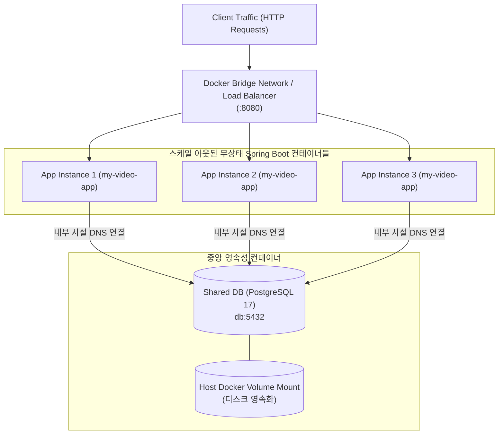

# Docker Compose 다중 컨테이너 운영과 공유 DB 스케일링

## 한눈에 보기
| 운영 요소 | 역할 | 구성 방식 |
|-----------|------|-----------|
| `compose.yaml` | 다중 서비스(App 1, App 2, PostgreSQL, Kafka) 일괄 정의 | 포트 포워딩, 볼륨 마운트, 네트워크 브리지 선언 |
| 공유 데이터베이스 | 복수의 무상태(Stateless) 앱 인스턴스가 동일 DB 공유 | 트랜잭션 격리 및 HikariCP 커넥션 풀 공유 |
| 수평적 스케일링 (Scale-out) | `docker compose up --scale app=3` | 트래픽 증가에 맞춰 애플리케이션 컨테이너 인스턴스 복제 확장 |

## 1. 왜 이게 필요한가

### 이런 상황을 상상해 보자
동영상 서비스의 트래픽이 폭증하여 단일 서버로는 몰려드는 요청을 감당할 수 없게 되었다. 데이터베이스(PostgreSQL)는 단일 공유 서버로 두고, 스프링 부트 애플리케이션 컨테이너를 3개로 늘려 수평 확장(Scale-out)하려 한다.

```yaml
services:
  app:
    image: my-video-app:latest
    environment:
      - SPRING_DATASOURCE_URL=jdbc:postgresql://db:5432/videodb
    depends_on:
      - db
  db:
    image: postgres:17
    environment:
      POSTGRES_DB: videodb
```

개발자는 `compose.yaml` 파일 하나에 전체 서비스 토폴로지를 정의하고 `docker compose up`을 실행했다.

### 여기서 뭐가 무너지나
애플리케이션이 세션 상태(State)를 메모리에 저장하는 상태 유지(Stateful) 구조로 설계되어 있다면, 사용자의 1차 요청이 1번 인스턴스로 가고 2차 요청이 2번 인스턴스로 전달되었을 때 로그인이 풀려버리는 세션 불일치 장애가 발생한다.

또한 로컬 개발 환경에서 개발자마다 서로 다른 포트와 DB 자격 증명으로 수동 테스트를 진행하다가 운영 배포 시 환경 설정 충돌로 서비스가 기동되지 않는 불일치가 빈번하다.

### 그래서 나온 생각
여러 개의 독립된 컨테이너 서비스들을 하나의 가상 사설 네트워크로 묶어 선언적으로 관리하는 **[[도커-컴포즈]]**(= 다중 컨테이너 환경을 단일 설정으로 정의하고 실행하는 오케스트레이션 도구) 체계를 구축했다.

스프링 부트 애플리케이션은 내부 상태를 완전히 비워두는 무상태(Stateless) 아키텍처를 준수하여, **[[클라우드-네이티브-빌드팩]]**으로 빌드된 동일한 도커 이미지를 몇 개든 자유롭게 복제하여 스케일링할 수 있게 되었다.

쉽게 비유하자면, 프랜차이즈 식당의 본사 물류창고(공유 DB)와 개별 가맹점 주방(앱 인스턴스)의 관계와 같다. 점심시간에 손님(트래픽)이 폭증하면 가맹점 주방(컨테이너 인스턴스)을 1개에서 3개로 늘려 조리사를 배치한다. 모든 조리사는 본사 물류창고(중앙 DB)에서 동일한 식재료를 꺼내어 요리하므로, 손님이 어느 주방에서 나온 음식을 받아도 동일한 맛과 품질(데이터 정합성)을 누릴 수 있다.

→ 비유가 깨지는 지점: 식당 주방은 확장에 물리적 공간과 공사 비용이 들지만, 도커 컴포즈 환경에서는 `docker compose up --scale app=5` 명령 한 줄로 수 초 만에 인스턴스를 5배로 확장하고 트래픽을 분산시킬 수 있다.

## 2. 어떻게 동작하는가
1. **도커 컴포즈 네트워크 브리지 생성**: `docker compose up`이 실행되면 격리된 내부 사설 가상 네트워크가 생성되고 DNS 서비스 디스커버리가 활성화된다 — 컨테이너들이 IP 주소 대신 서비스 이름(`db`, `kafka`)으로 통신할 수 있게 하기 위해서다.
2. **공유 데이터베이스 기동**: PostgreSQL 컨테이너가 먼저 구동되고 볼륨이 마운트되어 데이터를 디스크에 영속화한다 — 컨테이너가 재시작되어도 데이터가 유실되지 않게 하기 위해서다.
3. **스프링 부트 인스턴스 환경 변수 주입**: 앱 컨테이너들이 시작되면서 컴포즈가 주입한 `SPRING_DATASOURCE_URL=jdbc:postgresql://db:5432/videodb` 환경 변수를 읽어 DB 연결을 수립한다 — 설정 하드코딩 없이 동적으로 컨테이너 환경에 결합하기 위해서다.
4. **로드 밸런싱 및 요청 분산**: 전면 프록시(Nginx / Traefik / Docker 내부 라운드로빈)가 들어오는 HTTP 요청을 복제된 3개의 스프링 부트 인스턴스로 균등하게 분배한다 — 특정 인스턴스에 부하가 집중되는 것을 방지하기 위해서다.
5. **무상태 트랜잭션 처리**: 각 인스턴스는 공유 DB에 대해 독립적인 커넥션 풀을 열고 표준 ACID 트랜잭션을 실행한다 — 어떤 인스턴스가 요청을 처리하든 완벽한 데이터 일관성을 보장하기 위해서다.

## 3. 그림으로 보기



## 4. 이 노트에 나온 용어
| 용어 | 한 줄 풀이 | 용어집 링크 |
|------|------------|-------------|
| 도커-컴포즈 | 다중 컨테이너 환경을 단일 YAML로 정의하고 조율하는 도구 | [[_glossary#도커-컴포즈]] |
| 클라우드-네이티브-빌드팩 | 표준 OCI 컨테이너 이미지를 자동으로 빌드하는 프레임워크 도구 | [[_glossary#클라우드-네이티브-빌드팩]] |
| 우버-자르 | 내장 서버를 포함하여 단독 실행되는 단일 패키징 JAR | [[_glossary#우버-자르]] |
| 그랄브이엠 | 서브세컨드 기동을 지원하는 고성능 AOT 네이티브 런타임 | [[_glossary#그랄브이엠]] |

## 5. 자주 헷갈리는 것
- **Spring Boot 3.1+의 Docker Compose 내장 통합**: `spring-boot-docker-compose` 모듈을 의존성에 추가하면, `gradle bootRun`으로 로컬 개발 서버를 켤 때 스프링 부트가 `compose.yaml`을 감지하여 DB 컨테이너를 자동으로 띄우고 종료 시 함께 정리해 준다.
- **Stateless 세션 관리**: 여러 앱 인스턴스 간에 세션을 공유해야 할 때는 로컬 톰캣 메모리 세션을 쓰지 않고 `Spring Session Data Redis`를 도입하여 Redis에 세션을 중앙 저장해야 한다.

## 6. 언제 안 쓰나 / 경계
- **수백 대의 대규모 분산 클러스터 프로덕션 환경**: 수십 대 이상의 노드를 가로지르는 대규모 프로덕션 클러스터링, 자동 롤링 업데이트, 자율 치유(Self-healing)가 필요한 환경에서는 단일 호스트 중심의 Docker Compose 대신 쿠버네티스(Kubernetes)를 사용해야 한다.

## 7. 연결
- [[01-uber-jar-and-buildpacks-container]] — Buildpacks로 빌드된 컨테이너 이미지를 기반으로 Docker Compose 서비스를 구성한다.
- [[03-graalvm-native-image-and-runtime-hints]] — 컨테이너 기동 속도와 메모리 사용량을 극한으로 줄이기 위해 GraalVM 네이티브 이미지 컨테이너로 전환하는 과정으로 이어진다.

## 8. 스스로 확인
1. 다중 애플리케이션 컨테이너가 단일 데이터베이스를 공유하여 수평 확장(Scale-out)할 때 지켜야 하는 아키텍처 원칙은 무엇인가?
2. Docker Compose가 컨테이너 간 서비스 이름(Service Name) 기반 DNS 통신을 제공하는 원리는 무엇인가?
3. Spring Boot의 Docker Compose 지원 모듈이 로컬 개발 생산성을 높여주는 메커니즘은 무엇인가?

<!-- ==== 아래는 내 영역 · 스킬 수정 금지 ==== -->

## 내 설명 시도

## 막혔던 지점

## 리뷰 이력
