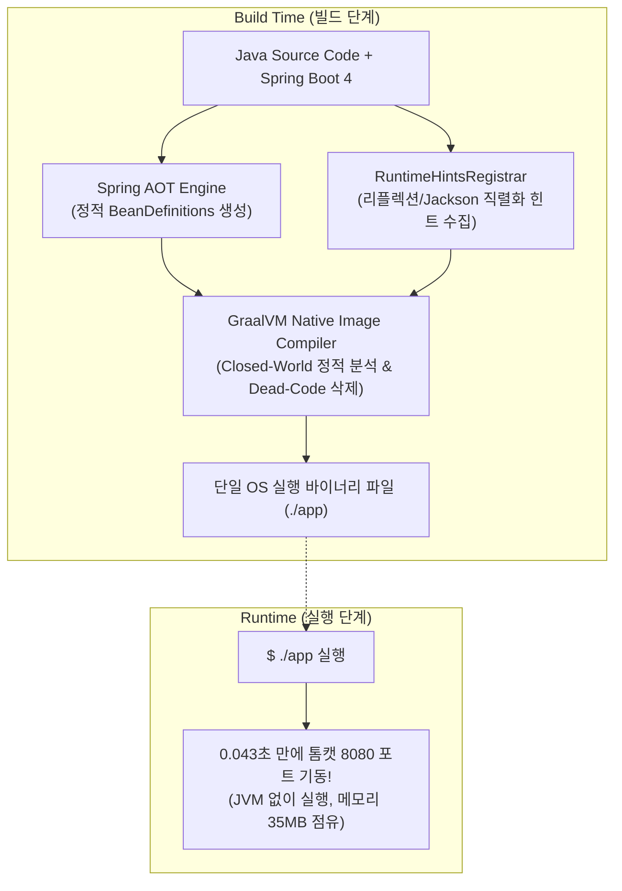

# GraalVM Native Image와 RuntimeHints AOT 최적화

## 한눈에 보기
| 항목 | 표준 JVM (HotSpot) | GraalVM Native Image (AOT) |
|------|-------------------|----------------------------|
| 컴파일 방식 | 빌드 시 바이트코드, 런타임에 JIT(Just-In-Time) 컴파일 | 빌드 시 기계어 바이너리로 사전 AOT 컴파일 |
| 기동 시간 (Startup Time) | 약 1.5 ~ 3.0 초 | **약 0.03 ~ 0.08 초 (밀리초 단위!)** |
| 메모리 점유율 (RSS) | 약 150 ~ 300 MB | **약 30 ~ 60 MB (최대 1/5 수준 절감)** |
| 런타임 동적 특성 | 리플렉션, 프록시 무제한 자유 허용 | 닫힌 세계 가설(Closed-World): `RuntimeHints` 사전 등록 필수 |

## 1. 왜 이게 필요한가

### 이런 상황을 상상해 보자
AWS Lambda 같은 서버리스 FaaS 환경이나 트래픽에 따라 Pod 개수가 0개에서 수십 개로 실시간 스케일링(Scale-to-Zero)되는 클라우드 환경에 스프링 부트 앱을 배포하려 한다.

```shell
./gradlew nativeCompile
```

바이너리 빌드를 마치고 생성된 단일 실행 파일(`build/native/nativeCompile/app`)을 터미널에서 실행하자마자, 눈 깜짝할 새인 **0.043초(43ms)** 만에 톰캣과 스프링 컨텍스트가 완전히 뜬다.

이처럼 자바 바이트코드를 빌드 타임에 운영체제 네이티브 머신 코드로 컴파일하는 기술을 **[[그랄브이엠]]**(= 고성능 AOT 네이티브 이미지를 생성하는 다국어 지원 런타임)이라 부른다.

### 여기서 뭐가 무너지나
표준 자바(HotSpot JVM)는 애플리케이션이 시작될 때마다 수천 개의 클래스를 동적으로 로딩하고, 리플렉션으로 어노테이션을 스캔하며, 런타임 프로파일링을 거쳐 JIT 컴파일러가 바이트코드를 머신 코드로 번역하는 "워밍업(Warm-up)" 과정을 거친다.

이로 인해 서버리스 환경에서 요청이 들어왔을 때 서버가 켜질 때까지 수 초 동안 응답이 멈추는 콜드 스타트(Cold Start) 문제가 발생하고, 수백 개의 마이크로서비스를 띄우면 JVM 메모리 기본 점유 비용만으로 수십 기가바이트의 클라우드 인프라 비용이 낭비된다.

### 그래서 나온 생각
빌드 타임에 스프링 애플리케이션의 모든 빈 구성과 어노테이션을 정적으로 미리 분석하여 최적화된 자바 코드로 생성한 뒤, 이를 네이티브 머신 코드로 구워내는 **[[에이오티-컴파일]]**(= 사전 컴파일을 통해 런타임 오버헤드를 제거하는 AOT 기술)을 완성했다.

AOT 컴파일러는 "빌드 시점에 보이지 않는 코드는 런타임에도 절대 실행되지 않는다"는 '닫힌 세계 가설(Closed-World Assumption)'을 전제로 미사용 코드를 과감히 제거(Dead Code Elimination)한다.

이때 동적 리플렉션이나 JSON 직렬화에 사용되는 클래스들이 컴파일러에 의해 삭제되는 것을 방지하기 위해, 개발자가 명시적으로 메타데이터를 선언하는 **[[런타임-힌트]]**(= AOT 컴파일러에게 리플렉션 및 리소스 접근 대상을 알려주는 인터페이스, `RuntimeHintsRegistrar`) 체계를 제공한다.

쉽게 비유하자면, 사전 제작된 완제품 조립 키트와 같다. 과거 JVM 방식은 현장에 도착해서 설계도를 펼치고(리플렉션 스캔), 부품을 하나하나 깎아서(JIT 컴파일) 가구를 조립하느라 1시간(수 초)이 걸렸다. GraalVM AOT 방식은 공장에서 이미 완제품을 100% 깎아서 금속으로 주조해 배송하므로, 상자를 열자마자 0.1초 만에 즉시 사용할 수 있는 것과 같다.

→ 비유가 깨지는 지점: 금속 완제품은 현장에서 설계를 바꿀 수 없듯이, GraalVM 네이티브 이미지는 런타임에 새로운 클래스를 동적으로 생성하거나 바이트코드를 조작할 수 없으므로 모든 동적 요소는 사전에 힌트로 신고해야 한다.

## 2. 어떻게 동작하는가
1. **Spring AOT 코드 생성 (Ahead-of-Time Processing)**: 빌드 시 스프링 부트의 AOT 엔진이 `@Configuration`, `@ComponentScan`을 정적으로 평가하여 리플렉션 없이 빈을 등록하는 최적화된 자바 소스 코드(`BeanDefinitions`)를 미리 생성한다 — 런타임 어노테이션 스캔 시간을 0으로 만들기 위해서다.
2. **RuntimeHintsRegistrar 힌트 수집**: 프로젝트의 `RuntimeHintsRegistrar` 구현체가 실행되어 Jackson 직렬화 대상 DTO, 리소스 번들, CGLIB 프록시 대상 클래스 목록을 JSON 힌트 파일로 방출한다 — GraalVM이 리플렉션 대상 클래스를 죽은 코드로 오판하여 삭제하는 것을 방지하기 위해서다.
3. **GraalVM 정적 분석 및 네이티브 컴파일**: GraalVM의 `native-image` 툴이 애플리케이션의 진입점(`main`)부터 도달 가능한 모든 코드 경로를 분석하고, 가비지 컬렉터(Substrate VM)와 함께 단일 OS 실행 파일로 압축 컴파일한다 — JVM 설치 없이 실행되는 독립 머신 바이너리를 생성하기 위해서다.
4. **초고속 기동 (Subsecond Startup)**: 바이너리가 실행되면 사전 초기화된 힙 스냅샷을 메모리로 즉시 로드하여 밀리초 단위로 웹 서버를 개방한다 — 서버리스 콜드 스타트 문제를 완벽히 소멸시키기 위해서다.

## 3. 그림으로 보기



## 4. 이 노트에 나온 용어
| 용어 | 한 줄 풀이 | 용어집 링크 |
|------|------------|-------------|
| 그랄브이엠 | 자바 바이트코드를 머신 코드로 사전 빌드하는 고성능 AOT 런타임 | [[_glossary#그랄브이엠]] |
| 에이오티-컴파일 | 빌드 시점에 코드를 정적 분석하여 머신 코드로 만드는 사전 컴파일 기술 (AOT) | [[_glossary#에이오티-컴파일]] |
| 런타임-힌트 | AOT 컴파일러에게 리플렉션/직렬화 대상 클래스를 알려주는 메타데이터 인터페이스 | [[_glossary#런타임-힌트]] |
| 에이오티-캐시 | 표준 JVM에서 AOT 이점을 누리게 해주는 Java 25의 경량 최적화 기능 | [[_glossary#에이오티-캐시]] |

## 5. 자주 헷갈리는 것
- **빌드 시간과 런타임 성능의 트레이드오프**: GraalVM 네이티브 컴파일은 전체 클래스패스의 도달 가능성을 정적 분석하므로 빌드 시 수 분(2~5분)의 시간과 많은 RAM이 소모된다. 하지만 런타임에는 극단적인 기동 속도와 메모리 절감을 제공한다.
- **Peak Throughput(최대 처리량) 비교**: 장기간 실행되는 대규모 서버에서는 HotSpot JVM의 JIT 컴파일러가 런타임 프로파일링을 통해 머신 코드를 실시간 재최적화하므로 최대 처리량(Peak Performance)이 GraalVM 기본 네이티브 이미지보다 약간 더 높을 수 있다 (단, GraalVM Enterprise PGO 사용 시 극복 가능).

## 6. 언제 안 쓰나 / 경계
- **런타임 동적 클래스 로딩/플러그인 구조**: 런타임에 외부 jar 파일을 동적으로 클래스로더에 올려 실행하는 플러그인 아키텍처는 GraalVM의 닫힌 세계 가설에 위배되므로 표준 HotSpot JVM을 써야 한다.

## 7. 연결
- [[01-uber-jar-and-buildpacks-container]] — Cloud Native Buildpacks의 `BP_NATIVE_IMAGE=true` 환경 변수를 통해 도커 컨테이너 내부에서 GraalVM 네이티브 바이너리를 자동 빌드한다.
- [[04-java25-aot-cache-and-runtime-comparison]] — 네이티브 이미지 빌드의 긴 빌드 시간을 우회하는 Java 25 AOT Cache 기술과의 비교로 이어진다.

## 8. 스스로 확인
1. HotSpot JVM의 JIT 컴파일과 GraalVM의 AOT 컴파일이 가지는 기동 속도 및 메모리 사용량 차이의 근본 원인은 무엇인가?
2. GraalVM의 닫힌 세계 가설(Closed-World Assumption) 하에서 `RuntimeHintsRegistrar`가 필요한 이유는 무엇인가?
3. 서버리스(FaaS) 및 클라우드 오토스케일링 환경에서 GraalVM Native Image가 필수적인 무기가 되는 이유는 무엇인가?

<!-- ==== 아래는 내 영역 · 스킬 수정 금지 ==== -->

## 내 설명 시도

## 막혔던 지점

## 리뷰 이력
