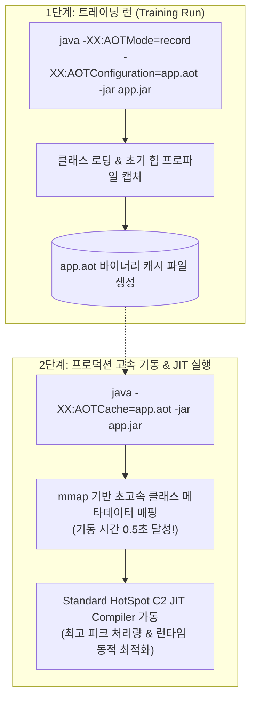

# Java 25 AOT Cache와 4대 자바 런타임 성능 비교

## 한눈에 보기
| 런타임 방식 | 빌드 소요 시간 | 기동 시간 (Startup) | 메모리 점유 (RSS) | 최대 처리량 (Peak) | 적합한 배포 시나리오 |
|-------------|----------------|---------------------|-------------------|-------------------|----------------------|
| **표준 HotSpot JVM** | 매우 빠름 (~수초) | 보통 (~2-3초) | 큼 (~250MB) | **최상 (JIT 최적화)** | 장시간 실행되는 대규모 단일 백엔드 서버 |
| **Java 25 AOT Cache** | 매우 빠름 (~수초) | **빠름 (~0.5-0.8초)** | 중간 (~150MB) | **최상 (HotSpot 유지)** | **빌드 속도와 기동 속도의 최적 밸런스 (기본 추천)** |
| **GraalVM Native Image** | 느림 (~2-5분) | **극초고속 (~0.04초)** | **최소 (~40MB)** | 우수 | 서버리스(FaaS), Scale-to-Zero 클라우드 |
| **CRaC (체크포인트 복원)** | 빠름 (웜업 필요) | **극초고속 (~0.05초)** | 중간 (~150MB) | 최상 | 웜업 상태를 스냅샷으로 저장 가능한 쿠버네티스 |

## 1. 왜 이게 필요한가

### 이런 상황을 상상해 보자
현대적인 클라우드 CI/CD 파이프라인에서 개발자가 코드를 커밋할 때마다 빌드와 테스트를 거쳐 컨테이너로 배포해야 한다.

GraalVM 네이티브 이미지를 쓰면 기동 시간(0.04초)과 메모리(40MB)가 혁신적으로 줄어들지만, CI/CD 빌드 시간이 매번 3~5분씩 걸려 빠른 피드백 루프가 저해된다. 반대로 표준 JVM을 쓰면 빌드는 5초 만에 끝나지만 서버 재시작 시 2~3초가 걸린다.

```shell
# 1단계: 트레이닝 실행으로 AOT 캐시 파일 생성
java -XX:AOTMode=record -XX:AOTConfiguration=app.aot -jar app.jar

# 2단계: 생성된 AOT 캐시를 적용하여 초고속 기동
java -XX:AOTMode=on -XX:AOTCache=app.aot -jar app.jar
```

이처럼 긴 네이티브 컴파일 시간 없이 표준 HotSpot JVM 위에서 클래스 로딩과 사전 프로파일링 캐시를 활용해 기동 시간을 3배 이상 단축하는 기술을 **[[에이오티-캐시]]**(= Java 25 OpenJDK의 표준 사전 캐싱 최적화 기능)라 한다.

### 여기서 뭐가 무너지나
과거에는 "빠른 빌드와 높은 JIT 처리량을 가진 표준 JVM"과 "느린 빌드지만 즉각 기동과 최소 메모리를 가진 GraalVM AOT"라는 양극단의 선택지만 존재했다.

개발팀은 긴 네이티브 빌드 시간을 감당하지 못해 결국 표준 JVM으로 돌아가거나, 반대로 콜드 스타트를 잡기 위해 긴 빌드 시간을 억지로 감수해야 하는 극심한 딜레마에 시달렸다.

### 그래서 나온 생각
Java 25(Project Leyden)와 Spring Boot 4는 표준 HotSpot JVM의 장점(JIT 컴파일의 최고 처리량, 동적 리플렉션 자유도, 빠른 빌드)을 100% 보존하면서, 런타임에 반복되는 클래스패스 분석과 초기화 작업을 바이너리 캐시 파일로 굳혀두는 Java 25 AOT Cache를 공식 지원했다.

이를 통해 개발팀은 상황과 인프라 특성에 맞춰 4대 자바 런타임 전략을 자유롭게 선택하고 전환할 수 있게 되었다.

쉽게 비유하자면, 출근 준비 방식의 차이와 같다.
- 표준 JVM: 아침에 일어나서 원두를 갈고, 토스트를 굽고, 옷을 다려 입는 방식 (20분 소요).
- Java 25 AOT Cache: 전날 밤에 커피 머신 타이머를 맞춰두고 옷을 미리 걸어두어 아침에 버튼만 눌러 나가는 방식 (5분 소요, 맛은 완벽한 갓 내린 커피).
- GraalVM Native Image: 아예 캔 커피와 밀봉된 샌드위치를 가방에 넣어두고 0초 만에 문을 박차고 나가는 방식 (0초 소요, 단 만드는 데 전날 1시간 걸림).

→ 비유가 깨지는 지점: 일상 준비는 정답이 없지만, 자바 런타임은 배포 인프라의 과금 모델(메모리 초당 과금인 서버리스 vs 24시간 켜져 있는 전용 노드)에 따라 선택 기준이 명확히 갈린다.

## 2. 어떻게 동작하는가
1. **트레이닝 런 (Training Run)**: 애플리케이션의 **[[우버-자르]]**를 `-XX:AOTMode=record` 옵션으로 실행하여 스프링 부트 기동 시 로드되는 수천 개의 클래스 메타데이터와 인터프리터 프로파일을 수집한다 — 런타임 워밍업 정보를 캡처하기 위해서다.
2. **AOT 캐시 바이너리 생성**: JVM이 종료되면서 수집된 클래스 메타데이터, 사전 해결된 심볼릭 참조, 힙 초기 객체들을 `app.aot` 파일로 직렬화하여 저장한다 — 다음 기동 시 재사용할 캐시 아티팩트를 완성하기 위해서다.
3. **프로덕션 AOT 캐시 로드**: 프로덕션 환경에서 `java -XX:AOTCache=app.aot -jar app.jar`로 실행하면, JVM이 클래스 바이트코드를 파싱하고 검증하는 과정을 완전히 건너뛰고 메모리 맵(mmap)으로 캐시를 즉시 로드한다 — 기동 시간을 0.5초대로 대폭 줄이기 위해서다.
4. **HotSpot C2 JIT 가동**: 기동 후 트래픽이 유입되면 표준 HotSpot C2 컴파일러가 최신 하드웨어 명령어에 맞춰 실시간으로 최고 효율의 머신 코드로 최적화한다 — **[[그랄브이엠]]** 대비 최고의 롱런 피크 처리량을 달성하기 위해서다.

## 3. 그림으로 보기



## 4. 이 노트에 나온 용어
| 용어 | 한 줄 풀이 | 용어집 링크 |
|------|------------|-------------|
| 에이오티-캐시 | 표준 HotSpot JVM에서 클래스 로딩을 사전 캐싱하여 기동을 단축하는 Java 25 기능 | [[_glossary#에이오티-캐시]] |
| 그랄브이엠 | 바이트코드를 머신 코드로 완전 변환하여 초고속 기동을 달성하는 AOT 런타임 | [[_glossary#그랄브이엠]] |
| 에이오티-컴파일 | 빌드 타임에 정적 분석을 통해 사전 컴파일을 수행하는 기술 | [[_glossary#에이오티-컴파일]] |
| 우버-자르 | 모든 의존성을 포함한 단일 독립 실행형 JAR 파일 | [[_glossary#우버-자르]] |

## 5. 자주 헷갈리는 것
- **AppCDS vs Java 25 AOT Cache**: Java 10대의 기존 AppCDS(Application Class Data Sharing)는 공유 클래스 메타데이터만 덤프했지만, Java 25의 AOT Cache는 Project Leyden의 결실로서 클래스 초기화 상태와 사전 생성된 힙 객체 스냅샷까지 포괄하여 차원이 다른 기동 가속을 제공한다.
- **`RuntimeHints` 불필요**: Java 25 AOT Cache는 여전히 표준 HotSpot JVM 위에서 동작하므로, GraalVM처럼 복잡한 `RuntimeHints`를 등록하지 않아도 모든 동적 리플렉션 라이브러리가 100% 정상 작동한다.

## 6. 언제 안 쓰나 / 경계
- **콜드 스타트가 0.1초 미만이어야 하는 서버리스 FaaS**: 0.5초의 기동 시간도 허용되지 않고 메모리 사용량을 50MB 미만으로 극단적으로 쥐어짜야 하는 AWS Lambda 환경에서는 Java 25 AOT Cache 대신 GraalVM Native Image를 선택해야 한다.

## 7. 연결
- [[01-uber-jar-and-buildpacks-container]] — 동일한 Uber JAR 산출물 위에 AOT Cache 플래그만 추가하여 최적화를 달성한다.
- [[03-graalvm-native-image-and-runtime-hints]] — 극단적인 기동 최적화가 필요한 경우 GraalVM Native Image로의 전환을 비교 검토할 수 있다.

## 8. 스스로 확인
1. Java 25 AOT Cache가 GraalVM Native Image와 비교하여 가지는 빌드 편의성 및 동적 리플렉션 호환성의 장점은 무엇인가?
2. 4대 자바 런타임(표준 JVM, Java 25 AOT Cache, GraalVM Native, CRaC)의 트레이드오프를 기동 시간과 최대 처리량 관점에서 비교 설명할 수 있는가?
3. `-XX:AOTMode=record`를 사용한 트레이닝 런이 런타임 기동 시간을 획기적으로 줄여주는 원리는 무엇인가?

<!-- ==== 아래는 내 영역 · 스킬 수정 금지 ==== -->

## 내 설명 시도

## 막혔던 지점

## 리뷰 이력
