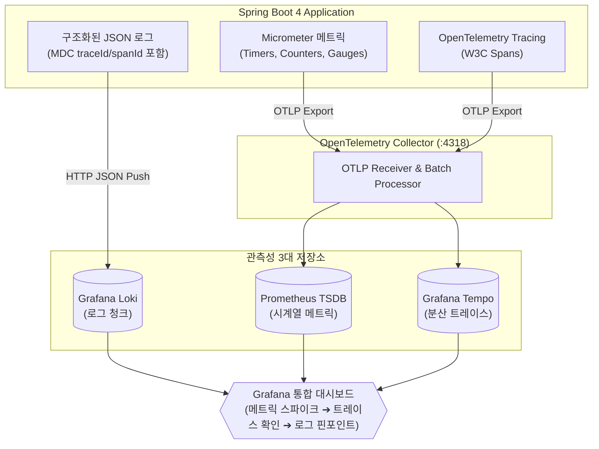

# 옵저버빌리티 3대 기둥과 OpenTelemetry 아키텍처

## 한눈에 보기
| 옵저버빌리티 3대 기둥 | 제공하는 정보 및 가치 | Spring Boot 4 연동 기술 |
|-----------------------|-----------------------|-------------------------|
| **로그 (Logs)** | 특정 시점에 애플리케이션 내부에서 발생한 개별 이벤트의 상세 텍스트 기록 | Logback 구조화된 JSON 로깅 & Grafana Loki |
| **메트릭 (Metrics)** | 일정 시간 동안의 수치 집계 데이터 (CPU 사용량, 처리량, 지연 시간) | Micrometer & Prometheus |
| **트레이스 (Traces)** | 요청이 여러 마이크로서비스와 카프카를 거쳐 처리되는 전 구간의 경로 그래프 | OpenTelemetry, Micrometer Tracing & Grafana Tempo |

## 1. 왜 이게 필요한가

### 이런 상황을 상상해 보자
수십 개의 마이크로서비스로 구성된 대규모 분산 전자상거래 시스템이 운영 중이다. 어느 날 오후 사용자들이 "주문 결제 버튼을 누르면 가끔 5초 이상 멈추다가 실패한다"는 불만을 접수했다.

```yaml
management:
  otlp:
    tracing:
      endpoint: "http://otel-collector:4318/v1/traces"
    metrics:
      export:
        url: "http://otel-collector:4318/v1/metrics"
        step: 5s
```

엔지니어는 각 서버에 SSH로 접속해 수백 기가바이트의 텍스트 로그 파일을 뒤적거리지 않고, 통합 모니터링 시스템(Grafana)을 열어 문제의 단일 요청 ID를 조회했다.

이처럼 시스템 내부를 직접 뜯어보지 않고도 외부로 방출되는 신호들을 통해 시스템의 상태를 완벽히 파악하는 능력을 **[[옵저버빌리티]]**(= 로그, 메트릭, 트레이스를 통해 시스템 상태와 장애 원인을 추론하는 관측성 체계)라 한다.

### 여기서 뭐가 무너지나
과거의 모니터링은 단지 "서버 CPU가 80%를 넘으면 알람을 울리는" 단순 메트릭 확인에 불과했다.

마이크로서비스 환경에서는 CPU나 메모리가 정상이어도, 특정 마이크로서비스 간의 네트워크 지연, 카프카 컨슈머의 지연, 특정 SQL 쿼리의 락(Lock) 경합으로 인해 사용자 요청이 실패할 수 있다. 분산 환경에서 로그, 메트릭, 트레이스가 서로 파편화되어 있으면, 장애가 났을 때 어느 서비스의 어느 메서드에서 병목이 터졌는지 원인을 파악하는 데 며칠이 걸린다.

### 그래서 나온 생각
Spring Boot 4는 CNCF의 글로벌 표준 관측성 프레임워크인 **[[오픈텔레메트리]]**(= OTel 표준 프로토콜로 로그/메트릭/트레이스를 통합 수집하는 규격)를 1급 시민으로 통합했다.

애플리케이션은 **[[마이크로미터]]**(= 벤더 중립적 메트릭 파사드 라이브러리)를 통해 지표를 측정하고, OTel 표준 OTLP(OpenTelemetry Protocol)를 통해 단일 파이프라인으로 관측성 데이터를 OpenTelemetry Collector로 쏜다.

그리고 수집된 데이터는 메트릭(Prometheus), 로그(Loki), **[[분산-추적]]**(= 요청의 전 구간 이동 경로를 추적하는 분산 트레이싱) 엔진(Tempo)으로 분기되어 Grafana 대시보드에서 하나의 화면으로 일목요연하게 결합된다.

쉽게 비유하자면, 종합병원의 중환자 모니터링 시스템과 같다.
- 메트릭: 환자의 실시간 심박수와 체온 그래프(시스템의 현재 건강 수치).
- 로그: 간호사의 매시간 환자 상태 진료 기록 차트(발생한 사건의 상세 내역).
- 트레이스: 조영제를 투여하여 혈관을 타고 약물이 온몸을 도는 경로를 촬영하는 실시간 X선 영상(단일 요청이 신체 전체를 이동하는 전 구간 추적).
이 세 가지가 하나의 모니터에 함께 표시되어야 의사(엔지니어)가 정확한 병인(Root Cause)을 10초 만에 진단할 수 있다.

→ 비유가 깨지는 지점: 병원 차트는 환자 1명씩 보지만, 스프링 부트의 OTel 옵저버빌리티 파이프라인은 초당 수십만 건의 동시 요청 속에서 `traceId`라는 고유 태그를 통해 단 1건의 실패한 요청만을 레이저처럼 핀포인트로 집어내어 그 순간의 로그와 메트릭을 동시 정렬해 보여준다.

## 2. 어떻게 동작하는가
1. **Actuator 및 OTel 계측기 가동**: 애플리케이션 시작 시 Spring Boot Actuator와 OTel 트레이서가 HTTP 요청 필터, RestClient, KafkaListener에 자동 계측(Instrumentation) 인터셉터를 삽입한다 — 모든 인바운드/아웃바운드 I/O 신호를 가로채기 위해서다.
2. **단일 요청에 TraceId 부여**: 클라이언트 요청이 들어오면 고유한 128비트 `traceId`와 `spanId`를 생성하여 MDC(Mapped Diagnostic Context)에 주입한다 — 이 요청에서 출력되는 모든 로그에 동일한 추적 ID를 낙인찍기 위해서다.
3. **메트릭 실시간 집계**: Micrometer가 HTTP 요청 수, 응답 시간 타이머(`Timer`), JVM 메모리 지표를 5초 주기로 집계한다 — 시계열 트렌드 데이터를 생성하기 위해서다.
4. **OTLP 단일 프로토콜 내보내기**: 스프링 부트가 수집된 메트릭과 트레이스 데이터를 gRPC/HTTP 기반 OTLP 포맷으로 OpenTelemetry Collector(`:4318`)로 전송한다 — 표준 단일 파이프라인으로 네트워크 오버헤드를 최소화하기 위해서다.
5. **백엔드 분기 저장 및 Grafana 통합 시각화**: OTel Collector가 메트릭은 Prometheus로, 트레이스는 Tempo로 라우팅하고, Logback이 보낸 로그는 Loki에 저장되어 Grafana에서 `traceId` 클릭 한 번으로 로그-메트릭-트레이스를 넘나들며 상관관계를 분석한다 — 장애 원인을 즉각 식별하기 위해서다.

## 3. 그림으로 보기



## 4. 이 노트에 나온 용어
| 용어 | 한 줄 풀이 | 용어집 링크 |
|------|------------|-------------|
| 옵저버빌리티 | 로그, 메트릭, 트레이스를 통해 시스템의 상태와 장애를 추론하는 능력 | [[_glossary#옵저버빌리티]] |
| 오픈텔레메트리 | 분산 관측성 데이터의 수집과 전송을 표준화한 CNCF 오픈소스 규격 (OTel) | [[_glossary#오픈텔레메트리]] |
| 마이크로미터 | 다양한 모니터링 시스템에 메트릭을 제공하는 벤더 독립적 메트릭 파사드 | [[_glossary#마이크로미터]] |
| 분산-추적 | 분산 시스템 전 구간의 요청 흐름을 traceId로 시각화 추적하는 기법 | [[_glossary#분산-추적]] |

## 5. 자주 헷갈리는 것
- **모니터링(Monitoring) vs 옵저버빌리티(Observability)**: 모니터링은 "시스템이 정상 작동하는가?(Is it working?)"를 사전에 정의된 대시보드로 확인하는 것이고, 옵저버빌리티는 "왜 시스템이 알 수 없는 방식으로 오작동하는가?(Why is it broken?)"를 사후 디버깅하기 위해 시스템을 관측 가능하게 만드는 역량이다.
- **Spring Boot 4의 Actuator 기본 프로브**: 쿠버네티스 환경을 위해 `/actuator/health/liveness`와 `/actuator/health/readiness` 프로브가 기본적으로 최적화되어 제공된다.

## 6. 언제 안 쓰나 / 경계
- **극단적인 성능이 요구되는 단순 배치 CLI 툴**: 1회성으로 실행되고 끝나는 스크립트나 초단기 배치 작업에 OTel 트레이싱을 풀로 켜면 수집기 통신 오버헤드가 발생할 수 있으므로, 최소한의 로컬 로깅만 남기는 것이 낫다.

## 7. 연결
- [[06-structured-logging-loki-grafana]] — 옵저버빌리티의 첫 번째 기둥인 구조화된 JSON 로깅과 Grafana Loki 연동으로 이어진다.
- [[07-metrics-micrometer-prometheus]] — 두 번째 기둥인 Micrometer 커스텀 비즈니스 메트릭과 Prometheus 수집으로 이어진다.
- [[08-distributed-tracing-tempo-correlation]] — 세 번째 기둥인 분산 트레이싱과 이들 3대 신호 간의 교차 상관관계 분석으로 완성된다.

## 8. 스스로 확인
1. 옵저버빌리티의 3대 기둥(로그, 메트릭, 트레이스)이 각각 담당하는 고유한 역할과 가치를 30초로 설명할 수 있는가?
2. OpenTelemetry(OTel) 표준이 모니터링 생태계의 벤더 종속성을 제거하는 원리는 무엇인가?
3. `traceId`가 분산 환경에서 로그와 트레이스를 연결해 주는 메커니즘은 무엇인가?

<!-- ==== 아래는 내 영역 · 스킬 수정 금지 ==== -->

## 내 설명 시도

## 막혔던 지점

## 리뷰 이력
