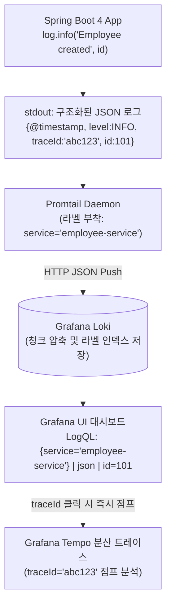

# 구조화된 JSON 로깅과 Grafana Loki 중앙 수집

## 한눈에 보기
| 로깅 포맷 | 출력 예시 | 장단점 및 검색 효율 |
|-----------|-----------|---------------------|
| 전통적 텍스트 로그 | `2026-08-26 10:00:00 INFO [main] EmployeeService - Created employee 101` | 사람이 눈으로 보긴 편하나, 파싱 정규식이 깨지기 쉽고 필드별 필터링이 비효율적 |
| **구조화된 JSON 로그** | `{"timestamp":"2026-08-26T10:00:00Z","level":"INFO","service":"employee-app","traceId":"a1b2c3","employeeId":101,"msg":"Created"}` | **기계가 즉시 인덱싱 및 쿼리 가능, LogQL을 통한 초고속 필드 필터링 지원** |

## 1. 왜 이게 필요한가

### 이런 상황을 상상해 보자
운영 중인 마이크로서비스 20대에서 하루에 수천만 줄의 로그가 쏟아져 나온다. 고객센터에서 "101번 사원의 입사 등록이 실패했다"는 문의가 들어왔다.

```json
{"@timestamp":"2026-08-26T10:00:00.123Z","level":"ERROR","service.name":"employee-service","trace_id":"4bf92f3577b34da6a3ce929d0e0e4736","span_id":"00f067aa0ba902b7","employeeId":101,"message":"Database constraint violation"}
```

엔지니어는 각 컨테이너의 콘솔을 뒤지는 대신, Grafana Loki 검색창에 `{service="employee-service"} | json | employeeId=101`이라는 LogQL 쿼리를 입력하여 0.1초 만에 정확한 에러 로그를 찾아냈다.

이처럼 로그를 사람이 읽는 단순 텍스트 줄이 아니라 key-value 구조의 JSON 객체로 출력하고 중앙 저장소에 수집하는 기법을 **구조화된 로깅(Structured Logging)**이라 한다.

### 여기서 뭐가 무너지나
과거의 자유 형식 텍스트 로그는 개발자마다 `[USER]`, `User:`, `user_id=` 등 출력 양식이 제각각이었다.

Elasticsearch 같은 중앙 로그 시스템에 넣으려면 복잡한 Logstash 정규표현식(Grok) 파서를 작성해야 했는데, 로그 포맷에 공백 하나만 바뀌어도 파싱이 깨져 인덱싱이 누락되었다. 또한 수십 테라바이트의 텍스트 전문 인덱싱으로 인해 검색 클러스터의 메모리 및 디스크 비용이 천문학적으로 폭증했다.

### 그래서 나온 생각
Spring Boot 4는 별도의 복잡한 XML 설정 없이도 내장된 구조화 로깅 기능(`spring.output.ansi.enabled` 및 Logback JSON 인코더)을 통해 애플리케이션의 모든 로그를 표준 JSON 포맷으로 방출할 수 있게 지원한다.

그리고 로그의 본문 전체를 인덱싱하는 대신, 쿠버네티스/도커 라벨(Service, Environment)만 가볍게 인덱싱하여 비용을 1/10 수준으로 절감하는 **Grafana Loki**를 결합했다.

스프링 부트의 로깅 프레임워크는 MDC(Mapped Diagnostic Context)를 통해 현재 HTTP 요청의 `traceId`와 `spanId`를 모든 로그 레코드에 자동으로 포함시켜, 완벽한 **[[옵저버빌리티]]**(= 시스템 상태를 신호로 관측하는 능력)와 **[[분산-추적]]**(= 요청의 전 구간 추적 기법)의 연결고리를 완성한다.

쉽게 비유하자면, 서류 캐비닛에 마구잡이로 적은 손글씨 메모지(텍스트 로그)를 쌓아두는 대신, 정형화된 전자 설문지(JSON 구조화 로그)로 통일하여 보관하는 것과 같다. 손글씨 메모는 "101번 사원"을 찾으려면 수만 장의 종이를 눈으로 한 장씩 넘겨봐야 하지만, 전자 설문지는 컴퓨터(Loki)가 "사원번호=101" 필터 버튼만 누르면 0.1초 만에 해당 서류만 쏙 뽑아주는 것과 같다.

→ 비유가 깨지는 지점: 일반 데이터베이스는 모든 필드를 무겁게 인덱싱하지만, Grafana Loki는 메타데이터 라벨만 색인하고 로그 본문은 청크 압축 파일로 저장하므로 초당 수백 메가바이트의 로그가 폭주해도 메모리 부담 없이 안전하게 삼켜낸다.

## 2. 어떻게 동작하는가
1. **MDC 컨텍스트 주입**: 요청이 들어오면 Spring Security와 **[[오픈텔레메트리]]** 트레이서가 사용자 식별자, `traceId`, `spanId`를 SLF4J MDC 스레드 로컬에 주입한다 — 이 스레드가 남기는 모든 로그에 추적 메타데이터를 일괄 전파하기 위해서다.
2. **Logback JSON 인코더 직렬화**: 개발자가 `log.info("Created employee {}", id)`를 호출하면, Logback의 JSON 레이아웃 인코더가 타임스탬프, 로그 레벨, 스레드명, 로거명, MDC 변수를 하나의 JSON 문자열로 변환하여 표준 출력(stdout)에 쓴다 — 로그의 기계 판독성과 규격 통일성을 보장하기 위해서다.
3. **도커 및 Promtail 로그 수집**: 컨테이너의 표준 출력을 **[[도커-컴포즈]]**의 Promtail 데몬이 감지하여 읽어 들인다 — 애플리케이션 코드의 네트워크 부하 없이 외부 데몬이 로그를 비동기 수집하기 위해서다.
4. **Grafana Loki 스트리밍 전송**: Promtail이 컨테이너 라벨(`service=employee-service`, `env=prod`)을 붙여 Loki의 HTTP API로 압축 스트리밍 전송한다 — 저비용 대용량 로그 저장소에 안전하게 적재하기 위해서다.
5. **LogQL 실시간 검색 및 트레이스 점프**: 엔지니어가 Grafana UI에서 LogQL로 로그를 검색하고, 로그 레코드에 박혀있는 `traceId` 하이퍼링크를 클릭하여 해당 순간의 분산 트레이스 타임라인으로 1초 만에 점프한다 — 장애 분석 시간을 획기적으로 단축하기 위해서다.

## 3. 그림으로 보기



## 4. 이 노트에 나온 용어
| 용어 | 한 줄 풀이 | 용어집 링크 |
|------|------------|-------------|
| 옵저버빌리티 | 시스템의 외부 신호를 수집하여 내부 상태와 장애를 추론하는 관측 능력 | [[_glossary#옵저버빌리티]] |
| 분산-추적 | 요청 전 구간의 흐름을 traceId로 추적하는 분산 모니터링 기법 | [[_glossary#분산-추적]] |
| 오픈텔레메트리 | 로그, 메트릭, 트레이스 수집을 표준화한 CNCF 오픈소스 규격 | [[_glossary#오픈텔레메트리]] |
| 도커-컴포즈 | 다중 컨테이너 및 Promtail/Loki 인프라를 일괄 실행하는 도구 | [[_glossary#도커-컴포즈]] |

## 5. 자주 헷갈리는 것
- **로컬 개발 콘솔 가독성**: 프로덕션에서는 JSON 구조화 로깅이 필수적이지만, 로컬 개발 환경(`profile=local`)에서는 터미널 가독성을 위해 컬러풀한 ANSI 표준 텍스트 포맷을 사용하도록 프로파일별로 분리 설정하는 것이 일반적이다.
- **LogQL의 JSON 파서 연산자 (`| json`)**: Loki에서 JSON 로그를 조회할 때는 파이프라인 연산자 `| json`을 붙여주면 쿼리 실행 시점에 JSON 속성들이 추출되어 필터링(`| id = 101`) 및 집계가 가능해진다.

## 6. 언제 안 쓰나 / 경계
- **민감 개인정보(PII)의 무분별한 로깅**: 주민등록번호, 비밀번호, 신용카드 번호 같은 개인정보가 구조화 로그에 평문으로 찍히면 대형 보안 사고가 되므로, 로깅 직전에 마스킹(Masking) 컨버터를 필터로 반드시 거쳐야 한다.

## 7. 연결
- [[05-observability-three-pillars-architecture]] — 옵저버빌리티 3대 기둥 중 첫 번째 기둥인 로그의 실무 구현체다.
- [[08-distributed-tracing-tempo-correlation]] — 로그 속의 `traceId`를 매개체로 Grafana Tempo 트레이스와 교차 분석되는 핵심 고리가 된다.

## 8. 스스로 확인
1. 단순 평문 텍스트 로그와 비교하여 구조화된 JSON 로깅이 대규모 분산 환경에서 가지는 검색상의 이점은 무엇인가?
2. SLF4J MDC(Mapped Diagnostic Context)가 비즈니스 로그에 `traceId`를 자동으로 포함시키는 원리는 무엇인가?
3. Grafana Loki가 Elasticsearch 대비 리소스(메모리/디스크) 비용을 획기적으로 줄일 수 있는 인덱싱 설계 원리는 무엇인가?

<!-- ==== 아래는 내 영역 · 스킬 수정 금지 ==== -->

## 내 설명 시도

## 막혔던 지점

## 리뷰 이력
