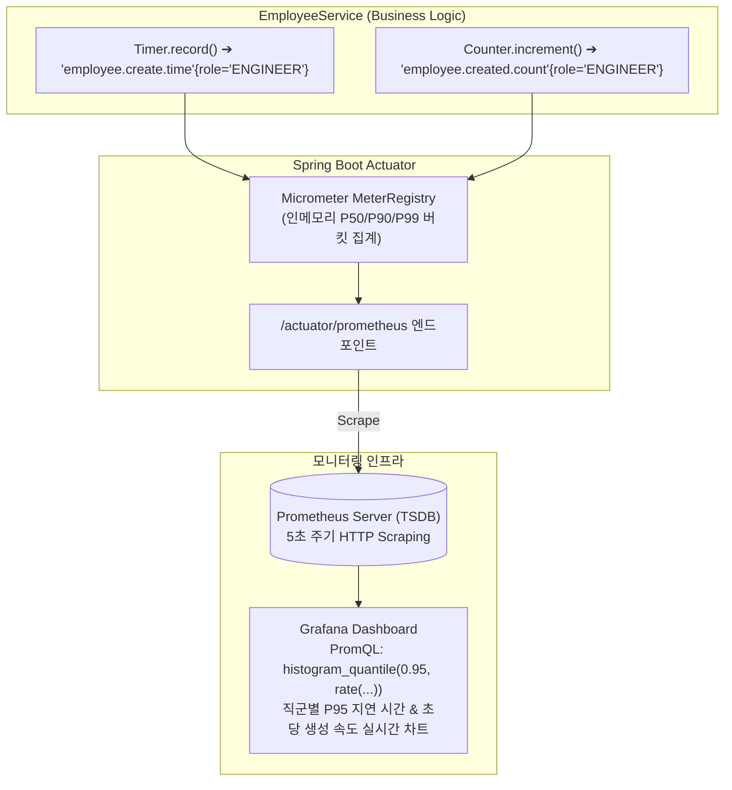

# Micrometer 커스텀 비즈니스 메트릭과 Prometheus 수집

## 한눈에 보기
| 메트릭 타입 | 측정 대상 | Micrometer API 예시 | Grafana 시각화 형태 |
|-------------|-----------|---------------------|---------------------|
| **Counter (카운터)** | 단조 증가하는 이벤트 발생 누적 횟수 | `meterRegistry.counter("employee.created.count", "role", role).increment()` | 초당 생성 처리량 (Throughput rate) 그래프 |
| **Timer (타이머)** | 작업 소요 시간(지연 시간) 및 호출 빈도 | `Timer.builder("employee.create.time").tag("role", role).register(registry).record(...)` | P95, P99 지연 시간(Latency) 히스토그램 |
| **Gauge (게이지)** | 임의로 오르내리는 순간적인 현재 상태 값 | `meterRegistry.gauge("active.users", userCount)` | 활성 사용자 수, 대기 큐 크기 단일 숫자/선 그래프 |

## 1. 왜 이게 필요한가

### 이런 상황을 상상해 보자
인사 관리 서비스에서 사원 등록 API가 운영되고 있다. 인프라 모니터링상으로는 CPU 15%, 메모리 30%로 모든 서버가 지극히 건강해 보인다.

그런데 비즈니스적으로는 "엔지니어(ENGINEER) 직군의 사원 등록 처리 시간만 유독 3초 이상 지연되고 있으며, 매니저(MANAGER) 직군의 등록 요청은 50%의 높은 실패율을 기록하고 있다"는 치명적인 비즈니스 결함이 숨어있었다.

```java
@Service
public class EmployeeService {
    private final MeterRegistry meterRegistry;

    public Employee createEmployee(Employee employee) {
        String role = roleForMetrics(employee);
        return Timer.builder("employee.create.time")
            .description("Time taken to create an employee")
            .tag("role", role)
            .register(meterRegistry)
            .record(() -> {
                Employee saved = employeeRepository.save(employee);
                meterRegistry.counter("employee.created.count", "role", role).increment();
                return saved;
            });
    }
}
```

이처럼 단순한 하드웨어 수치를 넘어, 비즈니스 도메인의 처리량과 지연 시간을 직군(`role`)별 다차원 태그로 계측하는 기술을 **[[마이크로미터]]**(= 다양한 모니터링 시스템을 위한 벤더 중립적 메트릭 파사드 라이브러리) 기반 비즈니스 메트릭이라 한다.

### 여기서 뭐가 무너지나
인프라 메트릭(CPU/RAM)만으로는 애플리케이션 내부에서 진짜 중요한 비즈니스가 잘 돌아가고 있는지 알 수 없다. "결제 성공률이 99%에서 80%로 떨어졌는가?", "재고 차감 로직에 병목이 생겼는가?" 같은 핵심 KPI 지표를 측정하지 못하면, 비즈니스 장애로 인한 매출 손실을 뒤늦게 고객 항의를 받고서야 알아차리게 된다.

또한 특정 모니터링 벤더(Prometheus 전용 SDK, Datadog 전용 SDK)에 종속된 코드를 작성하면 나중에 모니터링 플랫폼을 교체할 때 수백 개의 비즈니스 클래스를 전부 뜯어고쳐야 한다.

### 그래서 나온 생각
Spring Boot는 SLF4J가 로깅의 표준 파사드이듯, 메트릭 수집의 표준 파사드로 Micrometer를 전면 채택했다.

개발자는 `MeterRegistry`를 주입받아 비즈니스 코드에 `Counter`와 `Timer`를 심어두기만 하면, 스프링 부트가 이를 Prometheus가 긁어갈 수 있는 텍스트 포맷(`/actuator/prometheus`) 또는 **[[오픈텔레메트리]]** OTLP 메트릭으로 자동 변환하여 내보낸다.

이를 통해 풍부한 차원(Tags/Dimensions)을 가진 시계열 데이터를 Prometheus에 저장하고, Grafana 대시보드에서 직군별/부서별 지연 시간과 성공률을 실시간 차트로 감시하는 강력한 **[[옵저버빌리티]]**(= 시스템 상태를 정밀하게 관측하는 능력)를 확보하게 되었다.

쉽게 비유하자면, 스마트워치의 건강 측정 센서와 같다. 스마트워치 배터리가 몇 퍼센트 남았는지(인프라 메트릭: CPU/RAM)만 보는 것이 아니라, 착용자가 지금 달리기 운동을 할 때의 심박수, 칼로리 소모량, 페이스 속도(비즈니스 메트릭: 사원 등록 시간, 성공 카운트)를 실시간으로 측정하여 경고를 띄워주는 것과 같다.

→ 비유가 깨지는 지점: 스마트워치는 개인 1명의 수치만 기록하지만, Micrometer는 초당 수만 건의 트랜잭션 수치를 마이크로초 단위의 버킷으로 묶어 P50, P90, P99 백분위수(Percentile) 통계를 실시간 연산하여 Grafana로 전달한다.

## 2. 어떻게 동작하는가
1. **MeterRegistry 주입 및 메트릭 등록**: 서비스 계층 생성자에서 `MeterRegistry`를 주입받고, `Timer.builder("employee.create.time").tag("role", role)`로 다차원 메트릭을 등록한다 — 비즈니스 작업별로 그룹화된 지표를 정의하기 위해서다.
2. **record() 람다 측정 및 카운터 증가**: 비즈니스 로직 실행 시 `timer.record(() -> ...)`가 작업의 시작과 끝 시간을 나노초 단위로 측정하고, 저장이 완료되면 `counter.increment()`를 호출한다 — 성공적인 비즈니스 처리 건수와 소요 시간을 원자적으로 집계하기 위해서다.
3. **인메모리 버킷 축적**: Micrometer 내부의 링 버퍼가 메모리에서 실시간으로 지연 시간 분포와 카운터 합계를 집계한다 — 측정 작업으로 인한 비즈니스 스레드의 지연 오버헤드를 극소화하기 위해서다.
4. **Prometheus 스크래핑 (또는 OTLP Push)**: Prometheus 서버가 주기적으로 스프링 부트의 `/actuator/prometheus` 엔드포인트를 호출(Pull)하여 축적된 시계열 메트릭을 수집한다 — 시계열 데이터베이스(TSDB)에 메트릭을 영속 저장하기 위해서다.
5. **PromQL 대시보드 경보 (Alerting)**: 엔지니어가 Grafana에서 `rate(employee_created_count_total[1m])` 및 `histogram_quantile(0.99, ...)` 쿼리를 작성하여, 특정 직군의 지연 시간이 2초를 초과할 때 즉시 온콜(On-call) 경보를 울린다 — 장애에 선제적으로 대응하기 위해서다.

## 3. 그림으로 보기



## 4. 이 노트에 나온 용어
| 용어 | 한 줄 풀이 | 용어집 링크 |
|------|------------|-------------|
| 마이크로미터 | 다양한 모니터링 시스템에 메트릭을 공급하는 벤더 중립적 표준 메트릭 파사드 | [[_glossary#마이크로미터]] |
| 옵저버빌리티 | 메트릭, 로그, 트레이스를 통해 시스템의 상태를 정밀 추론하는 능력 | [[_glossary#옵저버빌리티]] |
| 오픈텔레메트리 | 메트릭과 트레이스 데이터를 표준화된 규격으로 내보내는 프로토콜 (OTel) | [[_glossary#오픈텔레메트리]] |
| 분산-추적 | 메트릭 이상 감지 시 개별 요청의 상세 흐름을 추적하는 기술 | [[_glossary#분산-추적]] |

## 5. 자주 헷갈리는 것
- **High Cardinality(고기수) 태그 주의**: 태그에 사용자 ID나 주문 번호처럼 무한대에 가까운 고유 값(UUID)을 넣으면 시계열 데이터베이스의 인덱스가 폭발하여 Prometheus가 다운된다. 태그에는 반드시 카테고리, 역할, 상태 코드처럼 기수(Cardinality)가 제한된 유한한 값만 넣어야 한다.
- **Counter는 절대 감소하지 않음**: Counter는 누적 합계만을 기록하며, 현재 동시 접속자 수처럼 증가와 감소를 반복하는 수치는 반드시 `Gauge`를 사용해야 한다.

## 6. 언제 안 쓰나 / 경계
- **개별 트랜잭션의 상세 디버깅 내용 기록**: 메트릭은 "수치와 집계 통계"만을 다루므로, 실패한 트랜잭션의 상세 에러 메시지나 스택트레이스는 메트릭이 아닌 구조화 로그(Log)나 트레이스(Trace)의 이벤트로 남겨야 한다.

## 7. 연결
- [[05-observability-three-pillars-architecture]] — 옵저버빌리티 3대 기둥 중 두 번째 기둥인 메트릭의 핵심 구현이다.
- [[08-distributed-tracing-tempo-correlation]] — 메트릭 차트의 지연 시간 급증 스파이크를 클릭하여 해당 시점의 분산 트레이스 샘플로 즉시 연결하는 기법으로 완성된다.

## 8. 스스로 확인
1. 인프라 메트릭(CPU/메모리)과 비즈니스 커스텀 메트릭(Counter/Timer)의 차이점과 실무적 필요성은 무엇인가?
2. Micrometer에서 메트릭에 태그(Tag)를 붙일 때 High Cardinality를 엄격히 피해야 하는 기술적 이유는 무엇인가?
3. `Timer`와 `Counter`를 사용하여 서비스 계층의 SLA(P99 지연 시간 및 처리량)를 계측하는 구현 원리는 무엇인가?

<!-- ==== 아래는 내 영역 · 스킬 수정 금지 ==== -->

## 내 설명 시도

## 막혔던 지점

## 리뷰 이력
