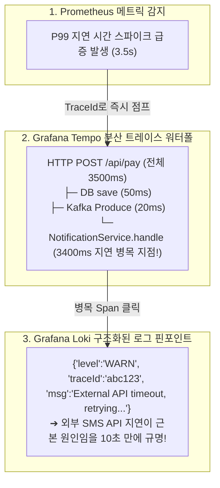

# Grafana Tempo 분산 추적과 3대 신호 교차 상관관계 분석

## 한눈에 보기
| 추적 요소 | 역할 | 전파 방식 |
|-----------|------|-----------|
| `TraceId` | 전체 분산 트랜잭션의 고유 식별자 (전 구간 동일 유지) | HTTP 헤더(`traceparent`) 및 Kafka 레코드 헤더로 전달 |
| `SpanId` | 특정 서비스나 개별 메서드 실행 구간의 고유 식별자 | 부모-자식 트리 구조(Parent-Child Span)로 계층화 |
| 3대 신호 교차 분석 | 메트릭 이상 감지 ──▶ 트레이스 타임라인 ──▶ 에러 로그 핀포인트 | Grafana UI에서 클릭 한 번으로 신호 간 컨텍스트 점프 |

## 1. 왜 이게 필요한가

### 이런 상황을 상상해 보자
사용자가 웹 브라우저에서 "동영상 결제 및 업로드" 버튼을 클릭했다. 이 단일 요청은 API 게이트웨이를 거쳐 결제 서비스(HTTP 호출)로 가고, 결제가 성공하자 카프카(Kafka)로 이벤트를 발행했으며, 알림 서비스와 트랜스코딩 서비스가 이 이벤트를 비동기로 수신하여 최종 처리를 완료했다.

전체 처리 과정에서 3.5초의 심각한 지연이 발생했다.

```text
HTTP GET /api/pay ──▶ PaymentService ──▶ Kafka (Topic: video-events) ──▶ TranscodeService
```

과거의 모니터링 방식으로는 동기 HTTP 호출과 비동기 카프카 메시지 큐 사이에서 컨텍스트가 끊어져, 3.5초 중 어느 구간(DB 락인가, 카프카 대기열인가, 외부 결제사 응답 지연인가)에서 시간이 지체되었는지 파악하는 것이 불가능에 가까웠다.

### 여기서 뭐가 무너지나
마이크로서비스 간의 통신 경계(HTTP, gRPC, 메시지 브로커)를 넘나들 때마다 추적 컨텍스트가 단절되면, 각 서비스 담당자는 "우리 서비스는 정상이고 다른 팀 서비스가 느린 것 같다"며 서로 책임을 떠넘기는 장애 분석의 암흑기에 빠지게 된다.

또한 수천 개의 로그 라인 중에서 방금 그 지연을 유발한 특정 쿼리나 예외 스택트레이스를 1:1로 매핑해 찾아낼 방법이 없다.

### 그래서 나온 생각
단일 요청이 시스템에 진입하는 순간 고유한 `traceId`를 발급하고, 이 ID를 HTTP 헤더(W3C TraceContext)와 카프카 메시지 헤더에 실어 네트워크 경계를 넘어 끊김 없이 전파하는 **[[분산-추적]]**(= 분산 시스템 전 구간의 요청 경로와 지연 시간을 시각화하는 기술)을 구축했다.

Spring Boot 4는 **[[오픈텔레메트리]]** 및 Micrometer Tracing을 통해 RestClient와 KafkaTemplate에 트레이스 컨텍스트 전파기를 자동 삽입한다.

그리고 수집된 분산 트레이스를 대규모 분산 추적 백엔드인 **Grafana Tempo**에 저장함으로써, Grafana 화면에서 메트릭 차트의 지연 시간 스파이크를 클릭하여 1초 만에 분산 트레이스 타임라인(워터폴 차트)을 확인하고, 그 순간의 구조화 로그를 정확히 조회하는 완전무결한 **[[옵저버빌리티]]**(= 시스템의 상태를 완벽히 관측하고 진단하는 능력) 교차 상관관계(Cross-Correlation)를 완성했다.

쉽게 비유하자면, 해외 특송 택배의 바코드 추적 시스템과 같다. 발송인이 택배를 부치면 고유한 운송장 번호(TraceId)가 발급된다. 택배가 비행기(HTTP 호출)를 타고, 물류 허브 터미널(카프카 브로커)에 보관되었다가, 최종 배송 트럭(컨슈머 서비스)으로 옮겨질 때마다 바코드를 찍는다(Span 기록). 수취인은 운송장 번호 하나만 조회하면 택배가 어느 터미널에서 몇 시간 동안 머물렀는지 전 구간을 1초 만에 엑스레이처럼 들여다볼 수 있는 것과 같다.

→ 비유가 깨지는 지점: 택배 바코드는 물리적 스캔이 필요하지만, 스프링 부트의 분산 트레이싱은 프레임워크 인터셉터가 메모리 상에서 패킷 헤더를 자동으로 주입/추출하므로 개발자가 비즈니스 코드에 추적 ID를 일일이 넘기는 수작업 코드를 작성할 필요가 전혀 없다.

## 2. 어떻게 동작하는가
1. **루트 스팬 생성 및 TraceId 발급**: 클라이언트 요청이 최초 컨트롤러에 도달하면 OTel 트레이서가 새로운 `traceId`와 Root `spanId`를 생성한다 — 전체 트랜잭션을 식별할 고유 키를 부여하기 위해서다.
2. **네트워크 프로파게이션 (Trace Context Propagation)**: RestClient나 KafkaTemplate이 호출될 때, 스프링 부트가 W3C 표준 헤더(`traceparent: 00-4bf92f3577b34da6a3ce929d0e0e4736-00f067aa0ba902b7-01`)를 HTTP 및 카프카 헤더에 자동으로 주입(Inject)한다 — 네트워크 경계를 넘어 비동기 컨슈머까지 동일한 traceId를 전파하기 위해서다.
3. **자식 스팬 생성 (Child Span)**: 카프카 컨슈머(`@KafkaListener`)가 메시지를 수신하면 헤더에서 `traceparent`를 추출(Extract)하여 부모 스팬 아래에 새로운 자식 스팬을 생성한다 — 호출 계층 구조(Tree)를 완벽히 형성하기 위해서다.
4. **Grafana Tempo 저장**: 각 서비스가 측정한 스팬 구간(시작 시간, 소요 시간, DB 쿼리 태그)을 OTLP 프로토콜로 Grafana Tempo 백엔드로 전송한다 — 분산 트레이스 워터폴 데이터를 영속화하기 위해서다.
5. **3대 신호 교차 상관관계 분석**: Grafana 대시보드에서 엔지니어가 메트릭 지연 그래프를 보다가 클릭 한 번으로 Tempo 트레이스 워터폴로 이동하고, 3.5초가 걸린 스팬을 누르면 해당 순간 Loki에 저장된 JSON 에러 로그가 화면 우측에 자동으로 팝업된다 — 장애의 근본 원인을 즉각 규명하기 위해서다.

## 3. 그림으로 보기



## 4. 이 노트에 나온 용어
| 용어 | 한 줄 풀이 | 용어집 링크 |
|------|------------|-------------|
| 분산-추적 | 요청의 전 구간 경로와 소요 시간을 traceId로 시각화 추적하는 기술 | [[_glossary#분산-추적]] |
| 옵저버빌리티 | 로그, 메트릭, 트레이스를 결합하여 시스템 장애를 정밀 추론하는 능력 | [[_glossary#옵저버빌리티]] |
| 오픈텔레메트리 | 분산 트레이스 컨텍스트 전파 및 데이터 전송을 표준화한 규격 (OTel) | [[_glossary#오픈텔레메트리]] |
| 마이크로미터 | 메트릭 측정 및 분산 트레이싱(Micrometer Tracing)을 연결하는 파사드 | [[_glossary#마이크로미터]] |

## 5. 자주 헷갈리는 것
- **TraceId vs SpanId의 관계**: `TraceId`는 클라이언트의 단일 요청이 시작되어 끝날 때까지 모든 마이크로서비스와 카프카를 통틀어 단 하나만 유지되는 글로벌 식별자이며, `SpanId`는 개별 서비스나 메서드 실행 블록마다 새로 생성되는 단위 구간 식별자다.
- **Trace Sampling Rate(샘플링 비율)**: 초당 수백만 건의 트래픽이 발생하는 서비스에서 모든 요청을 100% 트레이싱하면 저장소 비용이 감당되지 않으므로, `management.tracing.sampling.probability=0.1`(10%만 샘플링)처럼 비율을 조절하는 것이 실무 표준이다.

## 6. 언제 안 쓰나 / 경계
- **단일 모놀리식 단독 애플리케이션**: 외부 호출이나 메시지 큐 없이 단일 JVM 프로세스 안에서 모든 연산이 끝나는 단순 소규모 시스템에서는 분산 트레이싱 대신 전통적인 프로파일러(JProfiler)나 단순 로깅만으로도 충분하다.

## 7. 연결
- [[05-observability-three-pillars-architecture]] — 옵저버빌리티 3대 기둥의 최종 완성이자 이들을 하나로 엮는 통합 접착제다.
- [[06-structured-logging-loki-grafana]] — 분산 트레이스의 TraceId가 구조화 로그의 필터링 키로 활용된다.
- [[07-metrics-micrometer-prometheus]] — 메트릭의 이상 징후를 트레이스의 상세 타임라인으로 드릴다운(Drill-down)하는 워크플로우를 구성한다.

## 8. 스스로 확인
1. 마이크로서비스와 카프카를 넘나드는 분산 환경에서 W3C TraceContext 헤더가 컨텍스트를 전파하는 원리는 무엇인가?
2. `TraceId`와 `SpanId`의 개념적 차이와 부모-자식 스팬 트리가 형성되는 방식을 설명할 수 있는가?
3. 메트릭(Prometheus), 로그(Loki), 트레이스(Tempo)를 교차 상관관계(Cross-Correlation)로 분석할 때 얻을 수 있는 압도적인 장애 진단 효율은 무엇인가?

<!-- ==== 아래는 내 영역 · 스킬 수정 금지 ==== -->

## 내 설명 시도

## 막혔던 지점

## 리뷰 이력
