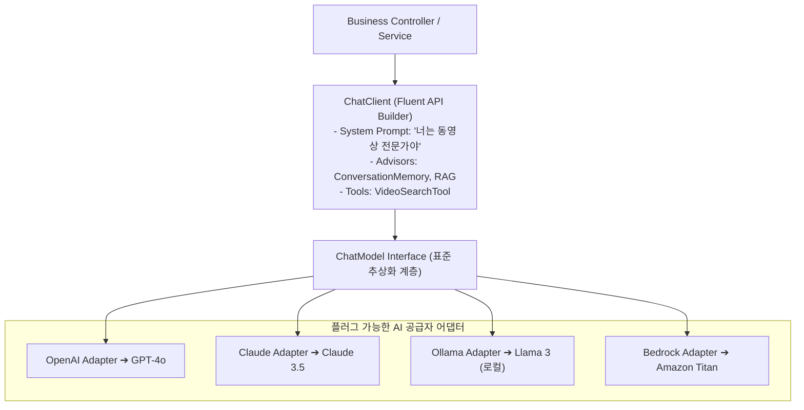

# Spring AI 아키텍처와 ChatClient Fluent API

## 한눈에 보기
| 계층 / 컴포넌트 | 역할 | 코드 예시 |
|-----------------|------|-----------|
| `ChatModel` (저수준 모델 인터페이스) | OpenAI, Anthropic, Ollama 등 특정 AI 벤더와의 원시 HTTP 통신 추상화 | `chatModel.call(prompt)` |
| `ChatClient` (고수준 Fluent API) | 시스템 프롬프트, 사용자 입력, RAG 어드바이저, 툴 콜링을 체이닝으로 조립 | `chatClient.prompt().system("...").user("...").call().content()` |
| Model Portability (모델 이식성) | 코드 수정 없이 `application.yml` 설정만으로 AI 모델 교체 | `spring.ai.openai` ──▶ `spring.ai.ollama` (Zero Code Change) |

## 1. 왜 이게 필요한가

### 이런 상황을 상상해 보자
동영상 웹 애플리케이션에 "AI 비디오 요약 및 추천 챗봇" 기능을 탑재하려 한다. 개발 초기에는 OpenAI의 GPT-4o를 연동해 테스트하다가, 프로덕션 배포 시에는 비용 절감과 보안 폐쇄망 운영을 위해 로컬 오픈소스 LLM인 Ollama(Llama 3)나 Anthropic Claude로 전환해야 하는 상황이 발생했다.

```java
@RestController
public class AiChatController {
    private final ChatClient chatClient;

    public AiChatController(ChatClient.Builder builder) {
        this.chatClient = builder
            .defaultSystem("너는 친절하고 전문적인 동영상 추천 전문가야.")
            .build();
    }

    @GetMapping("/api/chat")
    public String chat(@RequestParam String message) {
        return chatClient.prompt()
            .user(message)
            .call()
            .content();
    }
}
```

개발자는 위와 같이 단 몇 줄의 직관적인 빌더 체인 코드를 작성했다.

이처럼 특정 AI 벤더의 복잡한 원시 REST API에 얽매이지 않고 스프링의 일관된 DI와 POJO 모델로 LLM을 다루는 기술을 **[[스프링-에이아이]]**(= 대규모 언어 모델을 스프링 생태계에 매끄럽게 통합하는 공식 AI 프레임워크)라 부른다.

### 여기서 뭐가 무너지나
과거에 각 AI 벤더(OpenAI, Anthropic, Google Gemini, Ollama)가 제공하는 개별 SDK를 프로젝트에 직접 연동하면, 벤더마다 제각각인 JSON 요청 스키마, 파라미터 명칭(temperature, max_tokens), 스트리밍 응답 규격 때문에 애플리케이션 코드가 특정 벤더에 심각하게 종속(Vendor Lock-in)되었다.

OpenAI의 요금이 인상되거나 로컬 사내 LLM으로 교체해야 할 때 서비스 계층의 모든 AI 호출 코드를 뜯어고쳐야 하는 재앙이 발생했다.

### 그래서 나온 생각
Spring Data가 JPA, MongoDB, Redis의 저장소 차이를 `Repository`로 추상화하여 완벽한 데이터 이식성을 주었듯이, Spring AI는 LLM과의 대화를 `ChatModel`과 **[[챗-클라이언트]]**(= 유려한 Fluent API로 프롬프트, 어드바이저, 툴 콜링을 체이닝하는 고수준 클라이언트)로 완벽히 추상화했다.

개발자는 비즈니스 로직을 `ChatClient` 위에서 한 번만 작성해 두면, `application.yml`의 의존성 및 프로퍼티 변경만으로 OpenAI, Azure OpenAI, Anthropic, Bedrock, Ollama를 자유자재로 스위칭할 수 있다.

쉽게 비유하자면, 만능 스마트폰 충전기(USB-C 케이블)와 같다. 예전에는 제조사마다 충전 단자(제각각의 AI SDK)가 달라 폰을 바꿀 때마다 충전기를 새로 사야 했다. Spring AI의 ChatClient는 모든 최신 스마트폰(OpenAI, Claude, Ollama)에 완벽히 호환되는 표준 USB-C 단자(표준 Fluent API)와 같아서, 케이블 하나만 꽂으면 어떤 제조사의 폰이든 동일한 방식으로 전력을 공급(질의응답)할 수 있다.

→ 비유가 깨지는 지점: 충전 케이블은 단순히 전력만 전달하지만, Spring AI의 `ChatClient`는 내부 어드바이저(Advisor) 체인을 통해 대화 히스토리 메모리(Conversation Memory), RAG 지식 검색, 가드레일 필터링, 자바 메서드 툴 실행을 나노초 단위로 실시간 인터셉트하여 조합해 낸다.

## 2. 어떻게 동작하는가
1. **ChatClient.Builder 빈 주입**: 스프링 부트가 클래스패스의 스타터(`spring-ai-starter-openai` 또는 `ollama`)를 감지하여 기본 `ChatModel`을 구성하고 `ChatClient.Builder`를 DI 컨테이너에 주입한다 — 개발자가 원하는 공통 시스템 프롬프트와 어드바이저를 사전에 튜닝하기 위해서다.
2. **Fluent 프롬프트 조립**: `chatClient.prompt().system(...).user(message)` 호출을 통해 시스템 페르소나와 사용자 질문을 단일 `Prompt` 객체로 체이닝 조립한다 — 프롬프트 엔지니어링 규칙을 직관적으로 구조화하기 위해서다.
3. **ChatModel 추상화 변환**: 고수준의 `ChatClient`가 하부의 `ChatModel`로 요청을 넘기면, 해당 벤더(OpenAI / Ollama)의 전용 HTTP 클라이언트가 벤더별 네이티브 JSON 페이로드로 변환하여 AI API 엔드포인트로 전송한다 — 모델 이식성을 완벽히 보장하기 위해서다.
4. **LLM 추론 및 응답 역직렬화**: 원격 LLM이 생성한 텍스트 또는 툴 호출 요청이 도착하면, 스프링 AI가 이를 표준 `ChatResponse` 객체로 역직렬화한다 — 통일된 응답 메타데이터(토큰 사용량, 완료 이유)를 확보하기 위해서다.
5. **content() 문자열 반환 (또는 DTO 매핑)**: `.call().content()`를 통해 최종 완성된 AI 답변 텍스트를 추출하여 컨트롤러 호출자에게 반환한다 — 비즈니스 서비스가 즉각 소비할 수 있게 하기 위해서다.

## 3. 그림으로 보기



## 4. 이 노트에 나온 용어
| 용어 | 한 줄 풀이 | 용어집 링크 |
|------|------------|-------------|
| 스프링-에이아이 | 특정 벤더에 종속되지 않고 LLM을 객체 지향으로 다루는 공식 스프링 프레임워크 | [[_glossary#스프링-에이아이]] |
| 챗-클라이언트 | 시스템 프롬프트, 툴, RAG를 체이닝으로 조립하는 고수준 Fluent API 클라이언트 | [[_glossary#챗-클라이언트]] |
| 프롬프트-템플릿 | 동적 변수를 안전하게 치환하여 프롬프트를 생성하는 템플릿 컴포넌트 | [[_glossary#프롬프트-템플릿]] |
| 구조화된-출력-변환기 | LLM의 자유 텍스트를 Java 불변 Record DTO로 타입 세이프하게 변환하는 도구 | [[_glossary#구조화된-출력-변환기]] |

## 5. 자주 헷갈리는 것
- **`ChatModel` vs `ChatClient`**: `ChatModel`은 AI 공급자와 통신하는 저수준(Low-level) 1:1 인터페이스(단순 RPC 호출)인 반면, `ChatClient`는 Spring Framework 6의 `RestClient`/`WebClient`처럼 유려한 빌더 문법, 디폴트 시스템 프롬프트, 어드바이저 인터셉터 체인을 제공하는 권장 고수준(High-level) 클라이언트다.
- **스트리밍 응답 (`stream()`)**: `.call()` 대신 `.stream()`을 호출하면 `Flux<String>` 리액티브 스트림이 반환되어, ChatGPT처럼 단어가 생성되는 족족 글자가 타이핑되는 실시간 UI를 손쉽게 구현할 수 있다.

## 6. 언제 안 쓰나 / 경계
- **초고밀도 파이썬 딥러닝 텐서 연산 및 모델 직접 파인튜닝**: PyTorch 기반으로 LLM의 가중치 가중 행렬을 직접 역전파(Backpropagation) 학습시키는 작업은 Java가 아닌 Python 생태계(HuggingFace, PyTorch)에서 수행해야 하며, Spring AI는 이미 학습된 모델을 서빙하고 애플리케이션 비즈니스에 통합(Inference & Orchestration)하는 영역에 특화되어 있다.

## 7. 연결
- [[02-prompt-engineering-and-templates]] — ChatClient에 주입할 프롬프트 엔지니어링과 JSON 구조화 DTO 출력 변환 기법으로 이어진다.
- [[03-tool-calling-and-function-callbacks]] — ChatClient가 LLM에게 자바 메서드를 도구로 제공하는 Agentic Tool Calling 기능으로 확장된다.

## 8. 스스로 확인
1. Spring AI가 제공하는 Model Portability(모델 이식성)가 엔터프라이즈 AI 개발에서 가지는 핵심 가치는 무엇인가?
2. `ChatModel`과 비교하여 `ChatClient` Fluent API가 제공하는 개발 편의성과 아키텍처적 확장성은 무엇인가?
3. `.call().content()` 동기식 호출과 `.stream().content()` 리액티브 스트리밍 호출의 차이점은 무엇인가?

<!-- ==== 아래는 내 영역 · 스킬 수정 금지 ==== -->

## 내 설명 시도

## 막혔던 지점

## 리뷰 이력
