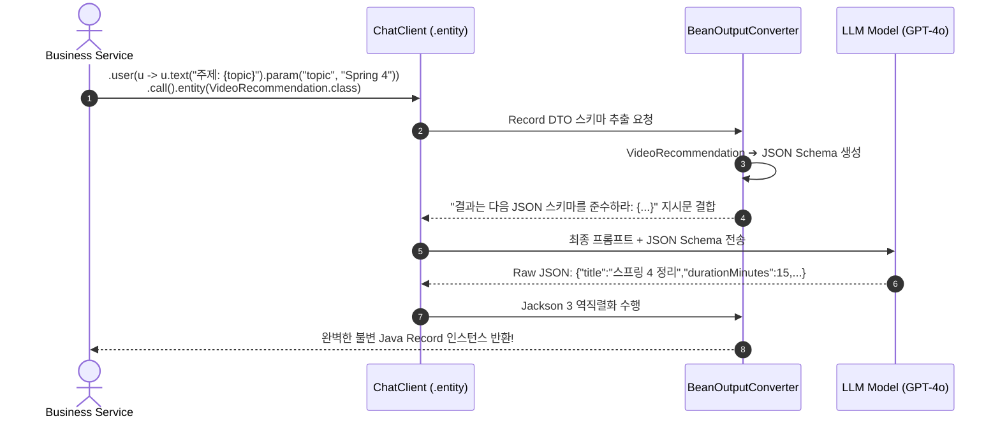

# 프롬프트 템플릿과 구조화된 DTO 출력 변환

## 한눈에 보기
| 항목 | 비구조화된 텍스트 응답 | 구조화된 DTO 응답 (`BeanOutputConverter`) |
|------|------------------------|-------------------------------------------|
| LLM 응답 형식 | "추천 동영상은 스프링 4 기초(10분)입니다..." (자유 텍스트) | `{"title": "스프링 4 기초", "durationMinutes": 10}` (엄격한 JSON) |
| 자바 코드 소비 방식 | 정규표현식이나 문자열 파싱 (깨지기 쉬움) | `VideoRecommendation record` 객체로 즉시 타입 세이프 매핑 |
| 프롬프트 제어 방식 | 문자열 하드코딩 연결 (`"질문: " + q`) | `PromptTemplate`을 통한 안전한 변수 플레이스홀더 바인딩 |

## 1. 왜 이게 필요한가

### 이런 상황을 상상해 보자
동영상 웹 애플리케이션에서 사용자의 관심사 키워드를 LLM에 전달하여, 3개의 추천 동영상 목록을 자바 `record VideoRecommendation(String title, int duration, List<String> tags)` 객체 리스트로 받아와 데이터베이스에 바로 저장하고 웹 UI에 그리려 한다.

```java
public record VideoRecommendation(String title, int durationMinutes, List<String> tags) {}

@Service
public class RecommendationService {
    private final ChatClient chatClient;

    public List<VideoRecommendation> getRecommendations(String topic) {
        return chatClient.prompt()
            .user(u -> u.text("주제 {topic}에 대한 추천 동영상 3개를 추천해줘.")
                        .param("topic", topic))
            .call()
            .entity(new ParameterizedTypeReference<List<VideoRecommendation>>() {});
    }
}
```

개발자는 위와 같이 `.entity(...)` 한 줄만 선언했다.

이처럼 프롬프트 문자열 템플릿과 변수를 안전하게 바인딩하는 컴포넌트를 **[[프롬프트-템플릿]]**(= 동적 변수를 안전하게 치환하는 프롬프트 빌더)이라 부르며, LLM의 텍스트 응답을 자바 DTO 객체로 완벽히 역직렬화하는 컴포넌트를 **[[구조화된-출력-변환기]]**(= LLM의 출력을 JSON 스키마를 통해 Java Record로 변환하는 BeanOutputConverter)라 한다.

### 여기서 뭐가 무너지나
과거에는 프롬프트 문자열을 자바 `+` 연산자로 직접 이어 붙이다가 사용자의 입력에 따옴표나 특수문자가 섞여 프롬프트 문법이 깨지거나 프롬프트 인젝션 취약점이 발생했다.

더 심각한 문제는 LLM의 비결정적(Non-deterministic) 출력 특성이다. "JSON으로만 답해줘"라고 부탁해도 LLM이 `"네, 여기 JSON입니다: ```json ... ```"`처럼 마크다운이나 서두 인삿말을 덧붙여 자바 JSON 파서가 `JsonParseException`을 터뜨리며 전체 비즈니스가 멈추는 에러가 빈번했다.

### 그래서 나온 생각
Spring AI는 프롬프트와 변수를 안전하게 격리하는 `PromptTemplate`을 제공한다.

동시에 원하는 Java Record/POJO 클래스의 구조를 분석하여 해당 DTO의 엄격한 JSON 스키마(Schema) 생성 및 지시사항을 프롬프트 뒤에 자동으로 덧붙이고, 돌아온 LLM 응답에서 순수 JSON 본문만 정밀하게 발라내어 자바 객체로 변환해 주는 `BeanOutputConverter`를 내장했다.

`ChatClient`의 `.entity(TargetClass.class)` Fluent API는 이 복잡한 변환 과정을 단 한 줄의 함수 호출로 완벽히 자동화했다.

쉽게 비유하자면, 세무서의 정형화된 표준 세금 신고서 양식(BeanOutputConverter JSON 스키마)과 같다. 납세자(LLM)에게 "당신의 수입과 지출을 자유롭게 편지로 써서 보내주세요(자유 텍스트)"라고 하면 온갖 사연과 미사여구가 섞여 컴퓨터가 세액을 계산할 수 없다. 대신 "이 네모 칸(Record DTO 필드)에 숫자와 항목만 정확히 적어 제출하세요"라는 표준 서식을 쥐여주고, 제출된 서식을 바코드 리더기(`.entity()`)로 찍어 1초 만에 전산 DB에 등록하는 것과 같다.

→ 비유가 깨지는 지점: 사람은 서식의 칸을 비우거나 오탈자를 낼 수 있지만, Spring AI의 `BeanOutputConverter`는 LLM이 JSON 스키마를 위반했을 때 예외를 발생시키거나 재시도(Retry) 메커니즘을 통해 완벽한 타입 안전성을 100% 보장한다.

## 2. 어떻게 동작하는가
1. **자바 Record DTO 스키마 추출**: 개발자가 `.entity(VideoRecommendation.class)`를 호출하면, **[[구조화된-출력-변환기]]**가 리플렉션을 통해 DTO의 필드명(`title`, `durationMinutes`, `tags`)과 데이터 타입을 분석하여 표준 JSON Schema 명세를 생성한다 — LLM에게 요구할 엄격한 출력 구조를 준비하기 위해서다.
2. **프롬프트 템플릿 변수 치환**: **[[프롬프트-템플릿]]**이 `{topic}` 플레이스홀더에 사용자 입력값("Spring Boot 4")을 안전하게 이스케이프하여 주입한다 — 프롬프트 문법 깨짐을 방지하기 위해서다.
3. **JSON 포맷팅 지시문 자동 주입**: 스프링 AI가 생성된 JSON 스키마와 `"Your response must strictly match the following JSON schema..."` 형식 지침을 프롬프트 시스템/유저 메시지 끝에 자동으로 추가한다 — LLM이 정확한 JSON 포맷으로만 답변하도록 강제하기 위해서다.
4. **LLM 추론 및 순수 JSON 생성**: LLM이 JSON 스키마 지시문을 준수하여 잡다한 설명 문구 없이 정확한 JSON 페이로드를 생성하여 반환한다 — 기계가 즉시 파싱할 수 있는 데이터를 얻기 위해서다.
5. **Jackson 역직렬화 및 DTO 인스턴스 반환**: 스프링 AI 내부의 Jackson 3 엔진이 응답 JSON을 파싱하여 불변 Java `VideoRecommendation` 레코드 객체로 인스턴스화하여 호출자에게 반환한다 — 개발자가 타입 캐스팅 없이 즉시 비즈니스 로직에 활용할 수 있게 하기 위해서다.

## 3. 그림으로 보기



## 4. 이 노트에 나온 용어
| 용어 | 한 줄 풀이 | 용어집 링크 |
|------|------------|-------------|
| 프롬프트-템플릿 | 동적 변수를 안전하게 치환하여 프롬프트 텍스트를 구성하는 템플릿 | [[_glossary#프롬프트-템플릿]] |
| 구조화된-출력-변환기 | LLM의 응답을 JSON 스키마를 통해 Java Record/POJO로 변환하는 컴포넌트 | [[_glossary#구조화된-출력-변환기]] |
| 스프링-에이아이 | 대규모 언어 모델을 스프링 프레임워크와 결합하는 공식 AI 라이브러리 | [[_glossary#스프링-에이아이]] |
| 챗-클라이언트 | 프롬프트와 DTO 엔티티 변환을 유려하게 연결하는 고수준 클라이언트 | [[_glossary#챗-클라이언트]] |

## 5. 자주 헷갈리는 것
- **컬렉션 제네릭 DTO 매핑**: `List<VideoRecommendation>`처럼 제네릭 타입 컬렉션으로 반환받을 때는 자바의 타입 소거(Type Erasure)를 방지하기 위해 `chatClient.prompt()...call().entity(new ParameterizedTypeReference<List<VideoRecommendation>>() {})` 문법을 사용해야 한다.
- **OpenAI Structured Outputs (JSON Mode)**: 최신 OpenAI 모델 등은 API 파라미터 수준에서 `response_format: json_schema`를 네이티브로 지원하며, Spring AI는 모델이 네이티브 JSON 스키마를 지원할 경우 이를 자동으로 감지하여 100% 신뢰도의 JSON 출력을 보장한다.

## 6. 언제 안 쓰나 / 경계
- **장문의 창의적 글쓰기나 자유 대화 챗봇**: 정형화된 필드 구조가 필요 없고 시, 소설, 사용자 감정 상담처럼 자유로운 문장 작성이 핵심인 시나리오에서는 `.entity()` 변환 대신 `.content()`를 사용해 순수 문자열로 소비해야 한다.

## 7. 연결
- [[01-spring-ai-architecture-and-chatclient]] — ChatClient Fluent API가 제공하는 `.entity()` 기능의 기반 동작 원리다.
- [[03-tool-calling-and-function-callbacks]] — 구조화된 DTO 스키마 생성 기술이 LLM에게 자바 메서드 파라미터 규격을 알려주는 Function Calling 도구로 확장된다.

## 8. 스스로 확인
1. LLM에게 단순 텍스트로 "JSON으로 줘"라고 요청하는 것과 `BeanOutputConverter`를 사용하는 것의 안정성 차이는 무엇인가?
2. `PromptTemplate`이 동적 파라미터 바인딩 시 프롬프트 인젝션 및 문법 깨짐을 방어하는 메커니즘은 무엇인가?
3. 제네릭 컬렉션 DTO(`List<MyDto>`)를 역직렬화할 때 `ParameterizedTypeReference`가 필요한 자바 언어적 이유는 무엇인가?

<!-- ==== 아래는 내 영역 · 스킬 수정 금지 ==== -->

## 내 설명 시도

## 막혔던 지점

## 리뷰 이력
