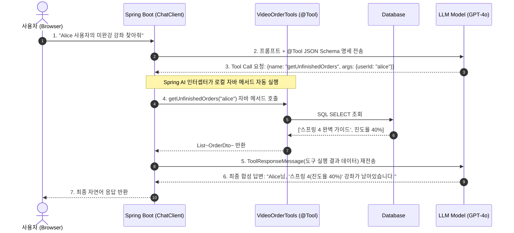

# Tool Calling과 자바 함수 기반 AI 에이전트 구축

## 한눈에 보기
| 항목 | 순수 LLM 질의응답 | Tool Calling 기반 AI 에이전트 |
|------|-------------------|-------------------------------|
| 지식 및 행동 범위 | 학습 데이터 시점의 과거 정적 지식에 국한 | **실시간 데이터베이스 조회, 외부 결제 API 실행, 이메일 발송 등 능동적 행동 가능** |
| 자바 연동 방식 | 단순 텍스트 입출력 | 스프링 빈 메서드에 `@Tool` 어노테이션 부여만으로 LLM이 자율 호출 |
| 실행 흐름 | 1회성 Request ──▶ Response | 자율 루프: 질문 ──▶ 도구 호출 결정 ──▶ 자바 메서드 실행 ──▶ 결과 반영 후 최종 응답 |

## 1. 왜 이게 필요한가

### 이런 상황을 상상해 보자
고객이 AI 챗봇에게 "내가 지난달에 주문한 동영상 강좌 중에서 아직 완강하지 않은 강좌 목록을 찾아서 남은 기간을 알려줘"라고 요청했다.

LLM은 고객이 누구인지, 회사의 데이터베이스에 무슨 주문 데이터가 들어있는지 전혀 알지 못한다.

```java
@Component
public class VideoOrderTools {
    private final OrderRepository orderRepository;

    @Tool(description = "사용자의 지난달 미완강 동영상 주문 목록을 데이터베이스에서 조회한다")
    public List<OrderDto> getUnfinishedOrders(String userId) {
        return orderRepository.findUnfinishedByUserId(userId);
    }
}
```

개발자는 위와 같이 일반적인 스프링 빈 메서드 위에 `@Tool` 어노테이션만 붙여두고 `ChatClient`에 등록했다.

이처럼 LLM이 스스로 판단하여 실시간 데이터를 조회하거나 시스템 액션을 수행하기 위해 자바 메서드를 원격 호출하는 기능을 **[[툴-호출]]**(= LLM의 추론 능력과 자바 비즈니스 로직을 결합하는 Function Calling 기술)이라 부른다.

### 여기서 뭐가 무너지나
과거의 LLM은 외부 세계와 단절된 "상자 속의 뇌"에 불과했다. 실시간 주가, 현재 날씨, 사내 DB 주문 내역을 물어보면 사실이 아닌 거짓 정보를 그럴듯하게 지어내는 치명적인 환각(Hallucination)을 일으켰다.

개발자가 모든 케이스를 if-else로 분기하여 필요한 데이터를 미리 조회해 프롬프트에 때려 넣으려 하면, 사용자의 복잡하고 다양한 의도를 사전에 예측할 수 없어 유지보수가 불가능해졌다.

### 그래서 나온 생각
Spring AI는 LLM에게 개발자가 작성한 자바 메서드의 이름, 설명(Description), 파라미터 스키마를 도구 명세(Tools Schema)로 건네준다.

LLM은 사용자의 질문을 분석하다가 "내 지식만으로는 답할 수 없고 `getUnfinishedOrders`라는 도구를 실행해야 한다"고 판단하면, 직접 메서드를 실행하는 대신 JSON 형식으로 실행 인자(`userId="alice"`)를 만들어 서버로 회신한다.

Spring AI 프레임워크는 이 신호를 가로채 실제 스프링 빈의 자바 메서드를 실행하고, 반환된 데이터를 다시 LLM에게 건네주어 완벽한 최종 답변을 생성하게 하는 "에이전틱 툴 실행 루프(Agentic Execution Loop)"를 100% 자동화했다.

쉽게 비유하자면, 지휘관(LLM)과 현장 정찰병(자바 @Tool 메서드)의 관계와 같다. 사령실에 앉아있는 지휘관(LLM)은 뛰어난 두뇌(추론 능력)를 가졌지만 현장의 실시간 상황(DB/API)을 직접 볼 수는 없다. 대신 지휘관이 무전기로 "정찰병 1호, 3번 벙커의 적군 수(getUnfinishedOrders)를 확인해 보고하라(툴 호출 결정)"고 명령하면, 정찰병(Spring AI 자바 빈)이 현장으로 달려가 정밀 측정(DB SQL 조회) 후 "적군 2명 확인(결과 데이터)"이라고 무전으로 보고한다. 지휘관은 이 실시간 보고를 종합하여 "적군 2명이 있으니 우회 공격하라(최종 답변)"는 완벽한 작전을 수립하는 것과 같다.

→ 비유가 깨지는 지점: 무전 대화는 시간이 걸리지만, Spring AI의 툴 콜링 루프는 HTTP JSON 통신과 JVM 인메모리 메서드 호출을 통해 수백 밀리초 안에 1회 또는 연속 다단계(Multi-turn)로 매끄럽게 완수된다.

## 2. 어떻게 동작하는가
1. **@Tool 도구 스키마 자동 등록**: 애플리케이션 시작 시 스프링 AI가 `@Tool` 어노테이션이 붙은 빈 메서드의 자바 파라미터(Java Record)를 리플렉션 분석하여 OpenAPI/JSON Schema 규격의 툴 명세를 추출한다 — LLM에게 제공할 도구 설명서를 준비하기 위해서다.
2. **도구 명세를 포함한 질문 전송**: `chatClient.prompt().tools(videoOrderTools).user("내 미완강 강좌 찾아줘").call()`을 호출하면, 도구 명세 JSON 목록이 LLM으로 함께 전송된다 — LLM이 어떤 도구를 사용할 수 있는지 인지하게 하기 위해서다.
3. **LLM의 Tool Call 결정 및 인자 생성**: LLM이 질문을 해석하고 직접 답하는 대신 `tool_calls: [{name: "getUnfinishedOrders", arguments: {"userId": "alice"}}]`라는 함수 실행 요청을 반환한다 — 자바 백엔드에게 메서드 실행을 위임하기 위해서다.
4. **Spring AI의 로컬 자바 메서드 자동 실행**: 스프링 AI 내부의 `FunctionCallback` 인터셉터가 LLM이 보낸 JSON 인자를 자바 객체로 역직렬화하여 실제 스프링 빈의 메서드를 실행하고 DB 조회 결과를 얻는다 — 비즈니스 데이터를 실시간으로 획득하기 위해서다.
5. **툴 결과 반환 및 LLM의 최종 답변 합성**: 조회된 결과 데이터(`List<OrderDto>`)를 `ToolResponseMessage`로 패키징하여 LLM으로 다시 쏘면, LLM이 이를 읽고 사용자가 이해하기 쉬운 자연스러운 한국어 문장으로 최종 요약하여 응답한다 — 실시간 팩트에 기반한 무결점 답변을 완성하기 위해서다.

## 3. 그림으로 보기



## 4. 이 노트에 나온 용어
| 용어 | 한 줄 풀이 | 용어집 링크 |
|------|------------|-------------|
| 툴-호출 | LLM이 실시간 데이터나 외부 액션을 위해 자바 메서드를 자율 호출하는 기능 | [[_glossary#툴-호출]] |
| 스프링-에이아이 | LLM과 스프링 빈을 자연스럽게 결합하는 공식 AI 프레임워크 | [[_glossary#스프링-에이아이]] |
| 챗-클라이언트 | 프롬프트와 툴 등록을 유려하게 체이닝하는 고수준 클라이언트 | [[_glossary#챗-클라이언트]] |
| 모델-컨텍스트-프로토콜 | 도구와 데이터 소스를 표준화된 프로토콜로 공유하는 차세대 규격 (MCP) | [[_glossary#모델-컨텍스트-프로토콜]] |

## 5. 자주 헷갈리는 것
- **`@Tool` 메서드의 description의 중요성**: LLM은 자바 바이트코드를 읽을 수 없으므로, 오직 `@Tool(description = "...")`에 적힌 자연어 설명을 읽고 어떤 상황에 이 메서드를 호출해야 하는지 결정한다. 따라서 description을 모호하지 않고 구체적으로 작성하는 것이 프롬프트 엔지니어링의 핵심이다.
- **다단계 도구 호출 (Multi-turn Tool Calling)**: 복잡한 질문의 경우 LLM이 한 번에 1개의 도구만 부르는 것이 아니라, "A 도구 실행 ──▶ 결과 확인 ──▶ B 도구 실행"처럼 연속해서 여러 도구를 연쇄 호출할 수 있으며 Spring AI는 이 루프를 자동으로 완주할 때까지 처리한다.

## 6. 언제 안 쓰나 / 경계
- **데이터베이스 직접 삭제/송금 등 고위험 파괴적 액션**: LLM의 판단 실수로 인한 금융 사고나 데이터 유실을 방지하기 위해, 결제나 데이터 삭제 같은 치명적 액션은 완전 자동 툴 호출에 맡기지 말고 사람의 최종 승인(Human-in-the-loop) 단계를 반드시 거쳐야 한다.

## 7. 연결
- [[01-spring-ai-architecture-and-chatclient]] — ChatClient Fluent API에 `.tools(...)`로 도구를 바인딩하는 구조로 이어진다.
- [[05-model-context-protocol-mcp]] — 단일 스프링 부트 앱 내부의 로컬 툴 호출을 넘어, 전사적 표준 프로토콜로 도구를 분산 공유하는 MCP(Model Context Protocol)로 확장된다.

## 8. 스스로 확인
1. LLM이 자체 지식의 한계를 극복하고 실시간 DB/API와 상호작용하는 Tool Calling의 4단계 실행 메커니즘을 설명할 수 있는가?
2. Spring AI에서 일반 자바 빈 메서드를 LLM이 호출 가능한 도구로 전환하기 위해 `@Tool` 어노테이션에 작성해야 하는 핵심 정보는 무엇인가?
3. Tool Calling 아키텍처가 LLM의 고질적인 환각(Hallucination) 문제를 획기적으로 줄여주는 원리는 무엇인가?

<!-- ==== 아래는 내 영역 · 스킬 수정 금지 ==== -->

## 내 설명 시도

## 막혔던 지점

## 리뷰 이력
