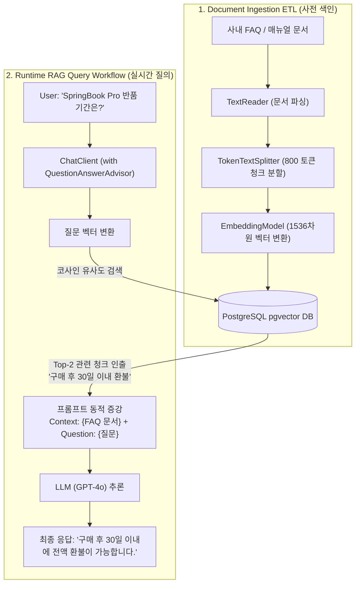

# RAG 아키텍처와 VectorStore 기반 의미론적 검색

## 한눈에 보기
| 단계 | 핵심 컴포넌트 | 처리 내용 |
|------|---------------|-----------|
| **1. Ingestion (수집 ETL)** | `TextReader` ──▶ `TokenTextSplitter` ──▶ `VectorStore` | 사내 비공개 문서(FAQ, PDF)를 청크로 쪼개고 임베딩 벡터로 변환하여 DB 저장 |
| **2. Retrieval (의미론적 검색)** | `VectorStore.similaritySearch(query)` | 사용자 질문과 가장 의미가 유사한 Top-K 문서 청크를 코사인 유사도로 인출 |
| **3. Generation (답변 생성)** | `QuestionAnswerAdvisor` & `ChatClient` | 인출된 사내 문서를 프롬프트 컨텍스트에 동적으로 주입하여 LLM 최종 답변 생성 |

## 1. 왜 이게 필요한가

### 이런 상황을 상상해 보자
우리 회사의 신제품인 "SpringBook Pro" 노트북에 대한 고객지원 FAQ 챗봇을 만들고 있다. 고객이 "SpringBook Pro의 반품 정책과 보증 기간이 어떻게 되나요?"라고 물었다.

OpenAI나 Claude 같은 상용 LLM은 우리 회사의 내부 신제품 FAQ나 사내 정책 문서를 사전에 학습한 적이 전혀 없다.

```java
@Service
public class CustomerSupportService {
    private final ChatClient chatClient;

    public CustomerSupportService(ChatClient.Builder builder, VectorStore vectorStore) {
        this.chatClient = builder
            .defaultAdvisors(new QuestionAnswerAdvisor(vectorStore))
            .build();
    }

    public String ask(String question) {
        return chatClient.prompt().user(question).call().content();
    }
}
```

개발자는 `ChatClient`에 `QuestionAnswerAdvisor(vectorStore)` 어드바이저 한 줄만 등록했다.

이처럼 외부 사내 지식 문서를 벡터 데이터베이스에서 의미 기반으로 검색하여 프롬프트 컨텍스트에 동적으로 주입해 주는 인공지능 기술을 **[[검색-증강-생성]]**(= 비공개 문서를 검색하여 최신 팩트에 기반한 답변을 생성하는 RAG 아키텍처)이라 부른다.

### 여기서 뭐가 무너지나
첫째, **LLM 파인튜닝(Fine-tuning)의 한계다.** 사내 문서를 LLM에 가르치기 위해 매번 수억 원의 비용과 수 주의 시간을 들여 모델을 재학습시킬 수 없다. 사내 규정이 내일 당장 바뀌면 모델을 또 처음부터 다시 학습시켜야 한다.

둘째, **단순 키워드(SQL LIKE) 검색의 한계다.** 사용자가 "환불 규정"이라고 물었을 때 문서에 "반품 정책"이라는 단어만 적혀있다면 단순 텍스트 매칭 검색은 문서를 찾아내지 못한다.

### 그래서 나온 생각
자연어 문장의 "의미론적 맥락"을 수백 차원의 숫자 벡터 좌표로 변환해 주는 **[[임베딩-모델]]**(= 텍스트를 고차원 부동소수점 벡터로 변환하는 AI 모델)과, 이 벡터 간의 코사인 유사도 거리를 측정하여 가장 뜻이 통하는 문서를 0.01초 만에 찾아내는 **[[벡터-저장소]]**(= PGVector, Redis 등의 벡터 데이터베이스)를 결합했다.

Spring AI는 문서를 읽고(`DocumentReader`), 적절한 크기로 자르고(`TokenTextSplitter`), 임베딩을 거쳐 저장하는 완전한 Ingestion ETL 파이프라인을 제공한다.

그리고 사용자가 질문하면 `QuestionAnswerAdvisor`가 질문과 관련된 사내 문서 조각들을 자동으로 검색하여 프롬프트의 `{context}`에 채워 넣음으로써, LLM이 사내 최신 팩트에 기반하여 완벽하고 정확한 답변을 생성하게 만들었다.

쉽게 비유하자면, 오픈북(Open-book) 시험과 같다. 학생(LLM)에게 사내 수천 페이지의 모든 매뉴얼을 머릿속에 통째로 암기하라(파인튜닝)고 요구하지 않는다. 시험 문제(사용자 질문)가 나왔을 때, 사서(VectorStore)가 도서관 서가에서 가장 관련된 참고서 2~3페이지(문서 청크)를 재빨리 펼쳐서 학생 책상 위에 올려주는(컨텍스트 주입) 것이다. 학생은 눈앞에 놓인 참고서를 보고 100점짜리 정확한 정답(RAG 생성)을 써낸다.

→ 비유가 깨지는 지점: 사람이 책을 찾으려면 목차를 일일이 넘겨야 하지만, 벡터 저장소는 고차원 HNSW(Hierarchical Navigable Small World) 인덱스를 통해 수백만 건의 문서 중에서 가장 유사한 문서를 수 밀리초 만에 찾아낸다.

## 2. 어떻게 동작하는가
1. **문서 Ingestion ETL 파이프라인 가동**: 애플리케이션 시작 시 `TextReader`가 FAQ 문서를 읽고, `TokenTextSplitter`가 800토큰 단위의 작은 청크(Chunk)로 분할한다 — LLM의 컨텍스트 윈도우 크기에 맞추고 검색 정밀도를 높이기 위해서다.
2. **임베딩 생성 및 PGVector 적재**: `vectorStore.accept(chunks)`가 호출되면, **[[임베딩-모델]]**(예: text-embedding-3-small)이 각 청크의 텍스트를 1536차원 부동소수점 벡터로 변환하여 PostgreSQL(`pgvector`) 테이블에 저장한다 — 의미론적 벡터 검색 인덱스를 구축하기 위해서다.
3. **사용자 질문 수신 및 임베딩 변환**: 사용자가 "SpringBook Pro 반품 기간이 어떻게 돼?"라고 질문하면, 스프링 AI가 질문 문장을 동일한 임베딩 모델로 벡터화한다 — 질문의 의미 좌표를 생성하기 위해서다.
4. **코사인 유사도 검색 (Similarity Search)**: **[[벡터-저장소]]**가 질문 벡터와 가장 가까운 코사인 유사도를 가진 Top-K(예: 상위 3개) 문서 청크를 인출한다 — 반품 및 보증 관련 실제 FAQ 텍스트를 확보하기 위해서다.
5. **프롬프트 증강 및 최종 답변 생성**: `QuestionAnswerAdvisor`가 인출된 FAQ 텍스트를 `"Context: {documents} \n Question: {input}"` 템플릿에 합쳐 LLM으로 전달하고, LLM이 사내 FAQ에 적힌 "구매 후 30일 이내"라는 정확한 팩트를 인용하여 답변을 완성한다 — 환각 없는 정확한 엔터프라이즈 AI 답변을 완성하기 위해서다.

## 3. 그림으로 보기



## 4. 이 노트에 나온 용어
| 용어 | 한 줄 풀이 | 용어집 링크 |
|------|------------|-------------|
| 검색-증강-생성 | 사내 비공개 문서를 검색하여 프롬프트에 주입하는 AI 아키텍처 (RAG) | [[_glossary#검색-증강-생성]] |
| 벡터-저장소 | 텍스트 임베딩 벡터를 저장하고 유사도 검색을 수행하는 전용 데이터베이스 | [[_glossary#벡터-저장소]] |
| 임베딩-모델 | 자연어 텍스트를 문맥적 의미가 보존된 고차원 숫자 벡터로 변환하는 모델 | [[_glossary#임베딩-모델]] |
| 스프링-에이아이 | RAG ETL 파이프라인과 VectorStore 추상화를 제공하는 프레임워크 | [[_glossary#스프링-에이아이]] |

## 5. 자주 헷갈리는 것
- **RAG vs Fine-tuning의 선택 기준**: 최신 사내 비즈니스 지식 연동, 문서 출처(Citation) 표기, 즉각적인 문서 업데이트가 필요할 때는 무조건 RAG가 정답이며, 모델의 말투/어조 변경이나 특정 도메인 전용 문법 습득이 목적일 때만 Fine-tuning을 고려한다.
- **Chunk Size의 중요성**: 문서를 너무 크게 자르면 불필요한 노이즈가 섞여 검색 정확도가 떨어지고, 너무 작게 자르면 문맥(Context)이 끊어지므로 보통 500~1000 토큰 크기에 100토큰 정도의 중첩(Overlap)을 두는 것이 권장된다.

## 6. 언제 안 쓰나 / 경계
- **데이터베이스의 정확한 숫자 합계/통계 집계 연산**: "지난달 총매출 합계는?" 같은 질문은 텍스트 유사도 기반 RAG로는 정확한 계산이 불가능하므로, Text-to-SQL 또는 앞서 배운 Java Tool Calling(`@Tool`)을 사용해 데이터베이스 집계 함수를 실행해야 한다.

## 7. 연결
- [[01-spring-ai-architecture-and-chatclient]] — QuestionAnswerAdvisor를 ChatClient에 결합하여 완전 자동화된 RAG 클라이언트를 구성한다.
- [[03-tool-calling-and-function-callbacks]] — 정적 문서 지식을 검색하는 RAG와 실시간 트랜잭션을 실행하는 Tool Calling이 상호 보완된다.

## 8. 스스로 확인
1. LLM 파인튜닝과 비교하여 RAG(검색 증강 생성) 아키텍처가 엔터프라이즈 사내 지식 관리에 압도적으로 유리한 이유는 무엇인가?
2. 텍스트가 임베딩 모델을 거쳐 벡터 저장소(VectorStore)에 저장되고 코사인 유사도로 인출되는 메커니즘은 무엇인가?
3. Spring AI의 `DocumentReader ──▶ TokenTextSplitter ──▶ VectorStore` ETL 파이프라인의 각 단계별 역할은 무엇인가?

<!-- ==== 아래는 내 영역 · 스킬 수정 금지 ==== -->

## 내 설명 시도

## 막혔던 지점

## 리뷰 이력
