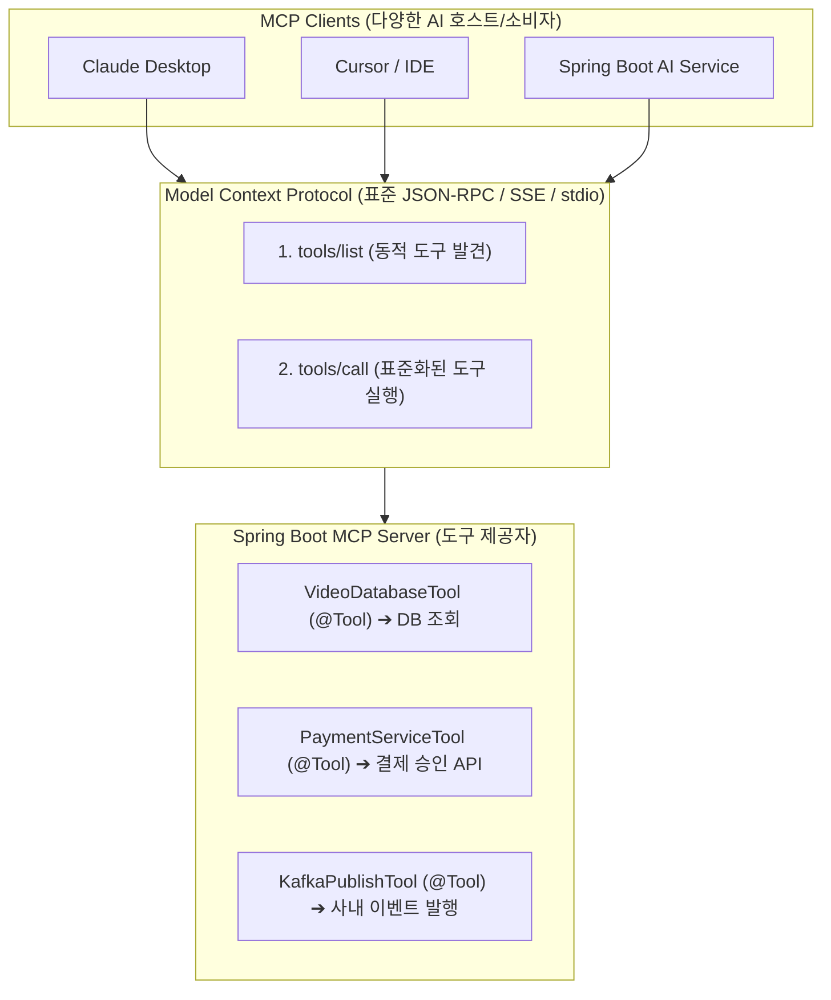

# Model Context Protocol (MCP) 표준과 엔터프라이즈 AI 도구 연동

## 한눈에 보기
| 항목 | 사설 커스텀 툴 연동 (Ad-hoc Tools) | Model Context Protocol (MCP 표준) |
|------|-----------------------------------|-----------------------------------|
| 프로토콜 규격 | AI 벤더별/프레임워크별 제각각 구현 | **Anthropic 제정 글로벌 오픈 표준 (JSON-RPC 기반)** |
| 도구 재사용성 | 특정 스프링 부트 애플리케이션 내부에서만 격리 사용 | **Claude Desktop, Cursor, 사내 타 AI 에이전트가 즉시 플러그앤플레이 연동** |
| 전송 계층 (Transport) | 인메모리 JVM 리플렉션 호출 | `stdio` (표준 입출력 프로세스) 또는 `SSE / HTTP` 분산 네트워크 통신 |

## 1. 왜 이게 필요한가

### 이런 상황을 상상해 보자
우리 기업 내부에는 고객 데이터베이스, 재고 관리 시스템, 사내 슬랙 봇, 사내 Git 저장소 등 수십 개의 비즈니스 도구와 데이터 소스가 존재한다. 

이 도구들을 엔지니어들이 쓰는 Cursor IDE, 기획자들이 쓰는 Claude Desktop, 그리고 고객용 Spring Boot 챗봇 서비스 모두에서 동일하게 AI 도구로 사용하게 만들려 한다.

```yaml
spring:
  ai:
    mcp:
      server:
        transport: sse
        port: 8081
```

스프링 부트 4에서는 사내 도메인 비즈니스 서비스들을 MCP 서버(Server) 모듈로 패키징하여 단 한 번 띄워두었다.

이처럼 AI 모델과 엔터프라이즈 도구/데이터 소스를 표준 규격으로 상호 연결하는 글로벌 오픈 프로토콜을 **[[모델-컨텍스트-프로토콜]]**(= AI 에이전트와 도구를 플러그앤플레이로 연결하는 오픈 표준, MCP)이라 부른다.

### 여기서 뭐가 무너지나
과거에는 AI 클라이언트가 10개(Claude Desktop, ChatGPT, 사내 봇, IDE 등)이고 사내 데이터 도구가 10개(DB, 슬랙, 지라, 노션 등)가 있다면, $10 \times 10 = 100$개의 맞춤형 접착 코드(Glue Code)를 제각각 수작업으로 개발하고 유지보수해야 했다.

도구의 API 규격이 하나만 바뀌어도 10개의 AI 클라이언트 통합 코드를 전부 다시 수정해야 하는 극심한 M×N 파편화 문제가 발생했다.

### 그래서 나온 생각
웹 브라우저와 웹 서버가 HTTP 표준 하나로 전 세계를 연결했듯이, AI 애플리케이션(MCP Client)과 비즈니스 도메인 서비스(MCP Server)를 단 하나의 표준화된 JSON-RPC 규격으로 연결하는 MCP 생태계가 탄생했다.

Spring AI는 공식 MCP 스타터(`spring-ai-mcp`)를 통해, 기존 스프링 부트 빈들을 단 몇 줄의 설정으로 **MCP Server**(도구 제공자)로 외부에 노출하거나, 반대로 외부의 수많은 오픈소스 MCP Server들을 **MCP Client**(도구 소비자)로 즉시 끌어와 `ChatClient`에 붙일 수 있게 지원한다.

쉽게 비유하자면, 컴퓨터의 표준 USB 단자와 같다. 마우스, 키보드, 프린터, 외장하드(다양한 데이터 도구) 제조사마다 컴퓨터 메인보드에 꽂는 케이블 모양(파편화된 연동 코드)이 달랐던 시절을 끝내고, 모든 장비가 표준 USB 포트(MCP 프로토콜) 하나로 통일된 것과 같다. 이제 어떤 제조사의 컴퓨터(Claude, GPT, Spring AI)를 사도 USB 케이블만 꽂으면(MCP 연결) 외장하드(사내 DB 도구)의 데이터를 1초 만에 읽고 쓸 수 있다.

→ 비유가 깨지는 지점: 물리적 USB는 유선 연결이지만, MCP는 로컬 서브프로세스(`stdio`) 통신뿐만 아니라 안전한 HTTPS/SSE(Server-Sent Events) 네트워크 전송 계층을 지원하여 클라우드 환경의 마이크로서비스 간에도 원격으로 도구를 자유자재로 공유한다.

## 2. 어떻게 동작하는가
1. **스프링 빈 도구의 MCP Server 노출**: 스프링 부트 애플리케이션의 `@Tool` 메서드들을 `McpServer`가 스캔하여 표준 JSON-RPC 도구 목록(`tools/list`) 엔드포인트로 노출한다 — 외부 AI 클라이언트에게 제공할 도구 카탈로그를 발행하기 위해서다.
2. **MCP Client 핸드셰이크**: Claude Desktop이나 다른 스프링 AI 서비스가 SSE 또는 stdio 채널을 통해 접속하여 프로토콜 버전과 지원 기능을 협상한다 — 클라이언트와 서버 간의 통신 채널을 안전하게 수립하기 위해서다.
3. **도구 카탈로그 자동 동기화**: MCP Client가 `tools/list` 요청을 보내 사용 가능한 도구들의 이름과 JSON Schema를 실시간으로 받아온다 — 클라이언트가 별도의 하드코딩 없이 도구 명세를 동적으로 발견(Discovery)하기 위해서다.
4. **원격 도구 실행 요청 (tools/call)**: 외부 AI 모델이 사용자 질문을 분석하여 도구 실행을 결정하면, 클라이언트가 `tools/call` JSON-RPC 메시지에 인자를 담아 스프링 부트 MCP 서버로 보낸다 — 실제 자바 비즈니스 로직 실행을 위임하기 위해서다.
5. **메서드 실행 및 표준 결과 반환**: 스프링 부트의 **[[툴-호출]]** 엔진이 해당 자바 메서드를 실행하고, 결과 데이터를 JSON-RPC 응답으로 포맷팅하여 회신한다 — AI 클라이언트가 표준 포맷으로 결과를 해석하여 최종 답변을 도출할 수 있게 하기 위해서다.

## 3. 그림으로 보기



## 4. 이 노트에 나온 용어
| 용어 | 한 줄 풀이 | 용어집 링크 |
|------|------------|-------------|
| 모델-컨텍스트-프로토콜 | AI 에이전트와 엔터프라이즈 도구를 표준 JSON-RPC로 연결하는 오픈 규격 (MCP) | [[_glossary#모델-컨텍스트-프로토콜]] |
| 툴-호출 | LLM이 실시간 액션을 위해 자바 메서드를 자율 실행하는 기능 | [[_glossary#툴-호출]] |
| 스프링-에이아이 | MCP Server 및 MCP Client 기능을 공식 제공하는 스프링 AI 프레임워크 | [[_glossary#스프링-에이아이]] |
| 인공지능-가드레일 | 외부 AI 클라이언트의 무단 도구 호출을 차단하는 보안 방어 체계 | [[_glossary#인공지능-가드레일]] |

## 5. 자주 헷갈리는 것
- **stdio vs SSE 전송 계층**: 로컬 데스크톱(Claude Desktop, 로컬 CLI)에서 실행할 때는 프로세스 표준 입출력을 사용하는 `stdio` 트랜스포트가 빠르고 간단하며, 원격 클라우드 서버 간 통신에서는 HTTP 기반의 `SSE`(Server-Sent Events) 트랜스포트를 사용해야 한다.
- **MCP의 3대 핵심 프리미티브**: MCP는 단순히 도구(Tools)뿐만 아니라, 읽기 전용 파일/DB 데이터를 제공하는 리소스(Resources), 그리고 미리 작성된 대화 템플릿인 프롬프트(Prompts)의 3가지 표준 요소를 모두 공유할 수 있다.

## 6. 언제 안 쓰나 / 경계
- **단일 마이크로서비스 내부의 완전 폐쇄형 전용 로직**: 도구를 외부에 노출하거나 다른 AI 클라이언트와 공유할 계획이 전혀 없고 단일 앱 안에서만 쓰는 로컬 헬퍼 함수는 굳이 MCP 서버로 감싸지 않고 앞서 배운 순수 `@Tool` 어노테이션으로 충분하다.

## 7. 연결
- [[01-spring-ai-architecture-and-chatclient]] — ChatClient가 MCP Client와 결합하여 외부 도구들을 손쉽게 소비하는 구조를 이룬다.
- [[03-tool-calling-and-function-callbacks]] — 로컬 자바 Tool Calling의 원리가 글로벌 분산 프로토콜로 확장된 표준화 결과물이다.

## 8. 스스로 확인
1. AI 클라이언트와 사내 도구 간의 M×N 파편화 문제를 Model Context Protocol(MCP)이 해결하는 메커니즘은 무엇인가?
2. Spring Boot 애플리케이션을 MCP Server로 구성했을 때 얻을 수 있는 비즈니스적 확장성은 무엇인가?
3. MCP의 전송 계층인 `stdio`와 `SSE`의 특징 및 실무 적용 시나리오 차이는 무엇인가?

<!-- ==== 아래는 내 영역 · 스킬 수정 금지 ==== -->

## 내 설명 시도

## 막혔던 지점

## 리뷰 이력
