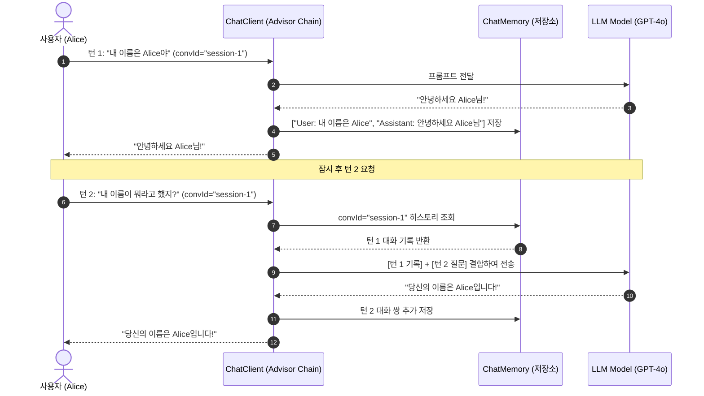

## 한눈에 보기
- 기본적으로 LLM API(OpenAI, Claude)는 이전 대화 내용을 기억하지 못하는 무상태(Stateless) 프로토콜이다.
- **[[대화-메모리]]**(`ChatMemory`)는 사용자별/대화방별(Conversation ID) 메시지 히스토리를 저장소에 안전하게 유지한다.
- Spring AI의 `MessageChatMemoryAdvisor`는 개발자가 대화 목록을 수동으로 관리할 필요 없이, **[[챗-클라이언트]]** 파이프라인에서 직전 대화 기록들을 최신 프롬프트 앞단에 자동으로 조립·주입한다.

## 1. 왜 이게 필요한가

### 여기서 뭐가 무너지나
사용자가 챗봇에게 "내 이름은 앨리스야"라고 말한 뒤 다음 턴에서 "내 이름이 뭐지?"라고 물었을 때, 무상태 LLM 서버는 이전 대화 컨텍스트가 전혀 없으므로 "죄송하지만 성함을 알 수 없습니다"라고 답해 사용자 경험이 심각하게 망가진다.

이를 해결하려고 컨트롤러나 서비스 계층에서 `List<Message>`를 세션에 담아 수동으로 루프를 돌며 합치면, 코드가 극도로 지저분해지고 토큰 제한(Context Window Limit) 초과로 서버 에러가 터지게 된다.

### 그래서 나온 생각
**[[스프링-에이아이]]**는 대화 상태를 전문적으로 캡슐화하는 `ChatMemory` 인터페이스(`InMemoryChatMemory`, `CassandraChatMemory` 등)를 설계했다.

그리고 `ChatClient`의 어드바이저 체인에 `MessageChatMemoryAdvisor`를 단 한 줄로 등록하기만 하면, 요청 시 대화 ID(`chat_memory_conversation_id`)를 기준으로 최근 N개의 대화 메시지를 자동으로 불러와 **[[프롬프트-템플릿]]** 상단에 결합하고, LLM의 응답이 도착하면 최신 질문과 답변 쌍을 메모리에 자동 저장하도록 만들었다.

쉽게 비유하자면, 스마트폰 메신저 대화창의 채팅 기록과 같다. 사용자가 메신저에서 새 메시지를 보낼 때마다 과거 대화 전체를 직접 복사해서 붙여넣지 않아도, 메신저 앱(MessageChatMemoryAdvisor)이 스크롤 화면 상단의 최근 대화 10개(ChatMemory)를 자동으로 함께 묶어서 서버로 보내주기 때문에 자연스럽게 "그거 어떻게 됐어?"라는 대명사 질문도 척척 알아듣는 것과 같다.

→ 비유가 깨지는 지점: 스마트폰은 무한히 스크롤되지만, LLM 대화 메모리는 모델의 컨텍스트 윈도우 크기에 맞춰 최근 N개의 메시지만 슬라이딩 윈도우(Sliding Window)로 유지하거나 오래된 대화를 요약 압축해야 한다.

## 2. 어떻게 동작하는가
1. **ChatMemory 빈 등록**: 스프링 부트 설정 클래스에서 `ChatMemory chatMemory = new InMemoryChatMemory()`를 빈으로 등록한다 — 대화 세션을 보관할 인메모리 또는 분산 저장소를 확보하기 위해서다.
2. **ChatClient에 어드바이저 연결**: `ChatClient.builder(chatModel).defaultAdvisors(new MessageChatMemoryAdvisor(chatMemory)).build()`로 클라이언트를 생성한다 — 대화 메모리 인터셉터를 자동 활성화하기 위해서다.
3. **요청 시 대화 식별자 전달**: 비즈니스 컨트롤러에서 `chatClient.prompt().user("내 이름이 뭐지?").advisors(a -> a.param(CHAT_MEMORY_CONVERSATION_ID_KEY, "session-alice-123")).call()`을 호출한다 — 특정 사용자의 대화 세션을 핀포인트 지정하기 위해서다.
4. **이전 대화 히스토리 자동 인출 및 프롬프트 증강**: 어드바이저가 저장소에서 `session-alice-123`의 직전 대화 기록(User: "내 이름은 앨리스야", Assistant: "반갑습니다 앨리스님!")을 조회하여 시스템 프롬프트 바로 아래에 주입한다 — LLM에게 완전한 멀티턴 맥락을 제공하기 위해서다.
5. **LLM 답변 생성 및 히스토리 자동 적재**: LLM이 "당신의 이름은 앨리스입니다"라고 응답하면, 어드바이저가 응답 텍스트를 가로채 `ChatMemory`에 새로운 Assistant 메시지로 영속 저장한다 — 다음 대화 턴을 위해 메모리를 최신화하기 위해서다.

## 3. 그림으로 보기

## 4. 이 노트에 나온 용어
| 용어 | 한 줄 풀이 | 용어집 링크 |
|------|------------|-------------|
| 대화-메모리 | 세션별 대화 기록을 보관하여 멀티턴 대화 맥락을 유지하는 컴포넌트 | [[_glossary#대화-메모리]] |
| 챗-클라이언트 | 어드바이저 체인을 통해 메모리와 툴을 유려하게 결합하는 고수준 클라이언트 | [[_glossary#챗-클라이언트]] |
| 스프링-에이아이 | 대화 메모리와 RAG를 객체 지향으로 다루는 공식 AI 프레임워크 | [[_glossary#스프링-에이아이]] |
| 프롬프트-템플릿 | 대화 히스토리와 사용자 질문을 동적으로 조립하는 템플릿 | [[_glossary#프롬프트-템플릿]] |

## 5. 자주 헷갈리는 것
- **`InMemoryChatMemory` vs 분산 저장소**: `InMemoryChatMemory`는 서버 재시작 시 대화가 날아가고 다중 인스턴스 로드밸런싱 환경에서 세션이 공유되지 않으므로, 상용 프로덕션 환경에서는 Redis, PostgreSQL, Cassandra 기반의 영속 ChatMemory 구현체를 사용해야 한다.
- **토큰 누적 방지 (Window Size)**: 대화가 50턴 이상 길어지면 프롬프트 토큰 비용이 눈덩이처럼 불어나므로, `MessageChatMemoryAdvisor` 생성 시 최근 10~20개 메시지만 유지하도록 윈도우 크기를 제한해야 한다.

## 6. 언제 안 쓰나 / 경계
- **단발성 단순 번역/요약 API**: 이전 대화 맥락이 전혀 필요 없고 매 요청이 완전히 독립적인 1회성 텍스트 가공 작업에서는 대화 메모리 어드바이저를 붙이지 않고 순수 Stateless로 호출해야 메모리와 토큰을 아낄 수 있다.

## 7. 연결
- [[01-spring-ai-architecture-and-chatclient]] — ChatClient의 defaultAdvisors 구성에 대화 메모리가 등록되는 기반 구조다.
- [[04-rag-architecture-and-vector-stores]] — RAG 문서 검색과 대화 메모리가 결합하여 완성형 AI 챗봇을 구성한다.

## 8. 스스로 확인
1. LLM API의 무상태(Stateless) 특성과 `ChatMemory`가 필요한 이유는 무엇인가?
2. `MessageChatMemoryAdvisor`가 프롬프트 전송 전과 응답 수신 후에 각각 수행하는 역할은 무엇인가?
3. 멀티턴 챗봇에서 토큰 비용 폭발을 방지하기 위한 대화 메모리 관리 전략은 무엇인가?

<!-- ==== 아래는 내 영역 · 스킬 수정 금지 ==== -->

## 내 설명 시도

## 막혔던 지점

## 리뷰 이력
