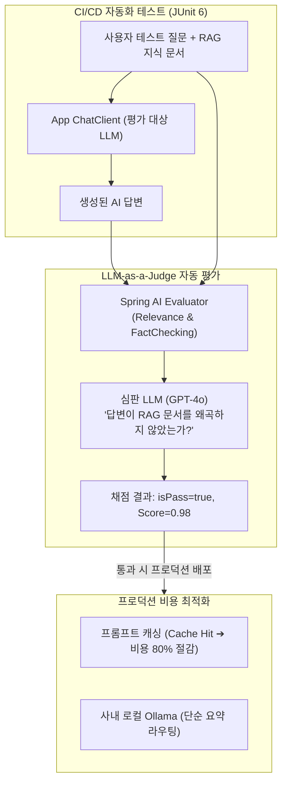

## 한눈에 보기
- AI 애플리케이션을 상용 배포하기 위해서는 "LLM이 정말 정확하게 답하고 있는가?"를 측정하는 자동화된 검증과 "API 호출 비용을 어떻게 줄일 것인가?"에 대한 최적화가 필수적이다.
- **[[인공지능-평가]]**(`Evaluator`, LLM-as-a-Judge)는 RAG 검색 문맥과 LLM의 생성 답변 간 관련성(Relevance) 및 사실 일치성(Factuality)을 판사가 채점하듯 자동 수치화한다.
- **[[프롬프트-캐싱]]**(`Prompt Caching`)과 사내 로컬 모델(Ollama / Docker Model Runner) 하이브리드 전략을 통해 고가의 클라우드 API 토큰 비용을 대폭 절감한다.

## 1. 왜 이게 필요한가

### 여기서 뭐가 무너지나
개발자가 프롬프트를 조금 수정했을 때, 이전보다 답변 품질이 좋아졌는지 나빠졌는지 사람이 일일이 수백 개의 질문을 눈으로 확인하는 것은 불가능하다.

또한 수천 줄의 사내 규정 문서를 RAG 컨텍스트로 매번 API에 보낼 때마다 엄청난 토큰 비용이 발생하여 매월 수백만 원의 클라우드 청구서 폭탄을 맞게 된다.

### 그래서 나온 생각
**[[스프링-에이아이]]**는 단위 테스트(JUnit) 환경에서 AI의 답변 품질을 자동으로 회귀 테스트(Regression Test)할 수 있는 `RelevanceEvaluator`와 `FactCheckingEvaluator`를 제공한다. 더 똑똑한 상위 모델(예: GPT-4o)이 판사가 되어 RAG 문서와 답변을 대조 채점하게 만든다.

동시에 OpenAI와 Anthropic의 **[[프롬프트-캐싱]]**을 활용하여 중복 전송되는 시스템 지침과 문서 본문을 서버측 캐시에서 0.001초 만에 재사용하게 하고, 단순 반복 작업은 사내 GPU의 로컬 Ollama 모델로 라우팅하는 하이브리드 비용 최적화 아키텍처를 확립했다.

쉽게 비유하자면, 대학교 논문 심사위원(LLM-as-a-Judge)과 도서관 정기 구독권(프롬프트 캐싱)의 결합과 같다. 학생(대상 LLM)이 작성한 논문(생성 답변)이 참고문헌(RAG 문서)을 왜곡하지 않고 올바르게 인용했는지 교수님(평가 모델)이 객관적인 채점 기준표로 점수를 매겨 합격 여부를 판정한다. 또한 매번 책을 새로 구매하지 않고 한 번 등록된 도서관 회원권(캐시)으로 책을 무제한 열람하여 비용을 80% 아끼는 것과 같다.

→ 비유가 깨지는 지점: 교수의 논문 채점은 며칠이 걸리지만, Spring AI의 자동 평가기는 CI/CD 빌드 파이프라인에서 수초 만에 수십 개의 테스트 케이스를 병렬로 채점하고 통과 여부(Pass/Fail)를 리포트한다.

## 2. 어떻게 동작하는가
1. **평가 대상 질의응답 실행**: 단위 테스트에서 **[[챗-클라이언트]]**가 질문과 RAG 컨텍스트를 주입하여 대상 답변(`ChatResponse`)을 획득한다 — 평가할 원본 데이터를 생성하기 위해서다.
2. **EvaluationRequest 조립**: 사용자 질문, RAG가 제공한 문서 조각 목록, LLM이 만든 최종 답변을 `EvaluationRequest` 객체로 패키징한다 — 심판 모델에게 건넬 근거 자료를 구성하기 위해서다.
3. **LLM-as-a-Judge 자동 채점**: `RelevanceEvaluator.evaluate(request)`가 실행되면, 심판 모델이 답변의 질문 관련성 점수(`score`)와 사실 왜곡 여부(`isPass`)를 판정한다 — 주관적 육안 검사 없이 객관적인 AI 품질 지표를 산출하기 위해서다.
4. **JUnit 단언문 검증**: `assertThat(evaluationResponse.isPass()).isTrue()` 단언문으로 테스트 성공 여부를 판정한다 — 품질 기준 미달 프롬프트가 프로덕션에 배포되는 것을 차단하기 위해서다.
5. **프롬프트 캐시 적중 및 비용 절감**: 프로덕션 런타임에서 1,024토큰 이상의 시스템 프롬프트가 반복 전송될 때, AI 공급자 캐시가 적중(Cache Hit)하여 토큰 비용 할인 및 초고속 응답을 달성한다 — 운영 비용을 극소화하기 위해서다.

## 3. 그림으로 보기

## 4. 이 노트에 나온 용어
| 용어 | 한 줄 풀이 | 용어집 링크 |
|------|------------|-------------|
| 인공지능-평가 | 심판 모델을 통해 AI 답변의 사실성과 관련성을 자동 채점하는 품질 검증 체계 | [[_glossary#인공지능-평가]] |
| 프롬프트-캐싱 | 반복 전송되는 프롬프트를 공급자 서버에 캐시하여 비용과 지연을 줄이는 최적화 | [[_glossary#프롬프트-캐싱]] |
| 스프링-에이아이 | 평가 프레임워크와 비용 최적화 클라이언트를 제공하는 공식 라이브러리 | [[_glossary#스프링-에이아이]] |
| 챗-클라이언트 | 평가 및 프로덕션 호출을 유려하게 수행하는 고수준 클라이언트 | [[_glossary#챗-클라이언트]] |
| 프롬프트-템플릿 | 평가용 테스트 데이터와 시스템 지시사항을 조립하는 템플릿 | [[_glossary#프롬프트-템플릿]] |

## 5. 자주 헷갈리는 것
- **평가기 모델의 선정**: 평가를 수행하는 심판 모델은 반드시 평가 대상 모델보다 똑똑하거나 동등 이상의 고성능 모델(예: 타겟이 GPT-4o-mini라면 심판은 GPT-4o)을 사용해야 정확한 채점 결과를 얻을 수 있다.
- **프롬프트 캐싱의 조건**: 프롬프트 캐싱은 주로 1,024토큰 이상의 정적 접두사(System Prompt, 긴 매뉴얼)에서만 동작하며, 프롬프트 앞부분에 동적 타임스탬프나 랜덤 값이 들어가면 캐시가 미스(Miss)된다.

## 6. 언제 안 쓰나 / 경계
- **단순 1회성 프로토타입 개발**: 신속하게 기능 동작 여부만 확인하는 초기 PoC 단계에서는 복잡한 LLM-as-a-Judge 평가 파이프라인 구축을 생략하고 수동 테스트로 빠르게 진행할 수 있다.

## 7. 연결
- [[01-spring-ai-architecture-and-chatclient]] — ChatClient의 호출 품질을 자동 검증하는 상위 운영 아키텍처다.
- [[04-rag-architecture-and-vector-stores]] — RAG가 인출한 문서와 답변 간의 사실성을 검증하는 핵심 짝꿍 기술이다.

## 8. 스스로 확인
1. LLM-as-a-Judge를 활용한 자동 평가가 AI 애플리케이션의 CI/CD에 필수적인 이유는 무엇인가?
2. `RelevanceEvaluator`와 `FactCheckingEvaluator`가 각각 검증하는 핵심 항목은 무엇인가?
3. 프롬프트 캐싱(Prompt Caching)이 동작하기 위해 지켜야 하는 프롬프트 구조 설계 원칙은 무엇인가?

<!-- ==== 아래는 내 영역 · 스킬 수정 금지 ==== -->

## 내 설명 시도

## 막혔던 지점

## 리뷰 이력
