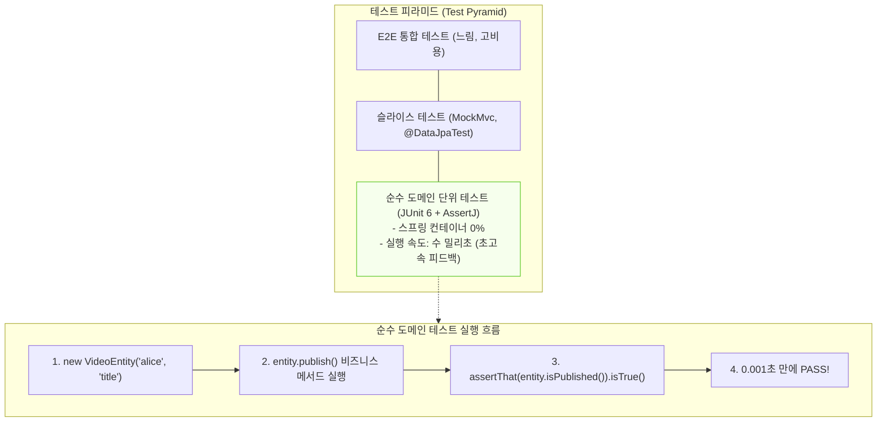

## 한눈에 보기
- 단위 테스트 피라미드의 가장 밑바닥이자 가장 빠르고 견고한 기초는 무거운 스프링 컨테이너 없이 순수 자바 객체만 검증하는 "순수 도메인 단위 테스트"다.
- Spring Boot 4는 **[[제이유닛6]]**을 기본 테스트 프레임워크로 채택하여 모듈화된 실행 런타임과 강력한 테스트 라이프사이클을 제공한다.
- **[[어서트제이]]**(`AssertJ`)의 유려한 Fluent API 단언문을 통해 도메인 엔티티와 값 객체의 비즈니스 불변식(Invariants)을 0.001초 만에 검증한다.

## 1. 왜 이게 필요한가

### 여기서 뭐가 무너지나
단순한 도메인 엔티티 생성자나 비즈니스 계산 메서드 하나를 검증하기 위해 매번 `@SpringBootTest`를 붙여 전체 스프링 컨테이너와 데이터베이스를 띄우면, 테스트 1개를 돌리는 데 5초~10초씩 걸려 개발자의 빠른 피드백 루프(Feedback Loop)가 완전히 무너진다.

결국 테스트 실행이 느려지면 개발자는 커밋 전 테스트 실행을 건너뛰게 되고, 사소한 널 포인터 예외나 도메인 버그가 프로덕션까지 흘러 들어가게 된다.

### 그래서 나온 생각
Spring Boot 4는 별도의 복잡한 의존성 설정 없이도 `JUnit 6`와 `AssertJ`를 프로젝트 생성 즉시 사용할 수 있도록 완벽히 번들링했다.

외부 프레임워크나 스프링 빈 의존성이 없는 순수 도메인 객체(`VideoEntity`, `UserAccount` 등)는 컨테이너 기동 없이 `new` 연산자로 직접 인스턴스화하고, `assertThat(actual).isEqualTo(expected)`로 단언하는 순수 단위 테스트를 작성하도록 표준화했다.

쉽게 비유하자면, 자동차를 조립하기 전 개별 볼트와 너트의 규격(순수 도메인 단위 테스트)을 버니어 캘리퍼스로 0.1초 만에 측정하는 것과 같다. 볼트 하나가 제대로 깎였는지 확인하려고 매번 완성된 자동차 엔진을 전부 조립하고 시동을 거는 것(불필요한 전체 스프링 컨테이너 기동)은 막대한 시간과 연료를 낭비하는 것과 같다.

→ 비유가 깨지는 지점: 볼트는 물리적 마모가 있지만, 순수 단위 테스트 코드는 수천 번을 반복 실행해도 부작용(Side-effect)이 없고 JVM 인메모리에서 나노초 단위로 즉각 실행된다.

## 2. 어떻게 동작하는가
1. **JUnit 6 테스트 클래스 선언**: 별도의 `@ExtendWith`나 스프링 어노테이션 없이 순수 자바 클래스(`public class CoreDomainTest`)를 정의한다 — 스프링 컨테이너 부팅 오버헤드를 0으로 만들기 위해서다.
2. **@Test 메서드 작성**: **[[제이유닛6]]**의 `@Test` 어노테이션을 붙여 테스트 케이스 진입점을 선언한다 — 테스트 러너가 실행 대상으로 인식하게 하기 위해서다.
3. **도메인 엔티티 인스턴스화**: `VideoEntity entity = new VideoEntity("alice", "스프링 4 완벽 정리", "상세 설명");`처럼 생성자 또는 팩토리 메서드로 대상 객체를 직접 생성한다 — 비즈니스 초기 상태를 세팅하기 위해서다.
4. **AssertJ 유려한 단언 체이닝**: **[[어서트제이]]**의 `assertThat(entity.getId()).isNull()` 및 `assertThat(entity.getName()).isEqualTo("스프링 4 완벽 정리")`를 호출한다 — 실패 시 가독성 높은 에러 메시지와 함께 객체 상태를 명확히 검증하기 위해서다.
5. **초고속 통과 및 피드백**: JVM 핫스팟 엔진 위에서 수 밀리초 만에 수백 개의 단위 테스트가 통과하며 개발자에게 즉각적인 코드 신뢰성을 부여한다 — TDD 및 리팩토링의 든든한 안전망을 제공하기 위해서다.

## 3. 그림으로 보기

## 4. 이 노트에 나온 용어
| 용어 | 한 줄 풀이 | 용어집 링크 |
|------|------------|-------------|
| 제이유닛6 | Spring Boot 4의 기본 표준 차세대 자바 단위 테스트 프레임워크 | [[_glossary#제이유닛6]] |
| 어서트제이 | 물 흐르듯 유려한 체이닝으로 테스트 결과를 단언하는 표준 Assertion 라이브러리 | [[_glossary#어서트제이]] |
| 스프링-부트-테스트 | 무거운 전체 ApplicationContext를 기동하는 엔드투엔드 통합 테스트 | [[_glossary#스프링-부트-테스트]] |

## 5. 자주 헷갈리는 것
- **JUnit 4 vs JUnit 5 vs JUnit 6**: JUnit 4는 완전히 레거시로 Spring Boot 4에서 기본 제외되었으며, JUnit 6는 JUnit 5(`org.junit.jupiter.api`)의 현대적 프로그래밍 모델과 패키지 구조를 유지하면서 Java 25 및 모듈 시스템과의 결합도를 극대화했다.
- **도메인 테스트에 SpringRunner 금지**: JPA 연관관계나 DB 쿼리를 검증하는 것이 아니라 엔티티 내부의 계산/상태 전이 로직을 검증할 때는 절대 `@SpringBootTest`나 `@ExtendWith(SpringExtension.class)`를 붙이지 말아야 한다.

## 6. 언제 안 쓰나 / 경계
- **실제 SQL 쿼리 실행 및 DB 제약 조건 검증**: 엔티티의 `@Column(unique=true)` 중복 에러나 데이터베이스 트리거, 매핑 오류는 자바 인메모리 단위 테스트만으로는 잡을 수 없으므로, `@DataJpaTest` 슬라이스 테스트나 Testcontainers를 사용해야 한다.

## 7. 연결
- [[02-web-mvc-test-mockmvc-mockito-bean]] — 도메인 단위 테스트 위에 웹 계층 슬라이스 테스트가 쌓여 피라미드를 구성한다.
- [[03-data-jpa-test-and-embedded-db]] — 도메인 객체의 영속화 계층 검증으로 테스트 범위가 확장된다.

## 8. 스스로 확인
1. Spring Boot 4에서 JUnit 6와 AssertJ를 활용한 순수 도메인 단위 테스트가 중요한 이유는 무엇인가?
2. 도메인 단위 테스트 작성 시 스프링 컨테이너 어노테이션(`@SpringBootTest`)을 배제해야 하는 이유는 무엇인가?
3. AssertJ의 Fluent API가 JUnit 내장 단언문(`assertEquals`) 대비 제공하는 장점은 무엇인가?

<!-- ==== 아래는 내 영역 · 스킬 수정 금지 ==== -->

## 내 설명 시도

## 막혔던 지점

## 리뷰 이력
