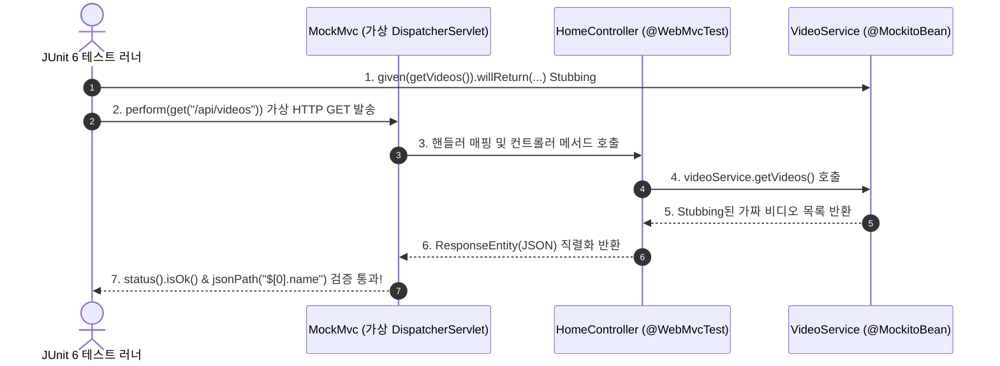

## 한눈에 보기
- 웹 컨트롤러 계층을 검증하기 위해 무거운 DB와 서비스 계층까지 전부 띄울 필요 없이, 웹 인프라만 칼같이 잘라내어 검증하는 기법이 **[[슬라이스-테스트]]**(`@WebMvcTest`)다.
- **[[목엠브이씨]]**(`MockMvc`)는 실제 톰캣 서버를 띄우지 않고 가상 HTTP 요청을 생성하여 라우팅, 파라미터 바인딩, HTTP 상태 코드, JSONPath 응답 본문을 초고속 검증한다.
- Spring Boot 4에서는 과거의 `@MockBean`을 공식 폐기하고 스프링 프레임워크 표준인 **[[목키토-빈]]**(`@MockitoBean`)을 전면 채택했다.

## 1. 왜 이게 필요한가

### 여기서 뭐가 무너지나
컨트롤러가 HTTP GET `/api/videos` 요청을 받았을 때 JSON 응답 규격이 맞는지, 유효하지 않은 요청 본문에 대해 400 Bad Request를 올바르게 뱉는지 검증하려고 매번 전체 서버를 띄우면, DB 연결 설정 실패나 타 서비스 빈 초기화 에러 때문에 웹 계층 테스트가 엉뚱하게 깨지는 일이 빈번하다.

또한 실제 네트워크 소켓을 열고 포트를 점유하면 병렬 테스트 실행 시 포트 충돌(Port Conflict)이 발생한다.

### 그래서 나온 생각
스프링 부트는 웹 계층 관련 빈들(`DispatcherServlet`, `@Controller`, `Filter`, `HttpMessageConverter`)만 선별적으로 메모리에 올리는 `@WebMvcTest(HomeController.class)` **[[슬라이스-테스트]]**를 제공한다.

하부의 비즈니스 서비스(`VideoService`)는 실제 구현체 대신 **[[목키토-빈]]**(`@MockitoBean`)으로 선언하여 가짜 객체로 대체하고, **[[목엠브이씨]]**(`MockMvc`)를 통해 가상의 HTTP GET/POST 요청을 쏘아 0.1초 만에 응답 헤더와 JSON 구조를 정밀 검증할 수 있게 했다.

쉽게 비유하자면, 방송국의 가상 스튜디오 세트장(MockMvc 슬라이스 테스트)과 같다. 드라마의 앵커 뉴스 진행 장면(웹 컨트롤러)을 촬영하기 위해 실제 뉴스 방송국 건물 전체와 전국 중계망 송출 타워(DB, 외부 API)를 다 지을 필요 없이, 앵커 테이블과 조명 세트(WebMvcTest)만 스튜디오에 갖추고 현장 기자 연결은 마네킹과 녹음된 목소리(@MockitoBean)로 대체하여 앵커의 멘트와 카메라 앵글(HTTP 요청/응답)만 완벽히 리허설하는 것과 같다.

→ 비유가 깨지는 지점: 세트장은 시각적 흉내만 내지만, `MockMvc`는 실제 스프링 MVC의 서블릿 필터체인, 인터셉터, 아규먼트 리졸버, 뷰 리졸버, Jackson 직렬화 파이프라인을 100% 동일하게 통과하므로 완벽한 웹 계층 무결성을 보장한다.

## 2. 어떻게 동작하는가
1. **@WebMvcTest 슬라이스 선언**: `@WebMvcTest(controllers = HomeController.class)`를 테스트 클래스에 붙인다 — 불필요한 JPA/Service 빈 로딩을 차단하고 웹 계층만 컨텍스트에 띄우기 위해서다.
2. **MockMvc 주입 및 @MockitoBean 선언**: `@Autowired MockMvc mvc;`와 `@MockitoBean VideoService videoService;`를 필드로 선언한다 — 가상 HTTP 발송기와 하부 서비스 모킹 빈을 준비하기 위해서다.
3. **Mockito stubbing (행위 정의)**: `BDDMockito.given(videoService.getVideos()).willReturn(List.of(new Video("Spring 4", "desc")))`로 가짜 서비스의 반환값을 정의한다 — 외부 의존성 없이 예측 가능한 결과를 만들기 위해서다.
4. **MockMvc 가상 요청 발송**: `mvc.perform(get("/api/videos").accept(MediaType.APPLICATION_JSON))`을 호출한다 — DispatcherServlet으로 가상 HTTP 요청을 밀어넣기 위해서다.
5. **상태 코드 및 JSONPath 단언**: `.andExpect(status().isOk()).andExpect(jsonPath("$[0].name").value("Spring 4"))`로 결과를 검증한다 — HTTP 응답 명세가 정확한지 확인하기 위해서다.

## 3. 그림으로 보기

## 4. 이 노트에 나온 용어
| 용어 | 한 줄 풀이 | 용어집 링크 |
|------|------------|-------------|
| 슬라이스-테스트 | 특정 계층의 빈만 선별 로드하여 초고속으로 검증하는 분할 테스트 | [[_glossary#슬라이스-테스트]] |
| 목엠브이씨 | 서블릿 컨테이너 없이 컨트롤러의 HTTP 파이프라인을 가상 검증하는 테스트 도구 | [[_glossary#목엠브이씨]] |
| 목키토-빈 | Spring Boot 4에서 구형 @MockBean을 대체한 스프링 표준 빈 오버라이드 어노테이션 | [[_glossary#목키토-빈]] |
| 제이유닛6 | 테스트를 실행하고 생명주기를 관장하는 프레임워크 | [[_glossary#제이유닛6]] |
| 어서트제이 | 테스트 결과를 유려하게 단언하는 라이브러리 | [[_glossary#어서트제이]] |

## 5. 자주 헷갈리는 것
- **`@MockBean` vs `@MockitoBean`**: Spring Boot 3.x까지 쓰이던 `org.springframework.boot.test.mock.mockito.MockBean`은 Spring Boot 4에서 전면 제거되었으며, 이제 스프링 코어 프레임워크에 표준 탑재된 `org.springframework.test.context.bean.override.mockito.MockitoBean`을 사용해야 한다.
- **실제 네트워크 포트 미개방**: `MockMvc`는 실제 TCP 소켓을 열지 않으므로 `RestTemplate`이나 `HttpClient`로 `http://localhost:8080`에 쏘면 연결 거부 에러가 난다. 실제 소켓 통신 테스트가 필요하다면 `@SpringBootTest(webEnvironment = RANDOM_PORT)`를 써야 한다.

## 6. 언제 안 쓰나 / 경계
- **데이터베이스 트랜잭션 롤백 및 실제 JPA 쿼리 검증**: 웹 슬라이스 테스트는 서비스와 DB를 모킹하므로, 실제 SQL 문법 에러나 테이블 제약 조건 위반은 검증할 수 없다. 이는 `@DataJpaTest`나 Testcontainers의 영역이다.

## 7. 연결
- [[01-junit6-and-domain-unit-testing]] — 순수 도메인 테스트 위에 웹 계층 슬라이스가 결합된다.
- [[03-data-jpa-test-and-embedded-db]] — 웹 계층과 짝을 이루는 데이터 계층 슬라이스 테스트로 이어진다.

## 8. 스스로 확인
1. `@SpringBootTest` 대신 `@WebMvcTest`를 사용해야 하는 가장 큰 이유는 무엇인가?
2. Spring Boot 4에서 `@MockBean` 대신 `@MockitoBean`을 사용해야 하는 배경은 무엇인가?
3. `MockMvc`가 서블릿 컨테이너(Tomcat)를 실제로 띄우지 않으면서도 웹 계층의 무결성을 검증할 수 있는 원리는 무엇인가?

<!-- ==== 아래는 내 영역 · 스킬 수정 금지 ==== -->

## 내 설명 시도

## 막혔던 지점

## 리뷰 이력
