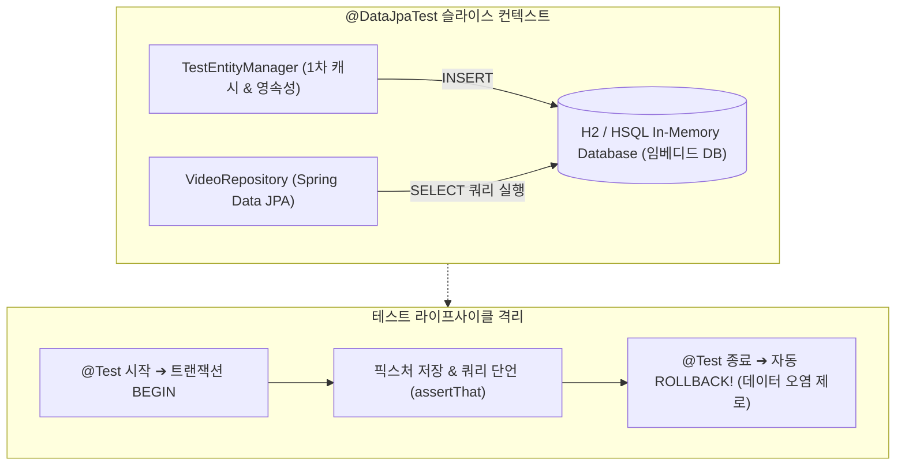

## 한눈에 보기
- 데이터 계층을 검증할 때 웹 컨트롤러나 보안 필터를 전부 띄우지 않고, JPA 엔티티와 리포지토리 및 DataSource만 격리 로드하는 기법이 **[[데이터-제이피에이-테스트]]**(`@DataJpaTest`)다.
- 기본적으로 H2/HSQL 등 인메모리 임베디드 데이터베이스를 자동 구성하여 실제 외장 DB 서버 없이도 초고속으로 JPA 쿼리와 매핑을 검증한다.
- 각 `@Test` 메서드 실행 후 자동으로 데이터베이스 트랜잭션을 롤백(`@Transactional`)하여 테스트 간 데이터 오염(Test Isolation)을 100% 방지한다.

## 1. 왜 이게 필요한가

### 여기서 뭐가 무너지나
개발자가 직접 작성한 복잡한 JPQL 파생 쿼리(`findByUsernameOrderByCreatedAtDesc`)나 커스텀 `@Query` 쿼리가 실제 SQL로 올바르게 변환되고 실행되는지 검증하지 않으면, 런타임에 SQL 문법 에러가 터져 서버가 죽는다.

또한 테스트 A가 DB에 `Video(id=1)`을 저장해 두고 롤백하지 않으면, 바로 뒤에 실행되는 테스트 B가 중복 키 에러로 깨지는 악명 높은 "테스트 간 데이터 오염(Flaky Test)"이 발생한다.

### 그래서 나온 생각
스프링 부트는 JPA 관련 핵심 빈들(`EntityManager`, `TestEntityManager`, `DataSource`, `JpaRepository`)만 정밀하게 띄우는 `@DataJpaTest` **[[슬라이스-테스트]]**를 제공한다.

클래스패스에 H2나 HSQL이 있으면 자동으로 임베디드 인메모리 DB로 데이터소스를 교체(`@AutoConfigureTestDatabase`)하고, 모든 테스트 메서드에 `@Transactional`을 기본 적용하여 메서드가 끝나자마자 `ROLLBACK`을 실행함으로써 무결하고 깨끗한 테스트 환경을 보장한다.

쉽게 비유하자면, 도자기 장인의 테스트용 찰흙 가마(인메모리 JPA 테스트)와 같다. 새로 고안한 그릇 모양(JPA 쿼리/엔티티 매핑)이 가마의 열(SQL 파싱)을 견디는지 확인하기 위해 거대한 상용 도자기 공장 전체(운영 RDBMS)를 가동할 필요 없이, 작은 테스트용 전기 가마(H2 임베디드 DB)에 구워보고 확인 후 즉시 찰흙을 원상태로 뭉개서 초기화(트랜잭션 자동 롤백)하는 것과 같다.

→ 비유가 깨지는 지점: H2 임베디드 가마는 빠르지만, 실제 운영 환경(PostgreSQL/Oracle) 전용 고유 SQL 함수나 특수 JSONB 인덱스 문법까지 100% 동일하게 재현하지는 못하므로, 운영 동일성 검증에는 Testcontainers가 필요하다.

## 2. 어떻게 동작하는가
1. **@DataJpaTest 슬라이스 선언**: 테스트 클래스에 `@DataJpaTest` 어노테이션을 선언한다 — 컨트롤러와 서비스 빈 로딩을 배제하고 JPA 인프라만 올리기 위해서다.
2. **임베디드 데이터소스 자동 교체**: 스프링 부트가 클래스패스의 H2/HSQL 라이브러리를 감지하고 메모리 기반 `DataSource`를 자동 구성한다 — 외부 DB 연결 없이 독립 실행하기 위해서다.
3. **TestEntityManager 및 Repository 주입**: `@Autowired VideoRepository repository;`와 `@Autowired TestEntityManager entityManager;`를 주입받는다 — 테스트 픽스처(Fixture) 데이터를 적재하고 쿼리를 실행하기 위해서다.
4. **엔티티 영속화 및 쿼리 실행**: `entityManager.persist(new VideoEntity("alice", "스프링 4"))`로 데이터를 밀어 넣고, `repository.findByNameContains("스프링")`을 호출한다 — 실제 데이터베이스에 쿼리가 날아가는지 확인하기 위해서다.
5. **AssertJ 결과 단언 및 트랜잭션 롤백**: `assertThat(results).hasSize(1)` 단언 후, 메서드가 종료되는 즉시 스프링이 `ROLLBACK`을 날려 메모리 DB를 깨끗하게 비운다 — 다음 테스트에 영향을 주지 않기 위해서다.

## 3. 그림으로 보기

## 4. 이 노트에 나온 용어
| 용어 | 한 줄 풀이 | 용어집 링크 |
|------|------------|-------------|
| 데이터-제이피에이-테스트 | JPA 관련 빈만 로드하고 자동 롤백을 보장하는 데이터 계층 슬라이스 테스트 | [[_glossary#데이터-제이피에이-테스트]] |
| 슬라이스-테스트 | 필요한 계층만 칼같이 잘라내어 초고속 검증하는 스프링 부트 테스트 기법 | [[_glossary#슬라이스-테스트]] |
| 제이유닛6 | 테스트 라이프사이클과 메서드를 실행하는 표준 프레임워크 | [[_glossary#제이유닛6]] |
| 어서트제이 | 단언문을 유려하게 작성하는 표준 Assertion 라이브러리 | [[_glossary#어서트제이]] |
| 테스트컨테이너 | 실제 운영과 동일한 Docker DB 컨테이너를 띄워 검증하는 도구 | [[_glossary#테스트컨테이너]] |

## 5. 자주 헷갈리는 것
- **`@DataJpaTest`는 기본적으로 `@Transactional` 포함**: 별도로 `@Transactional`을 명시하지 않아도 모든 테스트 메서드가 트랜잭션 안에서 돌며 종료 시 롤백된다. 만약 롤백을 원치 않는다면 `@Rollback(false)`를 명시해야 한다.
- **1차 캐시(영속성 컨텍스트) 함정**: `repository.save()`를 호출한 뒤 바로 `repository.findById()`를 호출하면 실제 DB SELECT 쿼리를 날리지 않고 1차 캐시에서 객체를 꺼내오므로, 실제 SQL 쿼리 실행 여부를 검증하려면 `TestEntityManager.flush()` 및 `clear()`를 호출해야 한다.

## 6. 언제 안 쓰나 / 경계
- **PostgreSQL JSONB 등 특정 RDBMS 전용 네이티브 쿼리 검증**: H2 임베디드 데이터베이스는 PostgreSQL의 고유 함수나 MySQL의 특수 인덱스 문법을 완벽히 지원하지 못하므로, 네이티브 쿼리 검증에는 Testcontainers를 사용해야 한다.

## 7. 연결
- [[02-web-mvc-test-mockmvc-mockito-bean]] — 웹 슬라이스 테스트와 데이터 슬라이스 테스트가 결합되어 피라미드를 이룬다.
- [[04-testcontainers-and-service-connection]] — H2 인메모리 테스트의 한계를 극복하는 Testcontainers 통합 테스트로 발전한다.

## 8. 스스로 확인
1. `@SpringBootTest` 대신 `@DataJpaTest`를 사용하여 데이터 계층을 검증할 때의 성능상 이점은 무엇인가?
2. `@DataJpaTest`에서 테스트 간 데이터 오염을 방지하는 기본 메커니즘은 무엇인가?
3. JPA 슬라이스 테스트 작성 시 `TestEntityManager.flush()`와 `clear()`가 필요한 이유는 무엇인가?

<!-- ==== 아래는 내 영역 · 스킬 수정 금지 ==== -->

## 내 설명 시도

## 막혔던 지점

## 리뷰 이력
