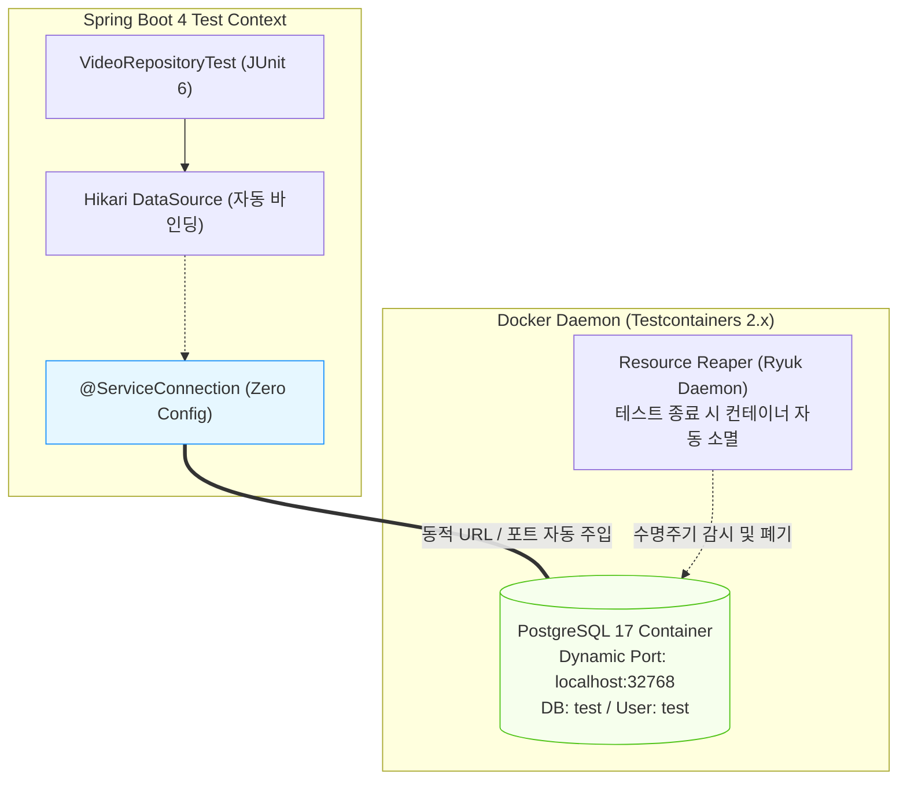

## 한눈에 보기
- H2 인메모리 DB는 가볍지만 PostgreSQL의 `jsonb`, 전문 검색(Full-text), 고유 락(Locking) 메커니즘 등 프로덕션 환경과의 방언(Dialect) 불일치를 완벽히 검증할 수 없다.
- **[[테스트컨테이너]]**(`Testcontainers 2.x`)는 테스트 실행 시 로컬 Docker 데몬을 통해 실제 운영과 100% 동일한 PostgreSQL/Kafka 컨테이너를 자바 코드로 자동 기동한다.
- Spring Boot 4의 **[[서비스-커넥션]]**(`@ServiceConnection`)은 동적으로 할당된 컨테이너의 랜덤 포트와 접속 URL을 보일러플레이트 코드 없이 스프링 `DataSource` 프로퍼티에 자동 바인딩한다.

## 1. 왜 이게 필요한가

### 여기서 뭐가 무너지나
과거에는 "로컬 H2 테스트는 100% 통과했는데, 운영 PostgreSQL에 배포하자마자 예약어 충돌이나 외래키 제약조건 차이로 장애가 터지는" 비극이 반복되었다.

이를 막으려고 개발자 로컬에 수동으로 Docker DB를 띄우고 고정 포트(`5432`)를 잡으면, CI/CD 빌드 서버에서 여러 브랜치가 동시 빌드될 때 포트 충돌이 터지거나 테스트 종료 후 더미 데이터가 남아 빌드가 깨졌다.

또한 동적 포트를 쓰는 Testcontainers를 연동하려면 과거에는 무겁고 번거로운 `@DynamicPropertySource` 보일러플레이트 코드를 수십 줄씩 작성해야 했다.

### 그래서 나온 생각
Spring Boot 4는 `org.springframework.boot.testcontainers.service.connection.ServiceConnection`을 핵심 기능으로 전면 지원한다.

테스트 클래스에 `@Container @ServiceConnection static PostgreSQLContainer database = new PostgreSQLContainer("postgres:17");` 한 줄만 선언해 두면, 스프링 부트가 컨테이너 기동을 감지하여 `spring.datasource.url`, `username`, `password`, `driver-class-name`을 0초 만에 완벽히 자동 구성한다.

쉽게 비유하자면, 스마트 홈의 자동 전자기기 인식(Service Connection)과 같다. 새로운 수입 가전제품(실제 Docker PostgreSQL 컨테이너)을 들여왔을 때, 전압과 플러그 모양(IP, 포트, 계정 정보)을 일일이 수동 개조(DynamicPropertySource)할 필요 없이, 표준 멀티탭(@ServiceConnection)에 꽂기만 하면 집안 전력망(스프링 부트 DataSource)이 가전제품의 전압을 자동 인식하여 전원을 공급하는 것과 같다.

→ 비유가 깨지는 지점: 물리적 가전제품은 공간을 차지하지만, Testcontainers는 테스트 수명주기(`Ryuk` 컨테이너)와 결합하여 테스트가 끝나면 Docker 컨테이너를 1초 만에 흔적도 없이 자동 파괴하고 메모리를 회수한다.

## 2. 어떻게 동작하는가
1. **@Testcontainers 및 @Container 선언**: 테스트 클래스에 `@Testcontainers`와 static `PostgreSQLContainer` 필드를 선언한다 — JUnit 6 라이프사이클과 연동하여 테스트 스위트 시작 시 컨테이너를 올리기 위해서다.
2. **@ServiceConnection 자동 바인딩**: 컨테이너 필드 위에 `@ServiceConnection` 어노테이션을 부여한다 — 동적 JDBC 접속 URL(`jdbc:postgresql://localhost:32768/test`)을 스프링 DataSource에 자동 주입하기 위해서다.
3. **@AutoConfigureTestDatabase(replace = NONE)**: 슬라이스 테스트 시 스프링 부트가 H2로 데이터소스를 강제 교체하지 못하도록 설정을 비활성화한다 — 방금 띄운 실제 PostgreSQL 컨테이너를 사용하게 강제하기 위해서다.
4. **실제 프로덕션 SQL 쿼리 실행**: JPA 리포지토리가 PostgreSQL 고유 문법 및 제약조건 위에서 실제 쿼리를 실행한다 — 프로덕션과 100% 동일한 환경에서 동작을 검증하기 위해서다.
5. **테스트 완료 및 컨테이너 자동 폐기**: 모든 테스트가 완료되면 Testcontainers의 백그라운드 데몬이 컨테이너를 정리하여 로컬 및 CI 서버의 리소스를 청소한다 — 빌드 서버의 무결성을 유지하기 위해서다.

## 3. 그림으로 보기

## 4. 이 노트에 나온 용어
| 용어 | 한 줄 풀이 | 용어집 링크 |
|------|------------|-------------|
| 테스트컨테이너 | 실제 운영과 동일한 Docker 컨테이너를 자바 코드로 자동 띄워 검증하는 도구 | [[_glossary#테스트컨테이너]] |
| 서비스-커넥션 | 컨테이너의 동적 접속 프로퍼티를 스프링 부트에 제로 구성으로 자동 바인딩하는 어노테이션 | [[_glossary#서비스-커넥션]] |
| 데이터-제이피에이-테스트 | JPA 영속성 계층을 검증하는 슬라이스 테스트 | [[_glossary#데이터-제이피에이-테스트]] |
| 제이유닛6 | 테스트 라이프사이클을 관장하는 프레임워크 | [[_glossary#제이유닛6]] |
| 어서트제이 | 단언문을 유려하게 작성하는 라이브러리 | [[_glossary#어서트제이]] |

## 5. 자주 헷갈리는 것
- **`@DynamicPropertySource` vs `@ServiceConnection`**: 과거에는 `@DynamicPropertySource` 메서드를 작성하여 `registry.add("spring.datasource.url", container::getJdbcUrl)`처럼 수동 등록해야 했으나, Spring Boot 4에서는 `@ServiceConnection` 하나로 모든 보일러플레이트가 100% 제거되었다.
- **Docker 데몬 필수**: Testcontainers는 개발자 머신이나 CI/CD 환경에 반드시 Docker 데몬(Docker Desktop, Colima 등)이 실행 중이어야 테스트가 동작한다.

## 6. 언제 안 쓰나 / 경계
- **극단적인 속도가 요구되는 수천 개의 단순 단위 테스트**: Docker 컨테이너 최초 기동에는 수 초의 시간이 소요되므로, 비즈니스 로직 단위 테스트는 순수 JUnit 6 단위 테스트나 H2 슬라이스 테스트로 검증하고, Testcontainers는 프로덕션 통합 검증에 집중 배치해야 한다.

## 7. 연결
- [[03-data-jpa-test-and-embedded-db]] — 인메모리 H2 슬라이스 테스트의 환경 불일치를 보완하는 상위 통합 검증이다.
- [[06-rest-test-client-and-integration]] — 실제 DB 컨테이너와 결합된 엔드투엔드 풀스택 통합 테스트로 발전한다.

## 8. 스스로 확인
1. H2 인메모리 데이터베이스 대신 Testcontainers를 사용하여 통합 테스트를 수행해야 하는 핵심 이유는 무엇인가?
2. Spring Boot 4의 `@ServiceConnection` 어노테이션이 제거해 준 과거의 보일러플레이트 작업은 무엇인가?
3. Testcontainers 사용 시 CI/CD 환경에서 포트 충돌이 발생하지 않는 원리는 무엇인가?

<!-- ==== 아래는 내 영역 · 스킬 수정 금지 ==== -->

## 내 설명 시도

## 막혔던 지점

## 리뷰 이력
