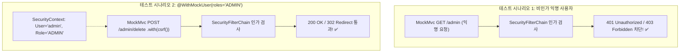

## 한눈에 보기
- 보안 필터체인이 적용된 엔드포인트는 인증되지 않은 익명 요청 시 401 Unauthorized 또는 403 Forbidden으로 차단되어야 하며, 정상 권한을 가진 사용자에게만 200 OK를 반환해야 한다.
- **[[스프링-시큐리티-테스트]]**(`spring-security-test`)는 복잡한 로그인 세션 생성 절차 없이 가짜 인증 토큰과 CSRF 토큰을 요청에 주입한다.
- **[[위드-목-유저]]**(`@WithMockUser`) 어노테이션은 테스트 메서드 실행 전에 특정 역할(`roles = "ADMIN"`)을 가진 `SecurityContext`를 즉시 세팅하여 인가 규칙과 메서드 보안을 검증한다.

## 1. 왜 이게 필요한가

### 여기서 뭐가 무너지나
보안이 적용된 컨트롤러를 테스트하기 위해 매번 실제 `/login` 폼에 아이디/비밀번호를 POST로 전송하고 세션 쿠키(JSESSIONID)나 JWT 토큰을 발급받아 다음 요청 헤더에 끼워 넣는 방식으로 테스트를 작성하면, 테스트 코드가 5배 이상 길어지고 유지보수가 불가능해진다.

또한 인증되지 않은 공격자의 악의적인 관리자 API 호출 시도나 CSRF 공격 차단 여부를 테스트하지 않으면 심각한 보안 구멍이 방치된다.

### 그래서 나온 생각
스프링 시큐리티 진영은 테스트 전용 모듈인 `spring-security-test`를 제공한다.

`@WithMockUser(username = "admin", roles = {"ADMIN"})` 어노테이션을 테스트 메서드에 붙이기만 하면, 프레임워크가 테스트 실행 스레드의 `SecurityContext`에 `ADMIN` 권한을 가진 `Authentication` 객체를 자동 주입한다.

또한 **[[목엠브이씨]]**와 결합하여 `SecurityMockMvcRequestPostProcessors.csrf()`를 통해 POST 요청 시 CSRF 토큰 검증 성공/실패 시나리오를 단 한 줄의 코드로 완벽히 테스트할 수 있게 했다.

쉽게 비유하자면, 보안 시설 점검관의 마스터 출입증(WithMockUser 가짜 보안 컨텍스트)과 같다. 군사 보안 구역(관리자 컨트롤러)의 출입 통제 시스템이 잘 작동하는지 테스트하기 위해 매번 신병 입대 절차(실제 DB 사용자 생성 및 로그인)를 밟을 필요 없이, 점검관 전용 임시 출입증(@WithMockUser)을 목에 걸고 게이트를 통과해 보거나, 출입증 없는 일반인(익명 요청)으로 통과를 시도하여 비상벨(401/403 응답)이 제대로 울리는지 확인하는 것과 같다.

→ 비유가 깨지는 지점: 마스터 출입증은 물리적 카드지만, `@WithMockUser`는 JVM `SecurityContextHolder`의 `ThreadLocal`에 즉시 주입되므로 데이터베이스 I/O가 0바이트 발생하여 나노초 단위로 실행된다.

## 2. 어떻게 동작하는가
1. **SecurityConfig 포함 슬라이스 테스트 구성**: `@WebMvcTest(controllers = HomeController.class)`와 `@Import(SecurityConfig.class)`를 선언한다 — 실제 보안 인가 규칙이 적용된 필터체인을 컨텍스트에 띄우기 위해서다.
2. **익명 사용자 접근 차단 테스트**: 아무런 인증 정보 없이 `mvc.perform(get("/admin"))`을 날려 `.andExpect(status().isUnauthorized())`를 검증한다 — 비인가자의 접근이 거부되는지 확인하기 위해서다.
3. **@WithMockUser를 통한 권한 주입**: 관리자 테스트 메서드 위에 `@Test @WithMockUser(roles = "ADMIN")`을 부여한다 — `ROLE_ADMIN` 권한을 가진 인증 토큰을 컨텍스트에 주입하기 위해서다.
4. **CSRF 토큰을 포함한 가상 POST 요청**: `mvc.perform(post("/admin/delete").with(csrf()))`를 발송한다 — CSRF 방어 필터를 정상 통과시키기 위해서다.
5. **인가 성공 및 상태 코드 검증**: `.andExpect(status().isOk())` 또는 `.andExpect(redirectedUrl("/"))`로 정상 인가 및 비즈니스 실행을 검증한다 — 보안 정책이 의도대로 완벽히 작동함을 확정하기 위해서다.

## 3. 그림으로 보기

## 4. 이 노트에 나온 용어
| 용어 | 한 줄 풀이 | 용어집 링크 |
|------|------------|-------------|
| 스프링-시큐리티-테스트 | 보안 필터체인과 컨텍스트를 테스트 환경에서 검증하는 전용 테스트 라이브러리 | [[_glossary#스프링-시큐리티-테스트]] |
| 위드-목-유저 | 특정 권한과 이름을 가진 가짜 보안 인증 객체를 테스트에 즉시 주입하는 어노테이션 | [[_glossary#위드-목-유저]] |
| 목엠브이씨 | 서블릿 컨테이너 없이 가상 HTTP 요청을 생성하여 검증하는 테스트 도구 | [[_glossary#목엠브이씨]] |
| 슬라이스-테스트 | 필요한 계층만 선별 로드하여 초고속으로 검증하는 테스트 기법 | [[_glossary#슬라이스-테스트]] |
| 제이유닛6 | 테스트 라이프사이클을 관장하는 표준 프레임워크 | [[_glossary#제이유닛6]] |

## 5. 자주 헷갈리는 것
- **`@WithMockUser` vs `@WithUserDetails`**: `@WithMockUser`는 DB 조회 없이 단순 가짜 `User` 객체를 메모리에 만들지만, 커스텀 `UserDetails` 구현체(예: 이메일, 사원번호 등 추가 필드)를 쓰는 컨트롤러라면 실제 `UserDetailsService`를 호출하여 풍부한 도메인 사용자 객체를 채워주는 `@WithUserDetails`를 사용해야 한다.
- **POST/PUT 테스트 시 CSRF 누락 주의**: Spring Security가 켜져 있는 상태에서 POST/DELETE 요청을 `MockMvc`로 보낼 때 `.with(csrf())`를 붙이지 않으면 403 Forbidden 에러로 테스트가 실패한다.

## 6. 언제 안 쓰나 / 경계
- **실제 OAuth 2.0 / OIDC Authorization Code Flow 리다이렉트 검증**: Google/GitHub 로그인 화면으로 리다이렉트되고 토큰을 교환하는 전체 OAuth 플로우는 `@WithMockUser`로 모킹하지 말고, 전용 WireMock이나 E2E 통합 테스트로 검증해야 한다.

## 7. 연결
- [[02-web-mvc-test-mockmvc-mockito-bean]] — MockMvc 웹 테스트 위에 Spring Security 검증이 결합된다.
- [[06-rest-test-client-and-integration]] — 풀스택 환경에서의 실제 인증/인가 엔드투엔드 테스트로 이어진다.

## 8. 스스로 확인
1. Spring Security가 적용된 컨트롤러 테스트 시 `@WithMockUser`가 제공하는 장점은 무엇인가?
2. `MockMvc`로 상태 변경 HTTP POST/DELETE 요청을 테스트할 때 `.with(csrf())`가 필수적인 이유는 무엇인가?
3. `@WithMockUser`와 `@WithUserDetails`의 차이점과 각각의 적절한 사용 시점은 언제인가?

<!-- ==== 아래는 내 영역 · 스킬 수정 금지 ==== -->

## 내 설명 시도

## 막혔던 지점

## 리뷰 이력
