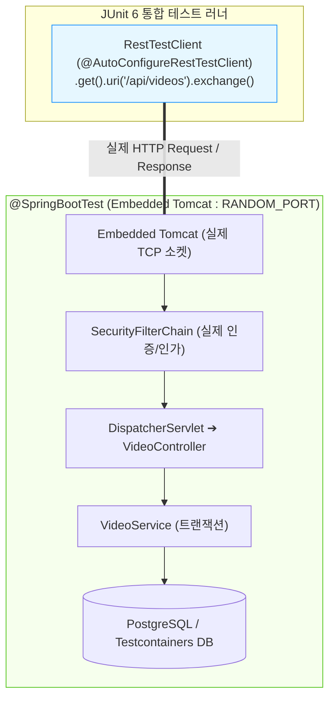

## 한눈에 보기
- 슬라이스 테스트가 개별 계층을 검증했다면, 실제 임베디드 톰캣을 띄우고 컨트롤러-서비스-리포지토리-DB 전체를 관통하는 검증이 바로 **[[스프링-부트-테스트]]**(`@SpringBootTest`)다.
- Spring Boot 4는 동기식 REST API 전용 차세대 테스트 도구인 **[[레스트-테스트-클라이언트]]**(`RestTestClient`, `@AutoConfigureRestTestClient`)를 새롭게 도입했다.
- 비동기 Netty 전용 WebTestClient 의존성 없이도, 실제 랜덤 포트(`RANDOM_PORT`) 서버 또는 MockMvc 인프라에 대해 유려하고 일관된 Fluent API로 HTTP 통합 테스트를 수행한다.

## 1. 왜 이게 필요한가

### 여기서 뭐가 무너지나
단위 테스트와 슬라이스 테스트가 전부 통과했더라도, 실제 톰캣 서블릿 컨테이너가 뜰 때 포트 바인딩 문제, 서블릿 필터 순서 꼬임, 실제 트랜잭션 커밋 후 DB 상태 변경 등 "전체 시스템이 하나로 묶였을 때 발생하는 결합 버그"는 슬라이스 테스트만으로 잡을 수 없다.

과거에는 `@SpringBootTest(webEnvironment = RANDOM_PORT)` 환경에서 테스트하기 위해 무거운 `TestRestTemplate`을 쓰거나, 리액티브 `spring-boot-starter-webflux` 라이브러리를 억지로 추가하여 `WebTestClient`를 빌려 써야 하는 비효율이 존재했다.

### 그래서 나온 생각
Spring Boot 4는 Spring Framework의 `RestClient`를 기반으로 설계된 전용 테스트 클라이언트인 `RestTestClient`를 공식 도입했다.

테스트 클래스에 `@AutoConfigureRestTestClient`를 붙이면, 실제 임베디드 톰캣의 랜덤 포트와 자동 연결된 `RestTestClient` 빈이 주입되어, `client.get().uri("/api/videos").exchange().expectStatus().isOk().expectBody(Video.class)`와 같은 최고 수준의 가독성을 가진 테스트 코드를 작성할 수 있게 되었다.

쉽게 비유하자면, 신차 출고 전 최종 트랙 주행 테스트(풀스택 통합 테스트)와 고성능 테스트 계측기(RestTestClient)의 관계와 같다. 엔진, 브레이크, 조향 장치(단위/슬라이스 테스트)를 각각 실험실에서 합격 판정했더라도, 실제 도로(임베디드 톰캣 RANDOM_PORT)에 차를 올리고 시속 100km로 달렸을 때 모든 부품이 조화롭게 작동하는지 최종 시험 운전을 하는 것과 같다.

→ 비유가 깨지는 지점: 실제 주행 시험은 위험과 시간 소모가 따르지만, `RestTestClient` 통합 테스트는 Testcontainers 및 로컬 톰캣과 결합하여 CI/CD 파이프라인에서 수 초 안에 완전 자동화로 안전하게 실행된다.

## 2. 어떻게 동작하는가
1. **@SpringBootTest(webEnvironment = RANDOM_PORT) 선언**: 테스트 클래스에 전체 컨텍스트 기동 및 랜덤 포트 임베디드 톰캣 실행을 선언한다 — 포트 충돌 없이 실제 네트워크 소켓 환경을 구축하기 위해서다.
2. **@AutoConfigureRestTestClient 주입**: `@Autowired RestTestClient client;`를 선언한다 — 랜덤 포트로 뜬 톰캣 서버와 자동 바인딩된 최신 동기식 테스트 클라이언트를 주입받기 위해서다.
3. **HTTP 요청 체이닝 조립**: `client.post().uri("/api/videos").contentType(APPLICATION_JSON).body(new CreateVideoRequest("Spring 4"))`를 호출한다 — 실제 HTTP 네트워크 패킷을 구성하여 전송하기 위해서다.
4. **exchange() 발송 및 응답 수신**: 실제 톰캣 서블릿 컨테이너로 TCP 통신이 날아가고, SecurityFilterChain, Controller, Service, DB까지 전 계층을 관통하여 실행된다 — 완전한 엔드투엔드 통합 동작을 수행하기 위해서다.
5. **expectStatus 및 expectBody 단언**: `.expectStatus().isCreated().expectBody(VideoResponse.class).value(v -> assertThat(v.id()).isNotNull())`로 최종 결과를 검증한다 — 전체 시스템의 최종 출력을 확정하기 위해서다.

## 3. 그림으로 보기

## 4. 이 노트에 나온 용어
| 용어 | 한 줄 풀이 | 용어집 링크 |
|------|------------|-------------|
| 레스트-테스트-클라이언트 | Spring Boot 4에 도입된 동기식 REST API 전용 고성능 테스트 클라이언트 | [[_glossary#레스트-테스트-클라이언트]] |
| 스프링-부트-테스트 | 실제 서블릿 컨테이너와 전체 빈을 기동하는 엔드투엔드 통합 테스트 어노테이션 | [[_glossary#스프링-부트-테스트]] |
| 슬라이스-테스트 | 특정 계층만 격리하여 검증하는 경량 테스트 | [[_glossary#슬라이스-테스트]] |
| 목엠브이씨 | 서블릿 컨테이너 없이 가상 요청을 검증하는 도구 | [[_glossary#목엠브이씨]] |
| 제이유닛6 | 통합 테스트를 구동하는 표준 테스트 프레임워크 | [[_glossary#제이유닛6]] |

## 5. 자주 헷갈리는 것
- **`WebTestClient` vs `RestTestClient`**: `WebTestClient`는 리액티브(WebFlux) 기반으로 동작하는 클라이언트인 반면, Spring Boot 4의 `RestTestClient`는 전통적인 서블릿 MVC 및 `RestClient` 기반 애플리케이션을 위해 설계된 순수 동기식 표준 테스트 도구다.
- **`MOCK` vs `RANDOM_PORT`**: `@SpringBootTest(webEnvironment = MOCK)`은 실제 톰캣 포트를 열지 않고 `MockMvc`를 주입받아 쓰지만, `webEnvironment = RANDOM_PORT`는 실제 톰캣을 띄워 네트워크 소켓 레벨까지 완전 검증한다.

## 6. 언제 안 쓰나 / 경계
- **단순 비즈니스 계산식이나 단일 컴포넌트 검증**: 전체 스프링 컨테이너를 띄우는 데 수 초의 부팅 비용이 들기 때문에, 단순 로직은 순수 JUnit 6 단위 테스트나 슬라이스 테스트로 해결하고, 통합 테스트는 핵심 비즈니스 유스케이스당 1~2개로 집중 구성해야 한다.

## 7. 연결
- [[02-web-mvc-test-mockmvc-mockito-bean]] — 가상 MockMvc 테스트의 한계를 실제 톰캣 환경 통합 테스트로 완성한다.
- [[04-testcontainers-and-service-connection]] — 실제 Testcontainers DB와 결합하여 무결점 프로덕션 시뮬레이션을 달성한다.

## 8. 스스로 확인
1. Spring Boot 4에서 `RestTestClient`가 도입된 배경과 `WebTestClient` 대비 장점은 무엇인가?
2. `@SpringBootTest(webEnvironment = RANDOM_PORT)`가 `MOCK` 환경 대비 검증할 수 있는 추가적인 범위는 무엇인가?
3. 전체 테스트 스위트에서 단위 테스트, 슬라이스 테스트, 풀스택 통합 테스트의 최적 비율(테스트 피라미드)은 무엇인가?

<!-- ==== 아래는 내 영역 · 스킬 수정 금지 ==== -->

## 내 설명 시도

## 막혔던 지점

## 리뷰 이력
